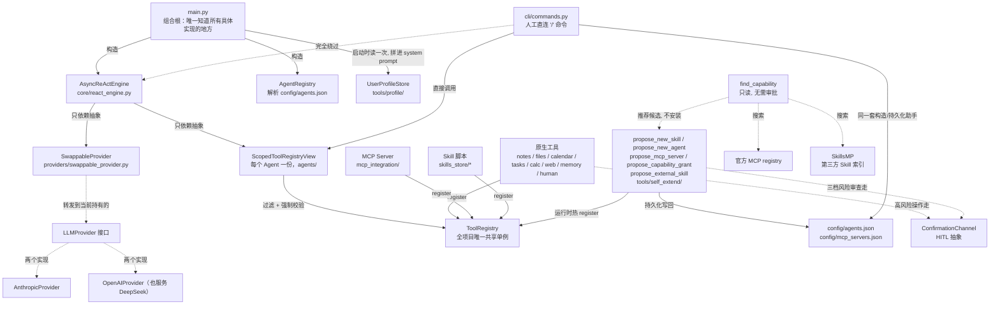
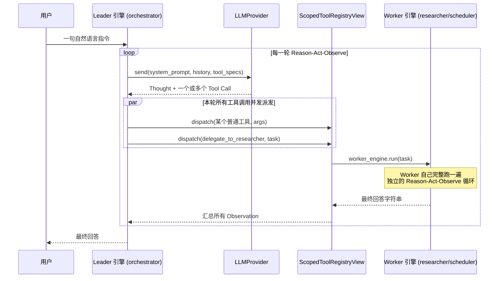

# AuraAgent

**[English](README.md)**

一个从零构建的轻量级个人 AI Agent：纯 `asyncio` + 官方 SDK 实现的白盒 ReAct 循环，不依赖 LangChain 等黑盒框架。现已支持 Multi-Agent（Leader-Worker 编排）。

## v1 范围

- **核心异步 ReAct 循环**（`core/react_engine.py`）：Reason → Act → Observe，每一轮的 Thought / Tool Call / Observation 都打印到终端并写入 `logs/session-*.jsonl`。
- **可插拔的 LLM 抽象层**（`providers/`）：`LLMProvider` 接口 + 两个真实实现——`AnthropicProvider`（官方 `anthropic` SDK）和 `OpenAIProvider`（官方 `openai` SDK，走 Chat Completions + Function Calling，同时兼容 OpenAI 和任何 OpenAI 协议兼容的服务，如 DeepSeek，只需切换 `OPENAI_BASE_URL`）。通过 `.env` 里的 `AURA_LLM_PROVIDER` 切换。
- **本地 Markdown 笔记工具**（`tools/notes/`）：`search_notes` / `read_note` / `create_note` / `update_note`，所有文件操作严格限制在 `sandbox/notes/` 内，防止路径穿越。沙盒校验函数 `resolve_within_sandbox()` 现在住在 `tools/sandbox_path.py`（原来在 `tools/notes/path_guard.py`——它本来就跟"notes"无关，只是历史上放错了地方，`tools/files/` 需要同一份逻辑时顺手搬了家）。
- **通用本地文件管理**（`tools/files/`）：`list_directory`/`read_file`/`write_file`/`delete_file`/`move_file`/`copy_file`/`get_file_info`/`search_files` 八个工具，管的是笔记之外的任意文件。跟其它 sandbox 不同的是，这个沙盒根**可以通过 `.env` 里的 `AURA_WORKSPACE_ROOT` 改指向用户真实的工作目录**（默认 `sandbox/workspace/`）——边界（`resolve_within_sandbox()`）本身从不取消，只是位置可配置。`delete_file` 始终要人工确认；`move_file`/`copy_file` 只在目的路径**已经存在、会被覆盖**时才确认，平移到一个新位置不用打扰人——跟 `delete_task` 的确认原则一脉相承。挂给 `orchestrator`（跟笔记管理是同一类"本地资源操作"）。
- **本地 JSON 日历 + Human-in-the-loop 确认**（`tools/calendar/`, `confirmation/`）：`list_calendar_events` / `create_calendar_event` / `update_calendar_event` / `delete_calendar_event`，事件持久化在 `sandbox/calendar/events.json`。删除操作、以及对标记为 `important` 事件的修改，都会通过终端 Y/N 交互确认后才执行；用户拒绝时返回普通 Observation 而不是抛异常。
- **任务清单工具**（`tools/tasks/`）：`create_task` / `list_tasks` / `complete_task` / `delete_task`，持久化模式和日历完全一致（`sandbox/tasks/tasks.json`）；`delete_task` 复用日历那一个 `confirmation_channel` 实例，同样走终端确认。
- **安全计算 + 网页抓取工具**（`tools/calc/`, `tools/web/`）：`calculate`（基于 `ast` 白名单手写解释器求值数学表达式，不用 `eval`/`exec`，抗对抗性输入）、`fetch_url`（httpx 异步抓取网页转纯文本，scheme 白名单 + 超时 + 大小截断；已知局限：不做 SSRF IP 段过滤，也无法绕过需要 JS 执行的反爬挑战页）。同一个模块里还有两个更通用的网络工具：`http_request`（`GET`/`POST`/`PUT`/`PATCH`/`DELETE` + 自定义 headers/body，`fetch_url` 做不到的提交表单/调用 JSON API 场景）、`download_file`（把 URL 内容**流式写进 `tools/files/` 的同一个 workspace 沙盒**，不是任意路径，单独有一档 `download_max_bytes` 大小上限，比纯文本的 `fetch_url_max_bytes` 宽松得多）。两者都挂给 `researcher`，跟 `fetch_url` 同一归属。真实网络验证过：真实下载一个公开小文件落进沙盒、真实对 `httpbin.org` 发一次带自定义 header 的 POST 并核对回显内容。刻意没做的：通用 Shell/命令执行工具（任意命令没法像 `propose_new_skill` 那样"审查一次、复用多次"，风险不可控，需要就引导写一个具体的 Skill）、原生浏览器自动化（引导通过 `find_capability`→`propose_mcp_server` 装一个现成的 Playwright/Puppeteer MCP server，不往项目里加浏览器二进制依赖）。
- **跨会话记忆工具**（`tools/memory/`）：`remember_fact` / `recall_facts`，持久化在 `sandbox/memory/facts.json`。拉取式设计——记忆内容不自动注入 system prompt，模型需要主动调用才能读到，避免随记忆条数增长而增加每轮 token 成本。（跟下面的用户画像是刻意设计成两种不同取舍的互补机制，不是同一个东西的两份实现。）
- **结构化、自动注入的用户画像**（`tools/profile/`）：跟 `remember_fact`/`recall_facts`"拉取式"相反的"推送式"设计——`update_user_profile` 把 `preferences`/`habits`/`common_topics`/`notes` 写进 `sandbox/memory/user_profile.json`（同样是 JSON + `asyncio.Lock`），但 `main.py` 启动时会读一次并**直接拼进 orchestrator 的 system prompt**，模型不需要调用任何工具就"认识"用户。列表字段合并去重、`notes` 追加而不是覆盖，避免一次调用抹掉之前积累的内容。取舍很直接：画像默认常驻但只在进程重启后反映最新一次更新（`AsyncReActEngine.system_prompt` 本来就是构造时固定的一个字符串，不是每轮重新读的），换来的是"模型天然记得你是谁"而不需要每次显式 recall——已用真实 DeepSeek 两次独立进程运行验证：第一次调用 `update_user_profile` 并确认文件正确合并写入，第二次全新进程、不调用任何工具，模型直接从 system prompt 里复述出画像内容。
- **`ask_human` 工具**（`tools/human/`）：让模型能暂停当前任务、向人类提出开放式问题并等待自由文本回答。复用日历/任务工具已有的 `confirmation_channel` 实例——`ConfirmationChannel` 接口在原来的 `confirm()`（Y/N）基础上加了 `ask_open_question()`（自由文本），同一个物理通道，两种响应形态。
- **MCP 客户端**（`mcp_integration/`）：`MCPClientManager` 用官方 `mcp` SDK 通过 stdio 连接 `config/mcp_servers.json` 里配置的 server，把每个 server 上报的工具适配成 `ToolSpec` 注册进同一个共享 `ToolRegistry`（工具名加 `mcp_<server>_` 前缀防冲突）。某个 server 连接失败只会打印警告、跳过，不影响其他 server 或整个程序启动。附带一个零外部依赖的示例 server（`mcp_servers/example_server.py`，两个玩具工具），开箱即用地演示整条链路，不需要 `npx`/联网拉包。
- **Skill 热加载**（`skills/`, `skills_store/`）：`SkillLoader` 扫描 `skills_store/*/SKILL.md`（YAML front matter：`name`/`description`/`input_schema`），为每个 skill 起一个子进程（`sys.executable run.py --args-json '...'`，所有参数统一走一个 JSON blob，不用逐个映射成 CLI flag），捕获 stdout 当 Observation，同样注册进共享 `ToolRegistry`。有超时保护（默认 30s，超时会杀掉子进程），单个 skill 解析/加载失败只跳过它，不影响其他 skill 或程序启动。`skills_store/example_skill/`（`word_count`）是一个真实可跑的示例。
- **细分市场洞察 Skill**（`skills_store/market_*`）：`market_new_products`/`market_tech_trends`/`market_company_moves` 三个 Skill，参数都是一个市场细分名称（比如 `"smartphone"`、`"electric vehicle"`），分别查该细分市场的新产品、新技术、主要公司动态资讯。数据源是 Google News 官方公开 RSS 订阅（不是爬虫），只读 GET、无需 API Key、标准库实现（`urllib`+`xml.etree`，零新增依赖）。挂在 `researcher` worker 的能力列表里。
- **Multi-Agent：Leader-Worker 编排**（`agents/`）：`config/agents.json` 声明一个 leader + N 个 worker（名字/角色 system prompt/`capabilities` 能力白名单，`fnmatch` 模式匹配工具名）。所有 Agent 共享同一个 `ToolRegistry`，各自只能看到并调用 `ScopedToolRegistryView` 按 `capabilities` 过滤出的子集——过滤同时是展示层（`get_tool_specs()`）和强制边界（`dispatch()` 会拒绝越权调用，即使该工具确实存在于共享 registry 里）。每个 Worker 被包装成 Leader 能调用的普通工具 `delegate_to_<name>`（worker-as-tool 模式），只存在于 Leader 自己的视图里，Worker 之间结构性地无法互相委派。`core/react_engine.py` 完全不知道 Multi-Agent 存在——委派就是一次普通的工具调用。Leader 在同一轮里可以并发委派给多个 Worker（`asyncio.gather`，本地 JSON 存储都加了 per-instance 锁应对并发写）。白盒日志的每一行都带 `[agent_name]` 前缀和工具调用的 `call_id`，方便在多 Agent 并发交错的终端输出/JSONL 里按 Agent 和调用配对还原完整轨迹。`SequentialPipelineOrchestrator`/`DebateOrchestrator` 是留好接口的占位（`OrchestrationMode`），本轮只实现 Leader-Worker。
- **运行时自我扩展（三个自我扩展工具，风险分三档）**（`tools/self_extend/`）：只有 `orchestrator` 有权限用的高风险工具族，统一走同一套流程——结构性预检查（不打扰人）→ **完整内容**（不是摘要）交给人工审批（复用同一个 `ConfirmationChannel.confirm()`，没有新增接口）→ 批准后当场热生效 **并且** 持久化写回对应的 config 文件（重启进程后依然可用）。

  - `propose_new_skill`（`risk_level=code_execution`）：LLM 判断现有工具/Skill/Worker 都做不到某件事时，自己写一个新 Skill 的完整 `run.py` 代码。非法名字、目录/工具名冲突、代码语法错误先拦掉；过审后完整代码连同一份静态扫描警告（正则匹配 `subprocess`/`eval`/`exec`/`socket`/网络请求/文件写入等敏感模式，不是沙箱，只是引导人的注意力）一起展示。批准后写入 `skills_store/<name>/`、`SkillLoader.register_one()` 热注册。**这段代码执行没有沙箱，权限等同 AuraAgent 本身**——责任在人工审批这一步，务必读代码而不是只看描述。
  - `propose_new_agent`（`risk_level=scope_expansion`）：LLM 判断需要一个长期存在的新团队角色（不是单次任务）时，提议一个新 worker——只有 system prompt 和一份 `capabilities` 白名单，不写新代码，只能触达**已存在**的工具。人工审批界面会把每条 `capabilities` pattern 实际解析到哪些真实工具**列出来**，避免"看起来窄、其实很宽"的授权（比如 `"*"`）被忽略过去。批准后当场构造 `ScopedToolRegistryView`/`AsyncReActEngine`，包装成 `delegate_to_<name>` 工具挂进 Leader 自己的 `extra_tools`（`agents/agent_builder.py` 抽出这段构造逻辑，供这里和未来的人工直连命令复用）。
  - `propose_mcp_server`（`risk_level=arbitrary_execution`，三者里风险最高）：LLM 提议连接一个全新的外部 MCP server 包。**没有代码可读**——人工审批是在信任这个命令/包本身而非审查具体行为，审批文案因此专门加重警示。LLM 只能报环境变量的**名字**（如 `BRAVE_API_KEY`），实际值由人工通过 `ConfirmationChannel.ask_open_question()` 直接输入，绝不经过 LLM 的上下文、也不写进日志。

  三者批准后都会持久化写回 `config/agents.json` / `config/mcp_servers.json`（新增 `agents/agent_config_writer.py`、`mcp_integration/mcp_config_writer.py`，JSON 文件 + `asyncio.Lock` 保护并发写，同一套模式也补进了 `propose_new_skill`）——这修复了早期版本一个真实缺口：`grant_access` 曾经只在内存里生效，`make_pptx` 被批准后重启就"消失"过，靠手动补 `config/agents.json` 才发现并绕过（见下一条）；现在三个工具共用同一套持久化基础设施，一次修好。

  真实端到端验证 `propose_mcp_server` 时还顺带发现并修了一个真实并发 bug：自我扩展工具调用发生在 `core/react_engine.py` 并发派发生成的**独立 asyncio Task** 里，而 `anyio` 的 cancel scope 要求进入和退出必须在同一个 Task——旧版 `MCPClientManager` 在这种场景下连接服务器后，进程退出时会抛 `RuntimeError: Attempted to exit cancel scope in a different task than it was entered in`。修复：把所有连接/关闭操作都路由到一个常驻的 "owner task"（通过 `asyncio.Queue` 传递指令），无论调用方身处哪个 Task 都能安全操作。
- **自主发现能力：`find_capability` + 两个新的受限安装工具**（`tools/self_extend/capability_search.py`、`find_capability_tool.py`、`propose_capability_grant_tool.py`、`propose_external_skill_tool.py`）：以上三个自我扩展工具都要求"已经知道要装什么"——这一条补的是"找"。`find_capability` 只读、不问人、不装任何东西，按自然语言 `intent` 依次查三处：(1) **完整共享 `ToolRegistry`**（不只是当前 Agent 被 `capabilities` 过滤后看到的子集，用来发现"已装但未授权给我"的工具）；(2) **官方 MCP registry**（`registry.modelcontextprotocol.io`，Anthropic/GitHub/Microsoft 背书，免鉴权查询——真实拉取过响应确认字段结构，只保留有 `packages` 数组、`transport.type=stdio` 的 npm/pypi 条目，因为本项目的 `MCPClientManager` 只实现了 stdio，HTTP/SSE 的"remote"条目再合适也装不了）；(3) **SkillsMP**（`skillsmp.com`，第三方聚合站，索引公开 GitHub 仓库里的 `SKILL.md`，匿名查询免 Key）。三类候选各自对应一条**已有**或**新增**的安装路径：内部命中 → 新增的 `propose_capability_grant`（`risk_level=capability_grant`，四档里最轻的一档——授权的代码早就装过、审查过了，只是把它加进 `capabilities`，审批文案因此比另外三个短很多）；MCP 命中 → **直接复用现成的 `propose_mcp_server`**，`find_capability` 已经把 registry 返回的包信息翻译成可以直接填进去的 `command`/`args`/`env_keys_needed`，零新增安装代码；SkillsMP 命中 → 新增的 `propose_external_skill`（`risk_level=code_execution`，跟 `propose_new_skill` 同档），因为 SkillsMP 给的是一个 GitHub 文件夹链接而不是 zip 包，所以直接用 GitHub 官方 raw content 接口取 `SKILL.md`+`run.py` 原文，取到之后跟其他安装路径汇合到同一套 `skills/skill_package.py::stage_skill_install()`/`finalize_skill_install()`（这段逻辑连同 `cli/skill_package.py` 原有的 zip 校验一起搬到了 `skills/` 包下，不再是 CLI 专属，因为 `propose_external_skill` 也要用同一套"结构预检查"）。**"自动"到此为止**：真正落地安装前，三条路径全部走人工确认，没有一条绕过审批——跟这个项目至今为止每一次自我扩展的原则一致。

  真实端到端跑通三条路径时，SkillsMP 那条发现了一个真实的生态差异，不是猜的：随手挑的 `nano-pdf` 候选，GitHub 上那个文件夹**只有一个 `SKILL.md`，没有 `run.py`**——因为 SkillsMP 索引的是更广义的"Agent Skills"生态（Claude/Codex 通用的 `SKILL.md` 约定，本质是给模型读的纯文本指令，可能引用一个需要另外安装的外部 CLI），跟 AuraAgent 自己"Skill 必须是一个能被 `--args-json` 调用的可执行 `run.py`"这个更窄的约定不是一回事。多数 SkillsMP 命中大概率都会在这一步结构性失败，这不是 bug，是两种"Skill"定义本来就不同——`propose_external_skill` 现在会给出明确提示（"这多半是个纯指令型 Skill，没有可执行代码，装不了"）而不是甩一个干巴巴的 404。
- **`make_pptx`（一个通过自我扩展生成、再正式收编进仓库的真实 Skill）**：`python-pptx` 生成中文友好的 PowerPoint，`orchestrator` 直接可用。留作一个真实案例：Skill 从"对话中被 LLM 提议 → 人工审批 → 临时可用"到"永久可用"的完整路径（这条路径现在是全自动持久化，不再需要手动补 `config/agents.json`）。过程中还顺带修了一个真实 bug：Windows 上子进程 stdout 走管道（不是真实控制台）时默认不会用 UTF-8，而是退回系统 ANSI codepage（比如中文系统的 GBK），导致任何 Skill 输出的中文在写进 Observation/JSONL 之前就已经被静默损坏成替换字符——不是终端显示问题，是数据本身错了。修复：`SkillLoader` 给子进程的环境变量强制加 `PYTHONIOENCODING=utf-8`。
- **人工直连 CLI 命令层**（`cli/`）：REPL 里以 `/` 开头的一行**不会**变成发给 orchestrator 的用户消息，而是被 `dispatch_command()` 直接拦下处理——这是跟"LLM 提议 + 人工审批"（`tools/self_extend/`）并列的**第二条通道**，服务同一批底层能力（新增/移除团队成员、安装 Skill），只是触发者是人、不是 LLM，所以跳过"结构性预检查 → 人工审批"里的审批一环（人已经是审批者本身），但复用完全相同的构造/持久化辅助函数（`agents/agent_builder.py`、`agents/agent_config_writer.py`），两条通道不会走出两套不一致的行为。命令**完全不经过** `core/react_engine.py`、LLM 或 `logs/session-*.jsonl`——这是 `/config set-key` 的安全性所在：输入的 API Key 只会进 `.env` 和一个内存字典，不会被任何会记录/展示给 LLM 的东西碰到。

  - `/config` [`use <provider> <model_id>` | `set-key <provider>`]：查看/切换 provider+model（Key 打码显示）、掩码输入并保存/更新 API Key（标准库 `getpass`，`.env` 写入复用已有依赖 `python-dotenv` 的 `set_key()`）。切换生效依赖新增的 `providers/swappable_provider.py`：所有引擎（Leader、每个 Worker、以及 `propose_new_agent`/`/agents add` 建的新 Worker）持有的都是**同一个** `SwappableProvider` 实例而不是具体 provider 对象，`/config use` 换的是这一个共享对象内部指向的具体 provider，不需要逐个引擎去改。
  - `/agents` [`add` | `remove <name>`]：查看/新增/移除团队成员。`add` 交互式收集 `name`/`system_prompt`/`capabilities`，构造+碰撞检查复用 `propose_new_agent` 抽出来的同一份 `agents/agent_builder.ensure_worker_name_available()`，最终仍会请人确认一次（防误输入，不是防 LLM 越权）。
  - `/skills` [`load <url>` | `install <local_path>`]：查看已安装 Skill；从网页链接下载或本地文件安装一个 Skill 包（`.zip`，含 `SKILL.md`+`run.py`）。校验（`skills/skill_package.py`）拒绝非法 zip、路径穿越（zip-slip）、结构不明确（顶层不止一个候选目录）的包，5MB 大小上限；**完整代码**+静态扫描警告一起打印给人看，审查强度跟 `propose_new_skill` 完全一致——代码的**来源**是外部下载/上传而不是 LLM 现场生成，不代表可以降低审查标准。
  - 三个命令批准后走的都是同一套热注册+持久化路径（`agents/agent_config_writer.py`/`mcp_integration/mcp_config_writer.py`），跟自我扩展工具一样重启后依然生效。

## 运行方式

```bash
# 1. 安装依赖（建议先建虚拟环境）
python -m venv .venv
.venv\Scripts\activate        # Windows PowerShell: .venv\Scripts\Activate.ps1
pip install -r requirements.txt

# 2. 配置 API Key
copy .env.example .env
# 编辑 .env：
#   使用 Anthropic：AURA_LLM_PROVIDER=anthropic，填 ANTHROPIC_API_KEY
#   使用 DeepSeek（或其他 OpenAI 兼容服务）：
#     AURA_LLM_PROVIDER=openai
#     OPENAI_API_KEY=<你的 key>
#     OPENAI_BASE_URL=https://api.deepseek.com
#     AURA_MODEL_ID=deepseek-chat

# 3. 运行
python main.py
```

启动后进入交互式 REPL,输入自然语言指令即可(如"帮我创建一篇笔记记录今天的会议要点"),输入 `exit` 退出。终端会实时打印每一轮的 Thought / Tool Call / Observation,每一行都带 `[agent_name]` 前缀。

默认的 Agent 团队（编辑 `config/agents.json` 自定义）：`orchestrator`（leader，管笔记/记忆/问人类，能委派给两个 worker）、`researcher`（网页抓取+计算）、`scheduler`（日历+任务）。试试"同时让 researcher 查一下 example.com、让 scheduler 建个任务"这种需要并发委派两个 worker 的指令。

## 运行测试

```bash
pytest
```

测试使用 `FakeLLMProvider`(见 `tests/fakes.py`)驱动 ReAct 引擎,不需要真实 API Key。

## 目录结构

```
AuraAgent/
├── main.py                 # 组合根：装配 ToolRegistry + Leader/Worker 引擎 + REPL 入口
├── config/                 # 配置加载 (pydantic-settings) + agents.json / mcp_servers.json
├── core/                   # ReAct 引擎、日志、异常、消息类型（不依赖任何具体实现）
├── agents/                 # Multi-Agent：AgentDefinition/Registry、ScopedToolRegistryView、编排模式
├── cli/                    # 人工直连 "/" 命令层（/help /config /agents /skills），不经过引擎/LLM
├── providers/               # LLMProvider 抽象层 + Anthropic/OpenAI 实现 + SwappableProvider（运行时切换）
├── tools/                  # ToolRegistry + sandbox_path.py（共享沙盒守卫）+ notes/files/calendar/tasks/calc/web/memory/human/profile 工具
├── confirmation/            # Human-in-the-loop 确认通道抽象
├── mcp_integration/         # MCP 客户端（真实实现：stdio 连接 + 工具适配）
├── mcp_servers/             # 零外部依赖的示例 MCP server，用于本地验证
├── skills/ skills_store/    # Skill 热加载（真实实现）+ skill_package.py（zip 校验/安装，CLI+propose_external_skill 共用）
│                            # tools/self_extend/ 是运行时自我扩展 + 自主发现：
│                            #   propose_new_skill / propose_new_agent / propose_mcp_server
│                            #   find_capability（只读发现）/ propose_capability_grant / propose_external_skill
│                            # agents/agent_config_writer.py, mcp_integration/mcp_config_writer.py
│                            #   是持久化写回（JSON + asyncio.Lock），六个自我扩展工具共用
├── sandbox/                # 所有工具副作用限定于此
├── logs/                   # 白盒执行日志 (JSONL)
└── tests/                  # pytest 单测
```

## AuraAgent 架构设计

### 设计哲学

- **白盒优先**：不用任何"黑盒" Agent 框架（LangChain 之类），从最基础的 ReAct 循环到最上层的 Multi-Agent 编排全部原生实现，建立在官方 SDK 之上。每一轮 Thought / Tool Call / Observation 都被打印到终端、写进 `logs/session-*.jsonl`，可见、可回放、可审计——这是整个项目最早定下、也贯穿始终的第一原则。
- **插件优先 / 严格解耦**：`core/react_engine.py` 是全项目唯一的"引擎"，但它不 import `tools/`、`providers/`、`confirmation/`、`agents/` 下任何具体实现——只依赖几个抽象接口。新增一个工具来源（MCP）、一种能力载体（Skill）、一套编排模式（Multi-Agent）都不需要改引擎一行代码。
- **小步演进，随时可跑**：整个项目是按 Epic（A 记忆/ask_human → B MCP → C Skill → D Multi-Agent → F 自我扩展一期 → H 自我扩展二期 → I CLI 命令层 → J 用户画像 → K 自主发现 → L 本地文件+网络增强）一批批加出来的，每一批都独立可运行、有真实测试覆盖、经过真实 LLM 端到端验证后才提交。没有"半成品"状态。
- **安全默认，风险分级处理**：能从架构上消除的风险就消除（`calculate` 用手写 AST 解释器而不是 `eval`，笔记工具强制沙箱路径），不能消除的风险交给人（破坏性操作走 HITL 确认，LLM 自己生成代码必须经过人工审查完整源码才能执行）。

### 分层架构



核心信息：**引擎在最中间，只认接口；四种工具来源（原生/MCP/Skill/自我扩展）最终都汇流到同一个 `ToolRegistry`，而 CLI 命令层是唯一一条不经过引擎的旁路通道**。这个"汇流"设计是整个架构能长期扩展而不腐化的关键——`core/react_engine.py` 从第一行代码到现在，签名和职责完全没变过。

### 各功能模块架构

上面的分层图是"一张图看全局"，这里按目录逐个模块说明内部结构和设计要点——`v1 范围`一节说的是"这个模块能做什么"，这里说的是"这个模块内部长什么样、为什么这么分"。

| 模块                                                         | 关键文件                                                                                                                                                                                                        | 架构要点                                                                                                                                                                                                                                                                                                                                                     |
| ------------------------------------------------------------ | ------------------------------------------------------------------------------------------------------------------------------------------------------------------------------------------------------------- | ------------------------------------------------------------------------------------------------------------------------------------------------------------------------------------------------------------------------------------------------------------------------------------------------------------------------------------------------------------ |
| **`core/`**（引擎核心）                              | `react_engine.py`、`message_types.py`、`logger.py`、`exceptions.py`                                                                                                                                     | 全项目唯一"引擎"，不 import 任何具体实现，只认`LLMProvider`/`ToolRegistry` 的接口形状（鸭子类型，`ScopedToolRegistryView` 结构上满足即可，不需要共同基类）。`AsyncReActEngine` 本身几乎无状态——`run()` 的 `history` 是每次调用全新的局部变量——所以同一个引擎实例能被多个并发的 `delegate_to_<worker>` 调用安全复用。                       |
| **`providers/`**（LLM 抽象层）                       | `base.py`（`LLMProvider` ABC）、`anthropic_provider.py`、`openai_provider.py`、`swappable_provider.py`                                                                                                | 每个具体 provider 独立负责把 provider-neutral 的`ConversationTurn`/`ToolSpec` 翻译成自己厂商的 wire format（`tool_use` block vs `tool_calls`），互不感知对方存在。`SwappableProvider` 是后加的一层间接——`main.py` 只构造一个实例，所有引擎（Leader/Worker/未来新建的 Worker）共享它，`/config use` 换的是这一个对象内部指向的具体 provider。 |
| **`agents/`**（Multi-Agent 编排）                    | `agent_definition.py`/`agent_registry.py`、`scoped_tool_registry.py`、`delegate_tool.py`、`agent_builder.py`、`agent_config_writer.py`、`leader_worker_orchestrator.py`/`orchestration_mode.py` | 声明式配置（`AgentRegistry.load()`）与运行时可变状态（`add_worker`/`remove_worker`）分离；`ScopedToolRegistryView` 同时是展示层和强制层；`agent_builder.py` 把"构造 Worker 引擎 + 包装成 delegate 工具"这一整套逻辑抽成一个函数，`propose_new_agent` 和 `/agents add` 两条触发路径共用，不会各写一份、行为慢慢分叉。                           |
| **`tools/registry.py`**（共享工具注册表）            | `ToolRegistry` 类                                                                                                                                                                                             | 全架构唯一的汇流点：`register()`/`get_tool_specs()`/`dispatch()` 三个方法，原生工具、MCP 工具、Skill、自我扩展新建的工具全部走同一套调用，注册进去之后彼此不可区分——`ScopedToolRegistryView` 的过滤逻辑也因此完全不需要知道一个工具"来自哪里"。                                                                                                    |
| **`tools/self_extend/`**（四档自我扩展 + 只读发现）   | `propose_skill_tool.py`/`propose_agent_tool.py`/`propose_mcp_tool.py`/`propose_capability_grant_tool.py`/`propose_external_skill_tool.py`、`find_capability_tool.py`+`capability_search.py`、`code_review.py` | 五个"propose_*"安装/授权工具共享同一个形状：结构性预检查（不打扰人）→ 完整内容交给人工审批（`ConfirmationChannel.confirm()`）→ 批准后热注册 + 持久化。风险分四档，从轻到重（`capability_grant` < `code_execution` < `scope_expansion` < `arbitrary_execution`），审批文案的措辞强度随档位递增，而不是一刀切。`find_capability` 是这一组里唯一的例外——纯只读搜索，不接 `ConfirmationChannel`，找到的候选交给对应的 propose_* 工具去走正常审批。`code_review.py` 是纯正则的"提醒式"静态扫描，不是沙箱。 |
| **`cli/`**（人工直连命令层）                         | `commands.py`（`dispatch_command` 主分发）、`context.py`（`CLIContext` 依赖打包）、`skill_package.py`（外部 Skill 包校验）                                                                            | 跟`tools/self_extend/` 并列的第二条触发通道，服务同一批底层能力（新增/移除 Agent、安装 Skill），复用完全相同的 `agents/agent_builder.py`/`agent_config_writer.py` 等助手，但触发者是人不是 LLM，所以跳过"审批"这一步（人已经是审批者），命令解析用 `partition`（不是 `shlex`）避免 Windows 路径里的反斜杠被当成转义符吞掉。                        |
| **`confirmation/`**（HITL 抽象）                     | `base.py`（`ConfirmationChannel` 接口）、`terminal_channel.py`（终端实现）                                                                                                                                | `confirm()`（Y/N）+ `ask_open_question()`（自由文本）共享同一个物理通道，`asyncio.to_thread` 包裹阻塞的 `input()` 避免卡住事件循环；引擎完全不 import 这个模块，只有具体工具的 handler 会用。                                                                                                                                                        |
| **`mcp_integration/`**（MCP 客户端）                 | `mcp_client_manager.py`、`mcp_tool_adapter.py`、`mcp_config_writer.py`                                                                                                                                    | `MCPClientManager` 内部用一个常驻的"owner task" + `asyncio.Queue` 串行化所有连接/关闭操作——这是修复"自我扩展工具调用在独立 Task 里连接服务器、进程退出时 anyio cancel scope 跨 Task 报错"这个真实 bug 之后的设计，不是从一开始就有的。                                                                                                                 |
| **`skills/` + `skills_store/`**（Skill 系统）      | `skill_loader.py`、`skill_schema.py`、`skills_store/*/`（数据，不是代码）                                                                                                                                 | 每个 Skill 是独立子进程（`sys.executable run.py --args-json '...'`），用统一的一个 JSON blob 传参而不是逐个映射成 CLI flag；`PYTHONIOENCODING=utf-8` 强制注入子进程环境修复了 Windows 上一个真实的中文输出损坏 bug；`registered_skill_names` 是 `SkillLoader` 自己维护的列表，因为共享 `ToolRegistry` 本身不区分"这个工具是不是 Skill"。           |
| **`tools/memory/` + `tools/profile/`**（双轨记忆） | `memory_store.py`/`memory_tool.py`（拉取式）、`user_profile_store.py`/`user_profile_tool.py`（推送式）                                                                                                  | 刻意做成两种不同取舍的互补机制，不是同一个东西的两份实现：`remember_fact`/`recall_facts` 不进 system prompt、需要模型主动查；用户画像启动时读一次直接拼进 system prompt、模型不需要调用任何工具就"认识"用户，代价是画像的更新只在下次重启后才反映到当前运行的 system prompt 里。两者都是 JSON 文件 + `asyncio.Lock` 的同一套持久化模式。               |
| **原生业务工具**                                       | `tools/notes/`、`tools/files/`、`tools/calendar/`、`tools/tasks/`、`tools/calc/`、`tools/web/`、`tools/human/`                                                                                                      | 每个子包只对外暴露一个`register_x_tools(registry, ...)` 函数，`main.py` 是唯一调用者，彼此互不 import。`calendar`/`tasks`/`files` 共享同一个 `confirmation_channel` 实例；`notes`/`files` 都强制走 `tools/sandbox_path.py` 的沙箱路径校验（各自指向不同的沙盒根，`files` 的可以通过 `AURA_WORKSPACE_ROOT` 改指向真实工作目录）；`calc` 是手写 AST 白名单解释器，不调用 `eval`/`exec`。                                                                  |
| **`config/`**（配置加载）                            | `settings.py`（`pydantic-settings`）、`agents.json`、`mcp_servers.json`                                                                                                                                 | `settings.py` 是全项目唯一读 `.env`/环境变量的地方，其余模块只接收 `Settings` 对象里已经解析好的字段；`agents.json`/`mcp_servers.json` 既是启动时的声明式配置，也是自我扩展工具和 CLI 命令运行时持久化写回的落点——同一份文件，两种写入路径。                                                                                                     |

### 核心抽象一览

| 抽象                                    | 定义位置                                             | 职责                                                                                                                                          |
| --------------------------------------- | ---------------------------------------------------- | --------------------------------------------------------------------------------------------------------------------------------------------- |
| `LLMProvider`                         | `providers/base.py`                                | 屏蔽厂商差异（Anthropic 的`tool_use` block vs OpenAI 的 `tool_calls`），引擎只看 provider-neutral 的 `ConversationTurn`/`LLMResponse` |
| `ToolRegistry`                        | `tools/registry.py`                                | 工具的唯一注册表：`register()`/`get_tool_specs()`/`dispatch()`，原生工具、MCP 工具、Skill 全部走同一个 `register()`                   |
| `ScopedToolRegistryView`              | `agents/scoped_tool_registry.py`                   | 每个 Agent 的能力边界：按`capabilities` 过滤 `get_tool_specs()`（展示层），并在 `dispatch()` 里重新校验一遍（强制层）——两者缺一不可   |
| `ConfirmationChannel`                 | `confirmation/base.py`                             | HITL 抽象：`confirm()`（Y/N）+ `ask_open_question()`（自由文本），引擎完全不知道它存在，只有具体工具 handler 会用                         |
| `AgentDefinition` / `AgentRegistry` | `agents/agent_definition.py`/`agent_registry.py` | 解析`config/agents.json`，fail-fast 校验（有且仅有一个 leader、名字唯一合法、能力非空）                                                     |
| `AsyncReActEngine`                    | `core/react_engine.py`                             | 真正的 Reason→Act→Observe 循环本体，全项目状态最少、职责最单一的一个类                                                                      |
| `OrchestrationMode`                   | `agents/orchestration_mode.py`                     | 编排模式的可插拔接口，`LeaderWorkerOrchestrator` 是目前唯一的真实实现                                                                       |

### 一次请求的完整生命周期



几个不直观、但很关键的实现细节：

1. **工具列表不是启动时冻结的**：`registry.get_tool_specs()` 在循环的**每一轮**都重新调用，不是引擎构造时缓存一次——这就是为什么 `propose_new_skill` 批准后新工具**当场**可用、不需要重启进程。
2. **并发不是"多线程"**，是 `asyncio.gather(..., return_exceptions=True)`：一轮里 LLM 如果同时请求好几个工具调用（包括同时委派给多个 Worker），会真的并发跑，其中一个失败也不会牵连其他——这也是本地 JSON 存储（日历/任务/记忆）都要加 `asyncio.Lock` 的原因。
3. **委派 Worker 本质上就是一次普通工具调用**：`delegate_to_researcher` 这个"工具"的 handler 里就是 `await worker_engine.run(task)`——`core/react_engine.py` 全程不知道 Multi-Agent 存在，Worker 的引擎是提前构造好、反复复用的（因为 `run()` 每次都是无状态的局部变量）。

### 白盒可观测性设计

`core/logger.py` 是双写设计：终端用 `rich` 打印彩色面板给人看，同时每一步都写一条结构化 JSON 到 `logs/session-*.jsonl` 给机器/未来的 Web 后端看，两者互不依赖。Multi-Agent 上线后每条记录都带 `agent_name`（顶层字段，不是塞进 payload）和工具调用的 `call_id`——因为多个 Worker 并发跑意味着终端打印顺序不再保证连续，靠这两个字段才能把交错的输出重新按 Agent、按调用配对回放。（这里踩过一个真实的坑：`rich` 默认把字符串里的方括号当成它自己的 markup 语法解析掉，`[agent_name]` 前缀和 `list_tasks` 这类 `- [id] ...` 格式的 Observation 曾经被静默吞掉过，后来统一用 `rich.markup.escape()` 修复。)

### 安全边界设计一览

| 风险点                      | 设计手段                                                                                                                                                                                                                                 |
| --------------------------- | ---------------------------------------------------------------------------------------------------------------------------------------------------------------------------------------------------------------------------------------- |
| 笔记/通用文件工具系统越权   | `tools/sandbox_path.py::resolve_within_sandbox()` 拒绝绝对路径和 `..` 穿越，越权直接报错而不是静默截断；`tools/notes/` 和 `tools/files/` 共用同一份逻辑，各自指向不同的沙盒根                                                    |
| 数学表达式注入              | `calculate` 用 `ast` 白名单手写递归解释器，全程不调用 `eval`/`exec`，压根不存在"沙箱逃逸"这个 bug 类别                                                                                                                           |
| 破坏性操作（删日历/删任务） | `ConfirmationChannel.confirm()` 终端 Y/N 确认，拒绝返回普通 Observation 而不是抛异常                                                                                                                                                   |
| Agent 越权调用工具          | `ScopedToolRegistryView.dispatch()` 强制重新校验 `capabilities`，不只是在 `get_tool_specs()` 展示层过滤——即使该工具真实存在于共享 registry 里也会被拒绝                                                                          |
| Worker 互相委派 / 越权升级  | `delegate_to_<worker>` 工具只存在于 Leader 自己的 `extra_tools`，Worker 的视图构造时从不传入，结构性地摸不到                                                                                                                         |
| LLM 自己生成代码并执行      | `propose_new_skill`（`risk_level=code_execution`）：非法名字/目录冲突/工具名冲突/语法错误先拦下来不打扰人；过审后**完整代码**（不是摘要）+ 静态扫描警告一起交给人工审批；批准后执行权限等同 AuraAgent 本身，**没有沙箱** |
| LLM 扩大团队自身的触达范围  | `propose_new_agent`（`risk_level=scope_expansion`）：新 Agent 只能触达**已存在**的工具，不写新代码；审批界面把每条 `capabilities` pattern 实际解析到的真实工具列出来，过宽授权（如 `"*"`）一眼可见                         |
| LLM 发起任意外部命令        | `propose_mcp_server`（`risk_level=arbitrary_execution`，风险最高）：无代码可读，审批即信任命令/包本身；环境变量**值**只能由人工直接输入，绝不经过 LLM 上下文或日志                                                             |
| LLM 悄悄扩大自己能调用的工具范围 | `propose_capability_grant`（`risk_level=capability_grant`，四档里最轻）：不装任何新代码，只是把一个已装、已审查过的工具加进 `capabilities`；仍然走人工确认而不是自动放行，因为 `capabilities` 本身就是强制边界，悄悄放宽它人不知情就是真实风险 |
| LLM 从不可信的第三方来源装 Skill | `propose_external_skill`（`risk_level=code_execution`，跟 `propose_new_skill` 同档）：审批文案显式提示"来自第三方聚合站 SkillsMP，非官方来源"，不会把外部代码包装成跟官方来源同等可信；结构预检查复用 `skills/skill_package.py`，同一套规则 |
| 网页抓取滥用                | `fetch_url`/`http_request` 限制 scheme 白名单（拒绝 `file://`）、超时、响应体大小上限；已知局限不做 SSRF 的 IP 段过滤                                                                                                                               |
| 下载文件写到任意路径        | `download_file` 的目的路径同样走 `resolve_within_sandbox()`，落在跟 `tools/files/` 相同的 workspace 沙盒里，不是任意本机路径；单独有 `download_max_bytes` 上限（比纯文本的 `fetch_url_max_bytes` 宽松，因为下载对象通常是真实文件） |
| 任意本地命令执行            | **架构上直接不提供这个能力**——没有通用 Shell/命令执行工具；需要跑命令的场景引导用 `propose_new_skill`（写一个具体、单一用途、人工审查过完整代码的脚本），而不是开一个"每次调用都要重新审查任意命令"的后门 |
| 并发写本地 JSON 存储        | 日历/任务/记忆三个 provider 各自一把`asyncio.Lock`，锁住整个方法体而不只是写操作；`config/agents.json`/`config/mcp_servers.json` 的运行时持久化写回同样各自一把锁                                                                  |

### 可扩展性：加一个新能力要改哪些文件

这是"插件优先"原则的直接体现——下表每一行都不需要碰 `core/react_engine.py`：

| 想加什么                                     | 需要改的地方                                                                                                                                                                                     |
| -------------------------------------------- | ------------------------------------------------------------------------------------------------------------------------------------------------------------------------------------------------ |
| 一个新的原生工具                             | 新建`tools/<name>/`，在 `main.py` 里调一次 `register_x_tools(registry, ...)`                                                                                                               |
| 一个新的 MCP Server                          | 只改`config/mcp_servers.json`，加一条 `{"name", "command", "args"}`；或者让 LLM 通过 `propose_mcp_server` 在对话中自己提议（人工审批 + 手动填环境变量值）                                  |
| 一个新的 Skill                               | 只加`skills_store/<name>/`（`SKILL.md` + `run.py`），启动时自动扫描发现；或者让 LLM 通过 `propose_new_skill` 在对话中自己提议；或者人直接用 `/skills load\|install` 装一个外部 Skill 包 |
| 一个新的 Agent（含定位、能力、可选新 Skill） | 只改`config/agents.json`，加一条 worker 声明；或者让 LLM 通过 `propose_new_agent` 在对话中自己提议（能力只能来自已存在的工具）；或者人直接用 `/agents add`                                 |
| 一种新的编排模式                             | 实现`agents/orchestration_mode.py` 的 `OrchestrationMode` 接口（`SequentialPipelineOrchestrator`/`DebateOrchestrator` 已经是留好的真实占位）                                             |

## 路标

| Epic | 内容                                                                                                              | 状态           |
| ---- | ----------------------------------------------------------------------------------------------------------------- | -------------- |
| A    | 记忆工具 +`ask_human`                                                                                           | ✅ 已完成      |
| B    | MCP`stdio` 客户端真实连接 + 工具动态注册                                                                        | ✅ 已完成      |
| C    | Skill 热加载真实实现（解析`SKILL.md`）                                                                          | ✅ 已完成      |
| D    | Multi-Agent 基础设施 + Leader-Worker 编排（进程内，`worker-as-tool` 模式，并发工具派发）                        | ✅ 已完成      |
| F    | 对话式 Skill 自我扩展（`propose_new_skill` + 人工代码审批 + 热加载）                                            | ✅ 已完成      |
| H    | 自我扩展二期（`propose_new_agent` + `propose_mcp_server`）+ 三者共用的持久化写回基础设施                      | ✅ 已完成      |
| I    | 人工直连 CLI 命令层：`/help` `/config` `/agents` `/skills`（配置 API、管理团队、加载外部 Skill）          | ✅ 已完成      |
| J    | 用户画像：结构化、自动注入 system prompt 的用户画像（区别于按需检索的`remember_fact`）                          | ✅ 已完成      |
| K    | 自主发现：`find_capability`（内部/官方 MCP registry/SkillsMP 三路搜索）+ `propose_capability_grant` + `propose_external_skill` | ✅ 已完成      |
| L    | 本地操控能力一期：通用文件管理（`tools/files/`，可配置 workspace 沙盒）+ 网络增强（`http_request`/`download_file`）；明确不做通用 Shell 工具，浏览器自动化引导走 MCP | ✅ 已完成      |
| L2   | 系统/桌面操作（剪贴板、截图、进程管理、通知等）——设计草案已留档，依赖和跨平台细节留待独立排期 | 暂缓，未来路标 |
| G    | PM 能力团队扩编：`user_researcher`/`analyst` 新 Agent + `make_docx`/`make_html_report` + 报告输出沙箱加固 | 暂缓，未来路标 |
| E    | 其他编排模式、FastAPI 封装、Google Calendar OAuth、A2A 协议对外互通                                               | 更远期，仅占位 |
