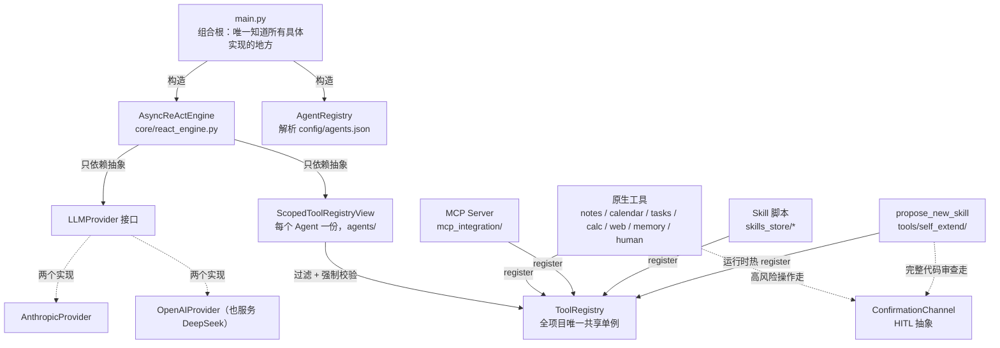
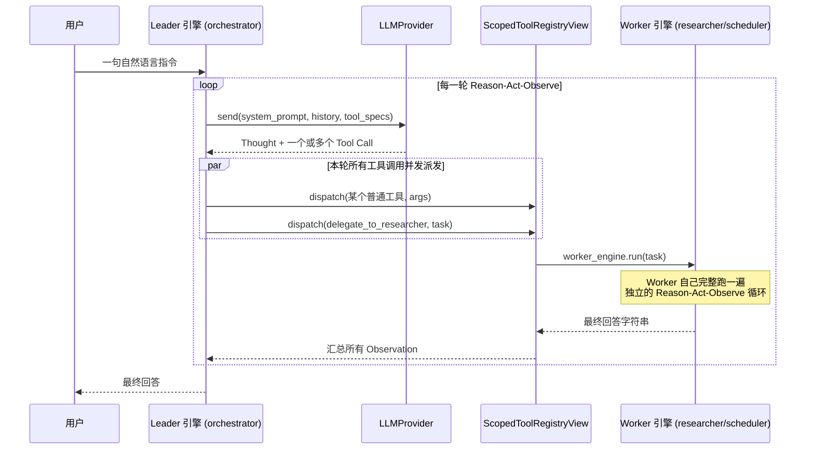

# AuraAgent

一个从零构建的轻量级个人 AI Agent：纯 `asyncio` + 官方 SDK 实现的白盒 ReAct 循环，不依赖 LangChain 等黑盒框架。现已支持 Multi-Agent（Leader-Worker 编排）。

## v1 范围

- **核心异步 ReAct 循环**（`core/react_engine.py`）：Reason → Act → Observe，每一轮的 Thought / Tool Call / Observation 都打印到终端并写入 `logs/session-*.jsonl`。
- **可插拔的 LLM 抽象层**（`providers/`）：`LLMProvider` 接口 + 两个真实实现——`AnthropicProvider`（官方 `anthropic` SDK）和 `OpenAIProvider`（官方 `openai` SDK，走 Chat Completions + Function Calling，同时兼容 OpenAI 和任何 OpenAI 协议兼容的服务，如 DeepSeek，只需切换 `OPENAI_BASE_URL`）。通过 `.env` 里的 `AURA_LLM_PROVIDER` 切换。
- **本地 Markdown 笔记工具**（`tools/notes/`）：`search_notes` / `read_note` / `create_note` / `update_note`，所有文件操作严格限制在 `sandbox/notes/` 内，防止路径穿越。
- **本地 JSON 日历 + Human-in-the-loop 确认**（`tools/calendar/`, `confirmation/`）：`list_calendar_events` / `create_calendar_event` / `update_calendar_event` / `delete_calendar_event`，事件持久化在 `sandbox/calendar/events.json`。删除操作、以及对标记为 `important` 事件的修改，都会通过终端 Y/N 交互确认后才执行；用户拒绝时返回普通 Observation 而不是抛异常。
- **任务清单工具**（`tools/tasks/`）：`create_task` / `list_tasks` / `complete_task` / `delete_task`，持久化模式和日历完全一致（`sandbox/tasks/tasks.json`）；`delete_task` 复用日历那一个 `confirmation_channel` 实例，同样走终端确认。
- **安全计算 + 网页抓取工具**（`tools/calc/`, `tools/web/`）：`calculate`（基于 `ast` 白名单手写解释器求值数学表达式，不用 `eval`/`exec`，抗对抗性输入）、`fetch_url`（httpx 异步抓取网页转纯文本，scheme 白名单 + 超时 + 大小截断；已知局限：不做 SSRF IP 段过滤，也无法绕过需要 JS 执行的反爬挑战页）。
- **跨会话记忆工具**（`tools/memory/`）：`remember_fact` / `recall_facts`，持久化在 `sandbox/memory/facts.json`。拉取式设计——记忆内容不自动注入 system prompt，模型需要主动调用才能读到，避免随记忆条数增长而增加每轮 token 成本。
- **`ask_human` 工具**（`tools/human/`）：让模型能暂停当前任务、向人类提出开放式问题并等待自由文本回答。复用日历/任务工具已有的 `confirmation_channel` 实例——`ConfirmationChannel` 接口在原来的 `confirm()`（Y/N）基础上加了 `ask_open_question()`（自由文本），同一个物理通道，两种响应形态。
- **MCP 客户端**（`mcp_integration/`）：`MCPClientManager` 用官方 `mcp` SDK 通过 stdio 连接 `config/mcp_servers.json` 里配置的 server，把每个 server 上报的工具适配成 `ToolSpec` 注册进同一个共享 `ToolRegistry`（工具名加 `mcp_<server>_` 前缀防冲突）。某个 server 连接失败只会打印警告、跳过，不影响其他 server 或整个程序启动。附带一个零外部依赖的示例 server（`mcp_servers/example_server.py`，两个玩具工具），开箱即用地演示整条链路，不需要 `npx`/联网拉包。
- **Skill 热加载**（`skills/`, `skills_store/`）：`SkillLoader` 扫描 `skills_store/*/SKILL.md`（YAML front matter：`name`/`description`/`input_schema`），为每个 skill 起一个子进程（`sys.executable run.py --args-json '...'`，所有参数统一走一个 JSON blob，不用逐个映射成 CLI flag），捕获 stdout 当 Observation，同样注册进共享 `ToolRegistry`。有超时保护（默认 30s，超时会杀掉子进程），单个 skill 解析/加载失败只跳过它，不影响其他 skill 或程序启动。`skills_store/example_skill/`（`word_count`）是一个真实可跑的示例。
- **细分市场洞察 Skill**（`skills_store/market_*`）：`market_new_products`/`market_tech_trends`/`market_company_moves` 三个 Skill，参数都是一个市场细分名称（比如 `"smartphone"`、`"electric vehicle"`），分别查该细分市场的新产品、新技术、主要公司动态资讯。数据源是 Google News 官方公开 RSS 订阅（不是爬虫），只读 GET、无需 API Key、标准库实现（`urllib`+`xml.etree`，零新增依赖）。挂在 `researcher` worker 的能力列表里。
- **Multi-Agent：Leader-Worker 编排**（`agents/`）：`config/agents.json` 声明一个 leader + N 个 worker（名字/角色 system prompt/`capabilities` 能力白名单，`fnmatch` 模式匹配工具名）。所有 Agent 共享同一个 `ToolRegistry`，各自只能看到并调用 `ScopedToolRegistryView` 按 `capabilities` 过滤出的子集——过滤同时是展示层（`get_tool_specs()`）和强制边界（`dispatch()` 会拒绝越权调用，即使该工具确实存在于共享 registry 里）。每个 Worker 被包装成 Leader 能调用的普通工具 `delegate_to_<name>`（worker-as-tool 模式），只存在于 Leader 自己的视图里，Worker 之间结构性地无法互相委派。`core/react_engine.py` 完全不知道 Multi-Agent 存在——委派就是一次普通的工具调用。Leader 在同一轮里可以并发委派给多个 Worker（`asyncio.gather`，本地 JSON 存储都加了 per-instance 锁应对并发写）。白盒日志的每一行都带 `[agent_name]` 前缀和工具调用的 `call_id`，方便在多 Agent 并发交错的终端输出/JSONL 里按 Agent 和调用配对还原完整轨迹。`SequentialPipelineOrchestrator`/`DebateOrchestrator` 是留好接口的占位（`OrchestrationMode`），本轮只实现 Leader-Worker。
- **对话式 Skill 自我扩展**（`tools/self_extend/`）：只有 `orchestrator` 有的高风险工具 `propose_new_skill`——LLM 判断现有工具/Skill/Worker 都做不到某件事时，自己写一个新 Skill 的完整 `run.py` 代码。结构性问题（非法名字、目录/工具名冲突、代码语法错误）在打扰人之前就拦掉；过了这些检查才会把**完整代码**（不是摘要）连同一份静态扫描警告（正则匹配 `subprocess`/`eval`/`exec`/`socket`/网络请求/文件写入等敏感模式，不是沙箱，只是把人的注意力引导到风险点）一起交给人工审批（复用现有 `ConfirmationChannel.confirm()`，没有新增接口）。批准后写入 `skills_store/<name>/`、调用 `SkillLoader.register_one()` 热注册进共享 `ToolRegistry`，并把新工具名加进 orchestrator 自己那个 `ScopedToolRegistryView` 的可见范围（`add_allowed_pattern()`），当场就能用，不需要重启。拒绝则什么文件都不写。**这段代码执行没有沙箱，权限等同 AuraAgent 本身**——责任在人工审批这一步，务必读代码而不是只看描述。**注意**：`add_allowed_pattern()` 只在当次运行的内存里生效，重启进程后要长期保留这个能力，需要手动把新工具名补进 `config/agents.json` 对应 Agent 的 `capabilities`（`make_pptx` 就是这样被正式收编进来的，见下一条）。
- **`make_pptx`（一个通过自我扩展生成、再正式收编进仓库的真实 Skill）**：`python-pptx` 生成中文友好的 PowerPoint，`orchestrator` 直接可用。留作一个真实案例：Skill 从"对话中被 LLM 提议 → 人工审批 → 临时可用"到"手动补进 `config/agents.json` → 永久可用"的完整路径。过程中还顺带修了一个真实 bug：Windows 上子进程 stdout 走管道（不是真实控制台）时默认不会用 UTF-8，而是退回系统 ANSI codepage（比如中文系统的 GBK），导致任何 Skill 输出的中文在写进 Observation/JSONL 之前就已经被静默损坏成替换字符——不是终端显示问题，是数据本身错了。修复：`SkillLoader` 给子进程的环境变量强制加 `PYTHONIOENCODING=utf-8`。

## 运行方式

```bash
# 1. 安装依赖（建议先建虚拟环境）
python -m venv .venv
.venv\Scripts\activate        # Windows PowerShell: .venv\Scripts\Activate.ps1
pip install -r requirements.txt

# 2. 配置 API Key
copy .env.example .env
# 编辑 .env：
#   使用 Anthropic：AURA_LLM_PROVIDER=anthropic，填 ANTHROPIC_API_KEY
#   使用 DeepSeek（或其他 OpenAI 兼容服务）：
#     AURA_LLM_PROVIDER=openai
#     OPENAI_API_KEY=<你的 key>
#     OPENAI_BASE_URL=https://api.deepseek.com
#     AURA_MODEL_ID=deepseek-chat

# 3. 运行
python main.py
```

启动后进入交互式 REPL,输入自然语言指令即可(如"帮我创建一篇笔记记录今天的会议要点"),输入 `exit` 退出。终端会实时打印每一轮的 Thought / Tool Call / Observation,每一行都带 `[agent_name]` 前缀。

默认的 Agent 团队（编辑 `config/agents.json` 自定义）：`orchestrator`（leader，管笔记/记忆/问人类，能委派给两个 worker）、`researcher`（网页抓取+计算）、`scheduler`（日历+任务）。试试"同时让 researcher 查一下 example.com、让 scheduler 建个任务"这种需要并发委派两个 worker 的指令。

## 运行测试

```bash
pytest
```

测试使用 `FakeLLMProvider`(见 `tests/fakes.py`)驱动 ReAct 引擎,不需要真实 API Key。

## 目录结构

```
AuraAgent/
├── main.py                 # 组合根：装配 ToolRegistry + Leader/Worker 引擎 + REPL 入口
├── config/                 # 配置加载 (pydantic-settings) + agents.json / mcp_servers.json
├── core/                   # ReAct 引擎、日志、异常、消息类型（不依赖任何具体实现）
├── agents/                 # Multi-Agent：AgentDefinition/Registry、ScopedToolRegistryView、编排模式
├── providers/               # LLMProvider 抽象层 + Anthropic 实现
├── tools/                  # ToolRegistry + notes/calendar/tasks/calc/web/memory/human 工具
├── confirmation/            # Human-in-the-loop 确认通道抽象
├── mcp_integration/         # MCP 客户端（真实实现：stdio 连接 + 工具适配）
├── mcp_servers/             # 零外部依赖的示例 MCP server，用于本地验证
├── skills/ skills_store/    # Skill 热加载（真实实现）+ 示例 skill
│                            # tools/self_extend/ 是对话式自我扩展（propose_new_skill）
├── sandbox/                # 所有工具副作用限定于此
├── logs/                   # 白盒执行日志 (JSONL)
└── tests/                  # pytest 单测
```

## AuraAgent 架构设计

### 设计哲学

- **白盒优先**：不用任何"黑盒" Agent 框架（LangChain 之类），从最基础的 ReAct 循环到最上层的 Multi-Agent 编排全部原生实现，建立在官方 SDK 之上。每一轮 Thought / Tool Call / Observation 都被打印到终端、写进 `logs/session-*.jsonl`，可见、可回放、可审计——这是整个项目最早定下、也贯穿始终的第一原则。
- **插件优先 / 严格解耦**：`core/react_engine.py` 是全项目唯一的"引擎"，但它不 import `tools/`、`providers/`、`confirmation/`、`agents/` 下任何具体实现——只依赖几个抽象接口。新增一个工具来源（MCP）、一种能力载体（Skill）、一套编排模式（Multi-Agent）都不需要改引擎一行代码。
- **小步演进，随时可跑**：整个项目是按 Epic（A 记忆/ask_human → B MCP → C Skill → D Multi-Agent → F 自我扩展）一批批加出来的，每一批都独立可运行、有真实测试覆盖、经过真实 LLM 端到端验证后才提交。没有"半成品"状态。
- **安全默认，风险分级处理**：能从架构上消除的风险就消除（`calculate` 用手写 AST 解释器而不是 `eval`，笔记工具强制沙箱路径），不能消除的风险交给人（破坏性操作走 HITL 确认，LLM 自己生成代码必须经过人工审查完整源码才能执行）。

### 分层架构



核心信息：**引擎在最中间，只认接口；三种工具来源 + 一种运行时自我扩展机制，最终都汇流到同一个 `ToolRegistry`**。这个"汇流"设计是整个架构能长期扩展而不腐化的关键——`core/react_engine.py` 从第一行代码到现在，签名和职责完全没变过。

### 核心抽象一览

| 抽象                                    | 定义位置                                             | 职责                                                                                                                                          |
| --------------------------------------- | ---------------------------------------------------- | --------------------------------------------------------------------------------------------------------------------------------------------- |
| `LLMProvider`                         | `providers/base.py`                                | 屏蔽厂商差异（Anthropic 的`tool_use` block vs OpenAI 的 `tool_calls`），引擎只看 provider-neutral 的 `ConversationTurn`/`LLMResponse` |
| `ToolRegistry`                        | `tools/registry.py`                                | 工具的唯一注册表：`register()`/`get_tool_specs()`/`dispatch()`，原生工具、MCP 工具、Skill 全部走同一个 `register()`                   |
| `ScopedToolRegistryView`              | `agents/scoped_tool_registry.py`                   | 每个 Agent 的能力边界：按`capabilities` 过滤 `get_tool_specs()`（展示层），并在 `dispatch()` 里重新校验一遍（强制层）——两者缺一不可   |
| `ConfirmationChannel`                 | `confirmation/base.py`                             | HITL 抽象：`confirm()`（Y/N）+ `ask_open_question()`（自由文本），引擎完全不知道它存在，只有具体工具 handler 会用                         |
| `AgentDefinition` / `AgentRegistry` | `agents/agent_definition.py`/`agent_registry.py` | 解析`config/agents.json`，fail-fast 校验（有且仅有一个 leader、名字唯一合法、能力非空）                                                     |
| `AsyncReActEngine`                    | `core/react_engine.py`                             | 真正的 Reason→Act→Observe 循环本体，全项目状态最少、职责最单一的一个类                                                                      |
| `OrchestrationMode`                   | `agents/orchestration_mode.py`                     | 编排模式的可插拔接口，`LeaderWorkerOrchestrator` 是目前唯一的真实实现                                                                       |

### 一次请求的完整生命周期



几个不直观、但很关键的实现细节：

1. **工具列表不是启动时冻结的**：`registry.get_tool_specs()` 在循环的**每一轮**都重新调用，不是引擎构造时缓存一次——这就是为什么 `propose_new_skill` 批准后新工具**当场**可用、不需要重启进程。
2. **并发不是"多线程"**，是 `asyncio.gather(..., return_exceptions=True)`：一轮里 LLM 如果同时请求好几个工具调用（包括同时委派给多个 Worker），会真的并发跑，其中一个失败也不会牵连其他——这也是本地 JSON 存储（日历/任务/记忆）都要加 `asyncio.Lock` 的原因。
3. **委派 Worker 本质上就是一次普通工具调用**：`delegate_to_researcher` 这个"工具"的 handler 里就是 `await worker_engine.run(task)`——`core/react_engine.py` 全程不知道 Multi-Agent 存在，Worker 的引擎是提前构造好、反复复用的（因为 `run()` 每次都是无状态的局部变量）。

### 白盒可观测性设计

`core/logger.py` 是双写设计：终端用 `rich` 打印彩色面板给人看，同时每一步都写一条结构化 JSON 到 `logs/session-*.jsonl` 给机器/未来的 Web 后端看，两者互不依赖。Multi-Agent 上线后每条记录都带 `agent_name`（顶层字段，不是塞进 payload）和工具调用的 `call_id`——因为多个 Worker 并发跑意味着终端打印顺序不再保证连续，靠这两个字段才能把交错的输出重新按 Agent、按调用配对回放。（这里踩过一个真实的坑：`rich` 默认把字符串里的方括号当成它自己的 markup 语法解析掉，`[agent_name]` 前缀和 `list_tasks` 这类 `- [id] ...` 格式的 Observation 曾经被静默吞掉过，后来统一用 `rich.markup.escape()` 修复。)

### 安全边界设计一览

| 风险点                      | 设计手段                                                                                                                                                                                                |
| --------------------------- | ------------------------------------------------------------------------------------------------------------------------------------------------------------------------------------------------------- |
| 笔记工具文件系统越权        | `tools/notes/path_guard.py` 拒绝绝对路径和 `..` 穿越，越权直接报错而不是静默截断                                                                                                                    |
| 数学表达式注入              | `calculate` 用 `ast` 白名单手写递归解释器，全程不调用 `eval`/`exec`，压根不存在"沙箱逃逸"这个 bug 类别                                                                                          |
| 破坏性操作（删日历/删任务） | `ConfirmationChannel.confirm()` 终端 Y/N 确认，拒绝返回普通 Observation 而不是抛异常                                                                                                                  |
| Agent 越权调用工具          | `ScopedToolRegistryView.dispatch()` 强制重新校验 `capabilities`，不只是在 `get_tool_specs()` 展示层过滤——即使该工具真实存在于共享 registry 里也会被拒绝                                         |
| Worker 互相委派 / 越权升级  | `delegate_to_<worker>` 工具只存在于 Leader 自己的 `extra_tools`，Worker 的视图构造时从不传入，结构性地摸不到                                                                                        |
| LLM 自己生成代码并执行      | `propose_new_skill`：非法名字/目录冲突/工具名冲突/语法错误先拦下来不打扰人；过审后**完整代码**（不是摘要）+ 静态扫描警告一起交给人工审批；批准后执行权限等同 AuraAgent 本身，**没有沙箱** |
| 网页抓取滥用                | `fetch_url` 限制 scheme 白名单（拒绝 `file://`）、超时、响应体大小上限；已知局限不做 SSRF 的 IP 段过滤                                                                                              |
| 并发写本地 JSON 存储        | 日历/任务/记忆三个 provider 各自一把`asyncio.Lock`，锁住整个方法体而不只是写操作                                                                                                                      |

### 可扩展性：加一个新能力要改哪些文件

这是"插件优先"原则的直接体现——下表每一行都不需要碰 `core/react_engine.py`：

| 想加什么                                     | 需要改的地方                                                                                                                                         |
| -------------------------------------------- | ---------------------------------------------------------------------------------------------------------------------------------------------------- |
| 一个新的原生工具                             | 新建`tools/<name>/`，在 `main.py` 里调一次 `register_x_tools(registry, ...)`                                                                   |
| 一个新的 MCP Server                          | 只改`config/mcp_servers.json`，加一条 `{"name", "command", "args"}`                                                                              |
| 一个新的 Skill                               | 只加`skills_store/<name>/`（`SKILL.md` + `run.py`），启动时自动扫描发现；或者让 LLM 通过 `propose_new_skill` 在对话中自己提议                |
| 一个新的 Agent（含定位、能力、可选新 Skill） | 只改`config/agents.json`，加一条 worker 声明                                                                                                       |
| 一种新的编排模式                             | 实现`agents/orchestration_mode.py` 的 `OrchestrationMode` 接口（`SequentialPipelineOrchestrator`/`DebateOrchestrator` 已经是留好的真实占位） |

## 路标

当前是一个更大的路标的一部分（完整技术方案见本次规划会话的 Claude Code 计划文件）：

| Epic | 内容                                                                                       | 状态           |
| ---- | ------------------------------------------------------------------------------------------ | -------------- |
| A    | 记忆工具 +`ask_human`                                                                    | ✅ 已完成      |
| B    | MCP`stdio` 客户端真实连接 + 工具动态注册                                                 | ✅ 已完成      |
| C    | Skill 热加载真实实现（解析`SKILL.md`）                                                   | ✅ 已完成      |
| D    | Multi-Agent 基础设施 + Leader-Worker 编排（进程内，`worker-as-tool` 模式，并发工具派发） | ✅ 已完成      |
| F    | 对话式 Skill 自我扩展（`propose_new_skill` + 人工代码审批 + 热加载）                     | ✅ 已完成      |
| E    | 其他编排模式、FastAPI 封装、Google Calendar OAuth、A2A 协议对外互通、MCP 自我扩展          | 更远期，仅占位 |
