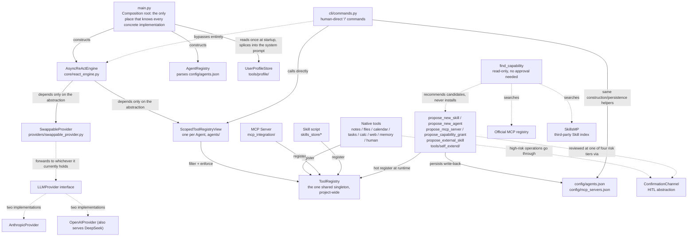
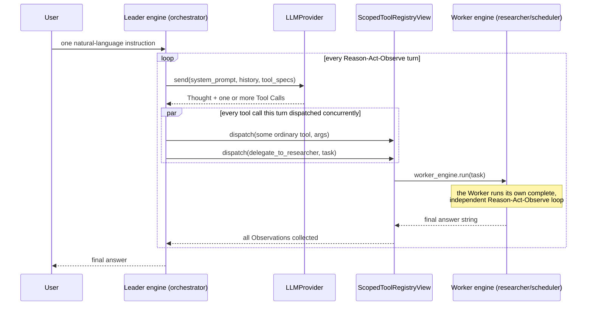

# AuraAgent

**[中文文档](README-cn.md)**

A lightweight personal AI Agent built from scratch: a white-box ReAct loop implemented in pure `asyncio` + official SDKs, with no LangChain-style black-box framework. Now supports Multi-Agent (Leader-Worker orchestration).

## v1 Scope

- **Core async ReAct loop** (`core/react_engine.py`): Reason → Act → Observe. Every turn's Thought / Tool Call / Observation is printed to the terminal and written to `logs/session-*.jsonl`.
- **Pluggable LLM abstraction layer** (`providers/`): the `LLMProvider` interface plus two real implementations — `AnthropicProvider` (official `anthropic` SDK) and `OpenAIProvider` (official `openai` SDK, using Chat Completions + Function Calling; also works with any OpenAI-compatible service such as DeepSeek by just switching `OPENAI_BASE_URL`). Switched via `AURA_LLM_PROVIDER` in `.env`.
- **Local Markdown note tools** (`tools/notes/`): `search_notes` / `read_note` / `create_note` / `update_note`, with all file access strictly confined to `sandbox/notes/` to prevent path traversal. The sandbox-validation function `resolve_within_sandbox()` now lives in `tools/sandbox_path.py` (it used to be `tools/notes/path_guard.py` — it was never actually notes-specific, it was just historically in the wrong place; it moved once `tools/files/` needed the exact same logic).
- **General local file management** (`tools/files/`): eight tools — `list_directory`/`read_file`/`write_file`/`delete_file`/`move_file`/`copy_file`/`get_file_info`/`search_files` — for any file beyond notes. Unlike the other sandboxes, this one's root **can be pointed at a user's real working directory via `AURA_WORKSPACE_ROOT` in `.env`** (defaults to `sandbox/workspace/`) — the boundary (`resolve_within_sandbox()`) itself is never removable, only its location is configurable. `delete_file` always asks for human confirmation; `move_file`/`copy_file` only ask when the destination **already exists and would be overwritten** — moving something to a brand-new location never bothers a human, the same confirmation principle `delete_task` already established. Owned by `orchestrator` (the same category of "local resource management" as note-taking).
- **Local JSON calendar + human-in-the-loop confirmation** (`tools/calendar/`, `confirmation/`): `list_calendar_events` / `create_calendar_event` / `update_calendar_event` / `delete_calendar_event`, persisted to `sandbox/calendar/events.json`. Deletions, and modifications to events flagged `important`, always pause for a terminal Y/N confirmation first; a decline returns a plain Observation rather than raising an exception.
- **Task list tools** (`tools/tasks/`): `create_task` / `list_tasks` / `complete_task` / `delete_task`, using the exact same persistence pattern as the calendar (`sandbox/tasks/tasks.json`); `delete_task` reuses the calendar's own `confirmation_channel` instance, going through the same terminal confirmation.
- **Safe calculation + web-fetching tools** (`tools/calc/`, `tools/web/`): `calculate` (a hand-written `ast`-whitelist interpreter for evaluating math expressions — no `eval`/`exec`, resistant to adversarial input); `fetch_url` (httpx async page fetch converted to plain text, scheme allowlist + timeout + size truncation; known limitation: no SSRF IP-range filtering, and it can't get past anti-bot challenge pages that need JS execution). The same module also has two more general network tools: `http_request` (`GET`/`POST`/`PUT`/`PATCH`/`DELETE` + custom headers/body, for submitting forms or calling JSON APIs that `fetch_url` can't handle) and `download_file` (streams a URL's content **into the same workspace sandbox `tools/files/` uses**, not an arbitrary path, with its own more generous `download_max_bytes` size cap, well above the text-oriented `fetch_url_max_bytes`). Both are owned by `researcher`, alongside `fetch_url`. Verified against real network calls: a real small public file downloaded into the sandbox, and a real POST to `httpbin.org` with a custom header, with the echoed content checked. Deliberately NOT built: a general shell/command-execution tool (an arbitrary command can't be "reviewed once, reused many times" the way `propose_new_skill`'s code can — the risk isn't tractable, so anything command-shaped should go through a specific Skill instead), and native browser automation (routed instead through `find_capability` → `propose_mcp_server` to install an existing Playwright/Puppeteer MCP server, rather than adding a browser binary dependency to this project).
- **Cross-session memory tools** (`tools/memory/`): `remember_fact` / `recall_facts`, persisted to `sandbox/memory/facts.json`. Pull-based by design — memory content is never auto-injected into the system prompt; the model must actively call the tool to read it, which keeps per-turn token cost from growing as the memory count grows. (This is a deliberate complementary design to the user profile below, not two implementations of the same thing.)
- **Structured, auto-injected user profile** (`tools/profile/`): the "push" counterpart to `remember_fact`/`recall_facts`'s "pull" design — `update_user_profile` writes `preferences`/`habits`/`common_topics`/`notes` into `sandbox/memory/user_profile.json` (same JSON + `asyncio.Lock` pattern), but `main.py` reads it once at startup and **splices it directly into the orchestrator's system prompt** — the model doesn't need to call anything to "know" the user. List fields are merged and deduplicated; `notes` is appended rather than replaced, so one call never wipes out what's already accumulated. The trade-off is explicit: the profile is always present, but only reflects the latest update after the next process restart (`AsyncReActEngine.system_prompt` was already a fixed string set at construction time, not re-read every turn) — in exchange the model "just knows who you are" without ever needing an explicit recall. Verified with two separate real DeepSeek process runs: the first calls `update_user_profile` and confirms the file merges correctly on disk; the second is a fresh process that, without calling any tool, recites the profile straight from its system prompt.
- **`ask_human` tool** (`tools/human/`): lets the model pause the current task, ask the user an open-ended question, and wait for a free-text answer. Reuses the same `confirmation_channel` instance the calendar/task tools already have — the `ConfirmationChannel` interface adds `ask_open_question()` (free text) alongside the original `confirm()` (Y/N), one physical channel, two response shapes.
- **MCP client** (`mcp_integration/`): `MCPClientManager` uses the official `mcp` SDK to connect over stdio to the servers configured in `config/mcp_servers.json`, adapting each server's advertised tools into a `ToolSpec` and registering them into the same shared `ToolRegistry` (tool names get an `mcp_<server>_` prefix to avoid collisions). A server that fails to connect just logs a warning and is skipped — it never blocks other servers or startup itself. Ships with a zero-external-dependency example server (`mcp_servers/example_server.py`, two toy tools) that demonstrates the whole pipeline out of the box, no `npx`/network package pull required.
- **Skill hot-loading** (`skills/`, `skills_store/`): `SkillLoader` scans `skills_store/*/SKILL.md` (YAML front matter: `name`/`description`/`input_schema`), spawns a subprocess per skill (`sys.executable run.py --args-json '...'` — every argument goes through a single JSON blob rather than being mapped to individual CLI flags), captures stdout as the Observation, and registers it into the same shared `ToolRegistry`. Timeout-protected (30s default, the subprocess gets killed on timeout); a skill that fails to parse/load is just skipped, without affecting any other skill or startup itself. `skills_store/example_skill/` (`word_count`) is a real, runnable example.
- **Market-segment insight Skills** (`skills_store/market_*`): three Skills — `market_new_products`/`market_tech_trends`/`market_company_moves` — each taking a single market-segment name (e.g. `"smartphone"`, `"electric vehicle"`) and looking up recent new-product, new-technology, and major-company news respectively for that segment. The data source is Google News' official public RSS subscription (not scraping) — read-only GET, no API key required, stdlib implementation (`urllib`+`xml.etree`, zero new dependencies). Attached to the `researcher` worker's capability list.
- **Multi-Agent: Leader-Worker orchestration** (`agents/`): `config/agents.json` declares one leader + N workers (name/role/system prompt/`capabilities` allowlist, `fnmatch` patterns against tool names). All Agents share the same `ToolRegistry`; each can only see and call the subset a `ScopedToolRegistryView` filters by `capabilities` — the filtering is both a display layer (`get_tool_specs()`) and an enforcement boundary (`dispatch()` rejects an out-of-scope call even if the tool genuinely exists in the shared registry). Each Worker is wrapped into an ordinary tool the Leader can call, `delegate_to_<name>` (the worker-as-tool pattern), existing only in the Leader's own view — Workers are structurally unable to delegate to each other. `core/react_engine.py` has zero awareness that Multi-Agent exists at all. The Leader can delegate to multiple Workers concurrently within the same turn (`asyncio.gather`; every local JSON store has a per-instance lock to handle concurrent writes). Every line of white-box logging carries an `[agent_name]` prefix and the tool call's `call_id`, so an interleaved terminal/JSONL trace from concurrent Workers can be reconstructed per-Agent, per-call. `SequentialPipelineOrchestrator`/`DebateOrchestrator` are real, wired-up placeholders (`OrchestrationMode`) — this round only implements Leader-Worker.
- **Runtime self-extension (three self-extension tools, three risk tiers)** (`tools/self_extend/`): a family of high-risk tools only `orchestrator` has, all following the same flow — structural pre-checks (never bother a human) → **full content** (never a summary) handed to a human for approval (reusing the same `ConfirmationChannel.confirm()`, no new interface) → on approval, hot-activation **and** a persisted write-back to the relevant config file (still there after a restart).

  - `propose_new_skill` (`risk_level=code_execution`): when the LLM judges that no existing tool/Skill/Worker can do something, it writes the complete `run.py` source for a brand-new Skill itself. Illegal names, directory/tool-name collisions, and syntax errors are all rejected up front; once past those checks, the full code is shown alongside a static-scan warning list (regex matches for `subprocess`/`eval`/`exec`/`socket`/network calls/file writes and similarly sensitive patterns — not a sandbox, just something to point a human's attention at). On approval it's written to `skills_store/<name>/` and hot-registered via `SkillLoader.register_one()`. **This code runs with no sandbox, at the same permissions as AuraAgent itself** — the responsibility sits entirely at the human-approval step, so actually read the code, not just the description.
  - `propose_new_agent` (`risk_level=scope_expansion`): when the LLM judges an ongoing (not one-off) new team role is needed, it proposes a new worker — just a system prompt and a `capabilities` allowlist, no new code, and it can only reach **already-existing** tools. The human-review screen lists exactly which real tools each proposed `capabilities` pattern actually resolves to, so an overly broad grant (e.g. `"*"`) that "looks narrow but isn't" doesn't slip past unnoticed. On approval it immediately constructs a `ScopedToolRegistryView`/`AsyncReActEngine` and wraps it into a `delegate_to_<name>` tool added to the Leader's own `extra_tools` (`agents/agent_builder.py` factors out this construction logic so both this path and the future human-direct CLI command can reuse it).
  - `propose_mcp_server` (`risk_level=arbitrary_execution`, the riskiest of the three): the LLM proposes connecting a brand-new external MCP server package. **There's no code to read** — approval here means trusting the command/package itself rather than reviewing specific behavior, so the review text is deliberately weightier. The LLM may only report the **names** of needed environment variables (e.g. `BRAVE_API_KEY`); the actual values are typed directly by the human via `ConfirmationChannel.ask_open_question()`, never passing through the LLM's context or getting logged.

  All three, once approved, persist their write-back to `config/agents.json` / `config/mcp_servers.json` (new `agents/agent_config_writer.py`, `mcp_integration/mcp_config_writer.py` — JSON file + `asyncio.Lock` guarding concurrent writes, the same pattern retrofitted onto `propose_new_skill` too) — this closes a real gap an earlier version had: `grant_access` used to only take effect in memory, so `make_pptx` "disappeared" after a restart once approved, and was only discovered and worked around by manually editing `config/agents.json` (see the next bullet). Now all three tools share the same persistence infrastructure, fixed once.

  Real end-to-end verification of `propose_mcp_server` also turned up and fixed a real concurrency bug: a self-extension tool call runs inside its own **independent asyncio Task**, spawned by `core/react_engine.py`'s concurrent dispatch, while `anyio`'s cancel scopes require entering and exiting from the exact same Task — the old `MCPClientManager`, having connected a server from that scenario, would raise `RuntimeError: Attempted to exit cancel scope in a different task than it was entered in` at process shutdown. Fixed by routing every connect/close operation through one persistent "owner task" (commands passed via an `asyncio.Queue`), so it's safe regardless of which Task the caller is running in.
- **Autonomous discovery: `find_capability` + two new gated install tools** (`tools/self_extend/capability_search.py`, `find_capability_tool.py`, `propose_capability_grant_tool.py`, `propose_external_skill_tool.py`): all three self-extension tools above require "already knowing what to install" — this fills in the "finding" step. `find_capability` is read-only, never asks a human, and never installs anything; given a natural-language `intent`, it checks three places in order: (1) the **full shared `ToolRegistry`** (not just the subset the calling Agent's `capabilities` filter would show it — this is how it discovers something already installed but not yet granted to it); (2) the **official MCP registry** (`registry.modelcontextprotocol.io`, backed by Anthropic/GitHub/Microsoft, no-auth queries — the real response shape was pulled and verified before writing this, keeping only entries with a `packages` array and `transport.type=stdio` npm/pypi entries, since this project's `MCPClientManager` only implements stdio — an HTTP/SSE "remote" entry, however suitable, still can't be installed here); (3) **SkillsMP** (`skillsmp.com`, a third-party aggregator indexing public GitHub repos' `SKILL.md` files, anonymous queries, no key needed). Each candidate type maps to an **existing** or **new** install path: an internal hit → the new `propose_capability_grant` (`risk_level=capability_grant`, the lightest of the four tiers — the code being granted access to was already installed and reviewed, this just adds it to `capabilities`, so the review text is much shorter than the other three); an MCP hit → **directly reuses the existing `propose_mcp_server`**, since `find_capability` has already translated the registry's package info into a `command`/`args`/`env_keys_needed` ready to pass straight in — zero new install code; a SkillsMP hit → the new `propose_external_skill` (`risk_level=code_execution`, the same tier as `propose_new_skill`), which — because SkillsMP gives a GitHub folder link rather than a zip package — fetches the raw `SKILL.md`+`run.py` text directly via GitHub's official raw-content API, then converges with every other install path onto the same `skills/skill_package.py::stage_skill_install()`/`finalize_skill_install()` (this logic, along with the zip validation that used to live at `cli/skill_package.py`, moved under the `skills/` package, since it's no longer CLI-exclusive — `propose_external_skill` needs the exact same "structural pre-check" too). **"Autonomous" stops right there**: before anything is actually installed, all three paths still go through human confirmation — none of them bypass approval, consistent with every self-extension this project has ever shipped.

  Running all three paths for real turned up a genuine ecosystem mismatch, not a guessed one: an arbitrarily-picked `nano-pdf` candidate's GitHub folder **contained only a `SKILL.md`, no `run.py` at all** — because SkillsMP indexes the broader "Agent Skills" ecosystem (the `SKILL.md` convention shared by Claude/Codex, which is fundamentally plain-text instructions meant for a model to read, possibly referencing a separately-installed external CLI), which isn't the same thing as AuraAgent's own, narrower convention that a Skill must be an executable `run.py` callable via `--args-json`. Most SkillsMP hits will probably fail structurally at this exact step — that's not a bug, it's just two different definitions of "Skill" — `propose_external_skill` now gives a clear, specific message ("this is most likely an instruction-only Skill with no executable code, and can't be installed here") instead of a bare 404.
- **`make_pptx` (a real Skill generated via self-extension, then formally adopted into the repo)**: `python-pptx`-based, generates a Chinese-friendly PowerPoint deck, directly available to `orchestrator`. Kept as a real case study of a Skill's full path from "proposed by the LLM mid-conversation → human-approved → available for the session" to "available permanently" (that path is now fully automatic, no longer needing a manual edit to `config/agents.json`). Along the way this also fixed a real bug: on Windows, a child process's stdout piped through (not a real console) doesn't default to UTF-8, falling back to the system ANSI codepage (e.g. GBK on a Chinese-locale install) instead — any Chinese text a Skill printed was silently corrupted into replacement characters before it ever reached the Observation/JSONL, not merely a terminal-display glitch, the underlying data itself was wrong. Fixed by forcing `PYTHONIOENCODING=utf-8` into the subprocess's environment in `SkillLoader`.
- **Human-direct CLI command layer** (`cli/`): a line in the REPL starting with `/` **never** becomes a user message sent to the orchestrator — `dispatch_command()` intercepts and handles it directly. This is a deliberate **second channel**, parallel to "LLM-proposal + human-approval" (`tools/self_extend/`), serving the same underlying capabilities (add/remove a team member, install a Skill), just triggered by a human instead of an LLM — so it skips the "approval" half of "structural pre-check → human approval" (the human typing the command already IS the reviewer), while reusing the exact same construction/persistence helpers (`agents/agent_builder.py`, `agents/agent_config_writer.py`) so the two channels never drift into inconsistent behavior. Commands **never touch** `core/react_engine.py`, the LLM, or `logs/session-*.jsonl` — this is precisely why `/config set-key` is safe: the API key typed in only ever reaches `.env` and an in-memory dict, never anything that logs or shows content to the LLM.

  - `/config` [`use <provider> <model_id>` | `set-key <provider>`]: view/switch provider+model (key masked on display), masked input to save/update an API key (stdlib `getpass`, `.env` writes reuse the already-installed `python-dotenv`'s `set_key()`). Switching relies on the new `providers/swappable_provider.py`: every engine (the Leader, every Worker, and any new Worker built later by `propose_new_agent`/`/agents add`) holds the exact **same** `SwappableProvider` instance rather than a concrete provider object, so `/config use` just swaps which concrete provider this one shared object currently points at, no need to touch each engine individually.
  - `/agents` [`add` | `remove <name>`]: view/add/remove team members. `add` interactively collects `name`/`system_prompt`/`capabilities`, reusing the exact same `agents/agent_builder.ensure_worker_name_available()` `propose_new_agent` already factored out for construction + collision checks, and still asks for one final human confirmation (guarding against a typo, not against LLM overreach).
  - `/skills` [`load <url>` | `install <local_path>`]: view installed Skills; install a Skill package (`.zip`, containing `SKILL.md`+`run.py`) either downloaded from a URL or from a local file. Validation (`skills/skill_package.py`) rejects an invalid zip, path traversal (zip-slip), an ambiguous structure (more than one candidate top-level folder), with a 5MB size cap; the **full code** plus static-scan warnings are printed for a human to review, at the exact same review intensity as `propose_new_skill` — the **source** being an external download/upload rather than LLM-generated on the spot is not license to lower the bar.
  - All three commands, once approved, go through the same hot-registration + persistence path (`agents/agent_config_writer.py`/`mcp_integration/mcp_config_writer.py`) as the self-extension tools, still there after a restart.

## Running It

```bash
# 1. Install dependencies (a virtual environment is recommended)
python -m venv .venv
.venv\Scripts\activate        # Windows PowerShell: .venv\Scripts\Activate.ps1
pip install -r requirements.txt

# 2. Configure an API key
copy .env.example .env
# Edit .env:
#   Using Anthropic: AURA_LLM_PROVIDER=anthropic, fill in ANTHROPIC_API_KEY
#   Using DeepSeek (or another OpenAI-compatible service):
#     AURA_LLM_PROVIDER=openai
#     OPENAI_API_KEY=<your key>
#     OPENAI_BASE_URL=https://api.deepseek.com
#     AURA_MODEL_ID=deepseek-chat

# 3. Run
python main.py
```

After it starts you're in an interactive REPL — just type natural-language instructions (e.g. "create a note summarizing today's meeting"), and type `exit` to quit. The terminal prints each turn's Thought / Tool Call / Observation in real time, every line prefixed with `[agent_name]`.

The default Agent team (customize via `config/agents.json`): `orchestrator` (leader — manages notes/memory/asking the user, can delegate to two workers), `researcher` (web fetching + calculation), `scheduler` (calendar + tasks). Try something like "have researcher look up example.com while scheduler creates a task" to see concurrent delegation to two workers in action.

## Running Tests

```bash
pytest
```

Tests drive the ReAct engine with `FakeLLMProvider` (see `tests/fakes.py`) and need no real API key.

## Directory Structure

```
AuraAgent/
├── main.py                 # Composition root: wires up ToolRegistry + Leader/Worker engines + REPL entry point
├── config/                 # Config loading (pydantic-settings) + agents.json / mcp_servers.json
├── core/                   # ReAct engine, logging, exceptions, message types (no dependency on any concrete implementation)
├── agents/                 # Multi-Agent: AgentDefinition/Registry, ScopedToolRegistryView, orchestration modes
├── cli/                    # Human-direct "/" command layer (/help /config /agents /skills), bypasses the engine/LLM entirely
├── providers/               # LLMProvider abstraction + Anthropic/OpenAI implementations + SwappableProvider (runtime switching)
├── tools/                  # ToolRegistry + sandbox_path.py (shared sandbox guard) + notes/files/calendar/tasks/calc/web/memory/human/profile tools
├── confirmation/            # Human-in-the-loop confirmation channel abstraction
├── mcp_integration/         # MCP client (real implementation: stdio connection + tool adaptation)
├── mcp_servers/             # Zero-external-dependency example MCP server, for local verification
├── skills/ skills_store/    # Skill hot-loading (real implementation) + skill_package.py (zip validation/install, shared by the CLI and propose_external_skill)
│                            # tools/self_extend/ is runtime self-extension + autonomous discovery:
│                            #   propose_new_skill / propose_new_agent / propose_mcp_server
│                            #   find_capability (read-only discovery) / propose_capability_grant / propose_external_skill
│                            # agents/agent_config_writer.py, mcp_integration/mcp_config_writer.py
│                            #   are the persistence write-back (JSON + asyncio.Lock), shared by all six self-extension tools
├── sandbox/                # Every tool's side effects are confined here
├── logs/                   # White-box execution logs (JSONL)
└── tests/                  # pytest unit tests
```

## AuraAgent Architecture

### Design Philosophy

- **White-box first**: no "black-box" Agent framework (LangChain and the like) — everything from the most basic ReAct loop up to top-level Multi-Agent orchestration is implemented natively, built directly on official SDKs. Every Thought / Tool Call / Observation is printed to the terminal and written to `logs/session-*.jsonl` — visible, replayable, auditable. This was the project's very first principle, and it's held throughout.
- **Plugin-first / strict decoupling**: `core/react_engine.py` is the project's one and only "engine," yet it never imports any concrete implementation under `tools/`, `providers/`, `confirmation/`, or `agents/` — only a handful of abstract interfaces. Adding a new tool source (MCP), a new capability carrier (Skill), or a new orchestration scheme (Multi-Agent) never requires touching a single line of the engine.
- **Small increments, always runnable**: the whole project was built up Epic by Epic (A memory/ask_human → B MCP → C Skill → D Multi-Agent → F self-extension round 1 → H self-extension round 2 → I CLI command layer → J user profile → K autonomous discovery → L local files + network enhancements), each batch independently runnable, with real test coverage, and only committed after real LLM end-to-end verification. No "half-finished" states.
- **Secure by default, risk-tiered handling**: risk that can be eliminated architecturally is eliminated (`calculate` uses a hand-written AST interpreter instead of `eval`; note tools enforce a sandboxed path); risk that can't be eliminated is handed to a human (destructive operations go through HITL confirmation; LLM-generated code must pass a human review of the full source before it can ever run).

### Layered Architecture



The core idea: **the engine sits at the center and only knows interfaces; four tool sources (native/MCP/Skill/self-extension) all converge on the same `ToolRegistry`, and the CLI command layer is the one bypass path that never goes through the engine**. This "convergence" design is what lets the whole architecture keep expanding without rotting — `core/react_engine.py`'s signature and responsibilities haven't changed since its very first line.

### Per-Module Architecture

The diagram above is the whole-system view; this section goes module-by-module, by directory, covering internal structure and design rationale — the `v1 Scope` section above says "what this module can do," this one says "what it looks like inside, and why it's split this way."

| Module                                                                            | Key Files                                                                                                                                                                                                                     | Architecture Notes                                                                                                                                                                                                                                                                                                                                                                                                                                                                                                                                                                                                                                                                                                                                                                |
| --------------------------------------------------------------------------------- | ----------------------------------------------------------------------------------------------------------------------------------------------------------------------------------------------------------------------------- | --------------------------------------------------------------------------------------------------------------------------------------------------------------------------------------------------------------------------------------------------------------------------------------------------------------------------------------------------------------------------------------------------------------------------------------------------------------------------------------------------------------------------------------------------------------------------------------------------------------------------------------------------------------------------------------------------------------------------------------------------------------------------------- |
| **`core/`** (engine core)                                                 | `react_engine.py`, `message_types.py`, `logger.py`, `exceptions.py`                                                                                                                                                   | The project's one and only "engine" — imports no concrete implementation, only cares about the interface shape of`LLMProvider`/`ToolRegistry` (structural/duck typing — `ScopedToolRegistryView` just needs to satisfy it structurally, no shared base class needed). `AsyncReActEngine` itself is nearly stateless — `run()`'s `history` is a fresh local variable on every call — so the same engine instance can be safely reused across multiple concurrent `delegate_to_<worker>` calls.                                                                                                                                                                                                                                                                   |
| **`providers/`** (LLM abstraction)                                        | `base.py` (`LLMProvider` ABC), `anthropic_provider.py`, `openai_provider.py`, `swappable_provider.py`                                                                                                               | Each concrete provider is independently responsible for translating provider-neutral`ConversationTurn`/`ToolSpec` into its own vendor's wire format (`tool_use` blocks vs. `tool_calls`), with no awareness of the other. `SwappableProvider` is a layer of indirection added later — `main.py` constructs exactly one instance, shared by every engine (Leader/Worker/any Worker built later); `/config use` just swaps which concrete provider that one object currently points at.                                                                                                                                                                                                                                                                              |
| **`agents/`** (Multi-Agent orchestration)                                 | `agent_definition.py`/`agent_registry.py`, `scoped_tool_registry.py`, `delegate_tool.py`, `agent_builder.py`, `agent_config_writer.py`, `leader_worker_orchestrator.py`/`orchestration_mode.py`               | Declarative config (`AgentRegistry.load()`) is kept separate from mutable runtime state (`add_worker`/`remove_worker`); `ScopedToolRegistryView` is simultaneously a display layer and an enforcement layer; `agent_builder.py` factors "construct a Worker engine + wrap it as a delegate tool" into a single function shared by both the `propose_new_agent` and `/agents add` trigger paths, so they never end up as two independently-drifting copies.                                                                                                                                                                                                                                                                                                          |
| **`tools/registry.py`** (shared tool registry)                            | the`ToolRegistry` class                                                                                                                                                                                                     | The one convergence point in the whole architecture:`register()`/`get_tool_specs()`/`dispatch()` — native tools, MCP tools, Skills, and anything newly installed via self-extension all go through the exact same calls, and once registered are indistinguishable from each other — which is also why `ScopedToolRegistryView`'s filtering logic never needs to know where a tool came from.                                                                                                                                                                                                                                                                                                                                                                           |
| **`tools/self_extend/`** (four-tier self-extension + read-only discovery) | `propose_skill_tool.py`/`propose_agent_tool.py`/`propose_mcp_tool.py`/`propose_capability_grant_tool.py`/`propose_external_skill_tool.py`, `find_capability_tool.py`+`capability_search.py`, `code_review.py` | The five "propose_*" install/grant tools share one shape: structural pre-check (never bother a human) → full content handed to a human for approval (`ConfirmationChannel.confirm()`) → on approval, hot-register + persist. Risk is tiered across four levels, light to heavy (`capability_grant` < `code_execution` < `scope_expansion` < `arbitrary_execution`), with the review text's tone escalating with the tier rather than a one-size-fits-all approach. `find_capability` is the one exception in this group — pure read-only search, never touches `ConfirmationChannel`; whatever it finds gets handed to the matching propose_* tool for normal review. `code_review.py` is a purely regex-based "look here first" static scan, not a sandbox. |
| **`cli/`** (human-direct command layer)                                   | `commands.py` (`dispatch_command`'s main dispatch), `context.py` (`CLIContext` dependency bundle), `skill_package.py` (external Skill package validation)                                                           | A second trigger channel parallel to`tools/self_extend/`, serving the same underlying capabilities (add/remove an Agent, install a Skill), reusing the exact same helpers (`agents/agent_builder.py`/`agent_config_writer.py`, etc.), but triggered by a human rather than an LLM, so it skips the "approval" step (the human is already the reviewer). Command parsing uses `partition` (not `shlex`), so a Windows path's backslashes never get swallowed as escape characters.                                                                                                                                                                                                                                                                                       |
| **`confirmation/`** (HITL abstraction)                                    | `base.py` (the `ConfirmationChannel` interface), `terminal_channel.py` (the terminal implementation)                                                                                                                    | `confirm()` (Y/N) and `ask_open_question()` (free text) share the same physical channel; `asyncio.to_thread` wraps the blocking `input()` call so it never stalls the event loop. The engine never imports this module at all — only specific tool handlers use it.                                                                                                                                                                                                                                                                                                                                                                                                                                                                                                      |
| **`mcp_integration/`** (MCP client)                                       | `mcp_client_manager.py`, `mcp_tool_adapter.py`, `mcp_config_writer.py`                                                                                                                                                  | `MCPClientManager` internally serializes every connect/close operation through one persistent "owner task" + an `asyncio.Queue` — a design that came out of fixing a real bug (a self-extension tool call connecting a server from its own independent Task, then an `anyio` cancel-scope error crossing Tasks at process exit), not something that was there from day one.                                                                                                                                                                                                                                                                                                                                                                                                |
| **`skills/` + `skills_store/`** (Skill system)                          | `skill_loader.py`, `skill_schema.py`, `skills_store/*/` (data, not code)                                                                                                                                                | Every Skill is its own subprocess (`sys.executable run.py --args-json '...'`), with all arguments going through one JSON blob rather than being mapped to individual CLI flags; `PYTHONIOENCODING=utf-8` forced into the subprocess environment fixes a real Chinese-output-corruption bug on Windows; `registered_skill_names` is a list `SkillLoader` maintains itself, since the shared `ToolRegistry` itself has no notion of "is this tool a Skill."                                                                                                                                                                                                                                                                                                               |
| **`tools/memory/` + `tools/profile/`** (dual-track memory)              | `memory_store.py`/`memory_tool.py` (pull-based), `user_profile_store.py`/`user_profile_tool.py` (push-based)                                                                                                          | Deliberately built as two complementary mechanisms with different trade-offs, not two implementations of the same thing:`remember_fact`/`recall_facts` never enters the system prompt and requires the model to actively query it; the user profile is read once at startup and spliced directly into the system prompt, so the model "knows" the user without calling any tool — the cost is that a profile update only shows up in the currently-running system prompt after the next restart. Both use the same JSON-file + `asyncio.Lock` persistence pattern.                                                                                                                                                                                                         |
| **Native business tools**                                                   | `tools/notes/`, `tools/files/`, `tools/calendar/`, `tools/tasks/`, `tools/calc/`, `tools/web/`, `tools/human/`                                                                                                  | Each subpackage exposes exactly one`register_x_tools(registry, ...)` function, called only by `main.py`, with no cross-imports between them. `calendar`/`tasks`/`files` share the same `confirmation_channel` instance; `notes`/`files` both enforce sandboxed paths via `tools/sandbox_path.py` (each pointed at a different sandbox root — `files`'s can be redirected to a real working directory via `AURA_WORKSPACE_ROOT`); `calc` is a hand-written AST-whitelist interpreter that never calls `eval`/`exec`.                                                                                                                                                                                                                                  |
| **`config/`** (config loading)                                            | `settings.py` (`pydantic-settings`), `agents.json`, `mcp_servers.json`                                                                                                                                                | `settings.py` is the one and only place in the project that reads `.env`/environment variables — every other module only ever receives already-parsed fields off the `Settings` object; `agents.json`/`mcp_servers.json` serve as both declarative startup config and the landing spot for runtime persistence write-backs from self-extension tools and CLI commands — the same file, two different write paths.                                                                                                                                                                                                                                                                                                                                                     |

### Core Abstractions at a Glance

| Abstraction                             | Defined In                                           | Responsibility                                                                                                                                                                                         |
| --------------------------------------- | ---------------------------------------------------- | ------------------------------------------------------------------------------------------------------------------------------------------------------------------------------------------------------ |
| `LLMProvider`                         | `providers/base.py`                                | Shields vendor differences (Anthropic's`tool_use` blocks vs. OpenAI's `tool_calls`) — the engine only ever sees provider-neutral `ConversationTurn`/`LLMResponse`                             |
| `ToolRegistry`                        | `tools/registry.py`                                | The one tool registry:`register()`/`get_tool_specs()`/`dispatch()` — native tools, MCP tools, and Skills all go through the same `register()`                                                 |
| `ScopedToolRegistryView`              | `agents/scoped_tool_registry.py`                   | Each Agent's capability boundary: filters`get_tool_specs()` by `capabilities` (display layer), and re-validates again inside `dispatch()` (enforcement layer) — neither one alone is sufficient |
| `ConfirmationChannel`                 | `confirmation/base.py`                             | The HITL abstraction:`confirm()` (Y/N) + `ask_open_question()` (free text); the engine has no idea it exists, only specific tool handlers use it                                                   |
| `AgentDefinition` / `AgentRegistry` | `agents/agent_definition.py`/`agent_registry.py` | Parses`config/agents.json`, fail-fast validation (exactly one leader, unique valid names, non-empty capabilities)                                                                                    |
| `AsyncReActEngine`                    | `core/react_engine.py`                             | The actual Reason→Act→Observe loop itself — the class with the least state and the single most focused responsibility in the whole project                                                          |
| `OrchestrationMode`                   | `agents/orchestration_mode.py`                     | The pluggable interface for orchestration schemes;`LeaderWorkerOrchestrator` is currently the only real implementation                                                                               |

### The Full Lifecycle of One Request



A few implementation details that aren't obvious but matter a lot:

1. **The tool list is never frozen at startup**: `registry.get_tool_specs()` is called fresh on **every single turn** of the loop, not cached once at engine-construction time — this is exactly why a newly-approved `propose_new_skill` tool is usable **immediately**, with no process restart needed.
2. **Concurrency isn't "multithreading"** — it's `asyncio.gather(..., return_exceptions=True)`: if the LLM requests several tool calls in one turn (including delegating to multiple Workers at once), they genuinely run concurrently, and one failing never takes the others down with it — which is also why every local JSON store (calendar/tasks/memory) needs its own `asyncio.Lock`.
3. **Delegating to a Worker is, underneath, just an ordinary tool call**: the handler behind the "tool" `delegate_to_researcher` is literally `await worker_engine.run(task)` — `core/react_engine.py` has zero awareness that Multi-Agent exists at all, and the Worker's engine is constructed once ahead of time and reused repeatedly (safe because `run()`'s state is always a fresh local variable per call).

### White-Box Observability Design

`core/logger.py` is a dual-write design: the terminal gets colorful `rich` panels for humans, while every single step also writes one structured JSON line to `logs/session-*.jsonl` for machines/a future web backend — the two are entirely independent of each other. Since Multi-Agent shipped, every record also carries `agent_name` (a top-level field, not buried in the payload) and the tool call's `call_id` — because multiple Workers running concurrently means the terminal's print order is no longer guaranteed to stay contiguous, and these two fields are what let an interleaved trace be reconstructed per-Agent, per-call. (A real bug was hit here: `rich` by default treats square brackets in a string as its own markup syntax and silently swallows them — the `[agent_name]` prefix, and `list_tasks`-style `- [id] ...` Observations, were both getting eaten before this was fixed uniformly with `rich.markup.escape()`.)

### Security Boundaries at a Glance

| Risk                                                            | Mitigation                                                                                                                                                                                                                                                                                                                                                                                              |
| --------------------------------------------------------------- | ------------------------------------------------------------------------------------------------------------------------------------------------------------------------------------------------------------------------------------------------------------------------------------------------------------------------------------------------------------------------------------------------------- |
| Notes/general-file tools escaping the filesystem sandbox        | `tools/sandbox_path.py::resolve_within_sandbox()` rejects absolute paths and `..` traversal, raising a clear error rather than silently truncating; `tools/notes/` and `tools/files/` share the exact same logic, each pointed at a different sandbox root                                                                                                                                      |
| Math-expression injection                                       | `calculate` uses a hand-written recursive AST-whitelist interpreter, never calling `eval`/`exec` — the whole "sandbox escape" bug category simply doesn't exist here                                                                                                                                                                                                                             |
| Destructive operations (deleting a calendar event/task)         | `ConfirmationChannel.confirm()`, a terminal Y/N confirmation; a decline returns a plain Observation rather than raising                                                                                                                                                                                                                                                                               |
| An Agent calling an out-of-scope tool                           | `ScopedToolRegistryView.dispatch()` forcibly re-validates `capabilities`, not just filtering at the `get_tool_specs()` display layer — even a tool that genuinely exists in the shared registry gets rejected                                                                                                                                                                                    |
| Workers delegating to each other / privilege escalation         | The`delegate_to_<worker>` tool only ever exists in the Leader's own `extra_tools`; a Worker's view is never constructed with it — structurally unreachable, not merely omitted by convention                                                                                                                                                                                                       |
| The LLM generating and running its own code                     | `propose_new_skill` (`risk_level=code_execution`): illegal names/directory collisions/tool-name collisions/syntax errors are all rejected before a human is ever bothered; past those checks, the **full code** (never a summary) plus static-scan warnings go to a human for approval; on approval it runs with the same permissions as AuraAgent itself, **with no sandbox**          |
| The LLM expanding its own team's reach                          | `propose_new_agent` (`risk_level=scope_expansion`): a new Agent can only ever reach **already-existing** tools, never new code; the review screen lists exactly which real tools each `capabilities` pattern resolves to, so an overly broad grant (e.g. `"*"`) is visible at a glance                                                                                                    |
| The LLM launching an arbitrary external command                 | `propose_mcp_server` (`risk_level=arbitrary_execution`, the riskiest): no code to read, approval means trusting the command/package itself; environment variable **values** can only ever be typed directly by a human, never through the LLM's context or a log                                                                                                                              |
| The LLM quietly expanding which tools it can call               | `propose_capability_grant` (`risk_level=capability_grant`, the lightest of the four tiers): installs no new code at all, just adds an already-installed, already-reviewed tool to `capabilities`; still goes through human confirmation rather than auto-approving, because `capabilities` is itself the enforcement boundary — quietly widening it without a human's knowledge is a real risk |
| The LLM installing a Skill from an untrusted third-party source | `propose_external_skill` (`risk_level=code_execution`, the same tier as `propose_new_skill`): the review text explicitly flags "this comes from the third-party aggregator SkillsMP, not an official source" — never dressing up external code as equally trustworthy as an official one; structural pre-checks reuse `skills/skill_package.py`, the exact same rules                          |
| Web-fetching abuse                                              | `fetch_url`/`http_request` enforce a scheme allowlist (rejecting `file://`), a timeout, and a response-body size cap; known limitation: no SSRF IP-range filtering                                                                                                                                                                                                                                |
| Downloading a file to an arbitrary path                         | `download_file`'s destination path also goes through `resolve_within_sandbox()`, landing in the exact same workspace sandbox `tools/files/` uses — never an arbitrary local path; it has its own `download_max_bytes` cap (more generous than the text-oriented `fetch_url_max_bytes`, since a download is usually a real file)                                                              |
| Arbitrary local command execution                               | **This capability is simply not provided, architecturally** — there is no general shell/command-execution tool; anything command-shaped is routed to `propose_new_skill` instead (a specific, single-purpose script with its full code reviewed by a human), rather than opening a backdoor that would require re-reviewing an arbitrary command on every single call                          |
| Concurrent writes to local JSON storage                         | Each of the calendar/task/memory providers has its own`asyncio.Lock`, guarding the entire method body, not just the write itself; the runtime persistence write-backs to `config/agents.json`/`config/mcp_servers.json` each have their own lock too                                                                                                                                              |

### Extensibility: Which Files to Touch to Add a New Capability

The direct embodiment of "plugin-first" — not one row in the table below ever needs to touch `core/react_engine.py`:

| What You Want to Add                                                  | Where to Change It                                                                                                                                                                                                                                        |
| --------------------------------------------------------------------- | --------------------------------------------------------------------------------------------------------------------------------------------------------------------------------------------------------------------------------------------------------- |
| A new native tool                                                     | Create`tools/<name>/`, call `register_x_tools(registry, ...)` once in `main.py`                                                                                                                                                                     |
| A new MCP Server                                                      | Just edit`config/mcp_servers.json`, adding one `{"name", "command", "args"}` entry; or have the LLM propose it itself mid-conversation via `propose_mcp_server` (human approval + manually filling in environment-variable values)                  |
| A new Skill                                                           | Just add`skills_store/<name>/` (`SKILL.md` + `run.py`) — auto-discovered on the next scan; or have the LLM propose it itself mid-conversation via `propose_new_skill`; or a human installs an external Skill package directly with `/skills load |
| A new Agent (with its own role, capabilities, optionally a new Skill) | Just edit`config/agents.json`, adding one worker declaration; or have the LLM propose it itself mid-conversation via `propose_new_agent` (capabilities can only come from already-existing tools); or a human uses `/agents add` directly           |
| A new orchestration scheme                                            | Implement the`OrchestrationMode` interface in `agents/orchestration_mode.py` (`SequentialPipelineOrchestrator`/`DebateOrchestrator` are already real, wired-up placeholders)                                                                      |

## Roadmap

| Epic | Content                                                                                                                                                                                                                                          | Status                        |
| ---- | ------------------------------------------------------------------------------------------------------------------------------------------------------------------------------------------------------------------------------------------------ | ----------------------------- |
| A    | Memory tools +`ask_human`                                                                                                                                                                                                                      | ✅ Done                       |
| B    | Real MCP`stdio` client connection + dynamic tool registration                                                                                                                                                                                  | ✅ Done                       |
| C    | Real Skill hot-loading implementation (parsing`SKILL.md`)                                                                                                                                                                                      | ✅ Done                       |
| D    | Multi-Agent infrastructure + Leader-Worker orchestration (in-process, worker-as-tool pattern, concurrent tool dispatch)                                                                                                                          | ✅ Done                       |
| F    | Conversational Skill self-extension (`propose_new_skill` + human code review + hot-loading)                                                                                                                                                    | ✅ Done                       |
| H    | Self-extension round 2 (`propose_new_agent` + `propose_mcp_server`) + the persistence write-back infrastructure all three share                                                                                                              | ✅ Done                       |
| I    | Human-direct CLI command layer:`/help` `/config` `/agents` `/skills` (configure the API, manage the team, install an external Skill)                                                                                                     | ✅ Done                       |
| J    | User profile: a structured user profile auto-injected into the system prompt (distinct from`remember_fact`'s pull-based recall)                                                                                                                | ✅ Done                       |
| K    | Autonomous discovery:`find_capability` (three-way search across internal/official MCP registry/SkillsMP) + `propose_capability_grant` + `propose_external_skill`                                                                           | ✅ Done                       |
| L    | Local control round 1: general file management (`tools/files/`, configurable workspace sandbox) + network enhancements (`http_request`/`download_file`); deliberately no general shell tool, browser automation routed through MCP instead | ✅ Done                       |
| L2   | System/desktop control (clipboard, screenshots, process management, notifications, etc.) — design sketch already on file, dependencies and cross-platform details await their own planning round                                                | Deferred, future roadmap      |
| G    | PM-capability team expansion: new`user_researcher`/`analyst` Agents + `make_docx`/`make_html_report` + sandboxing for report output                                                                                                      | Deferred, future roadmap      |
| E    | Other orchestration modes, a FastAPI wrapper, Google Calendar OAuth, A2A protocol interop                                                                                                                                                        | Further out, placeholder only |
