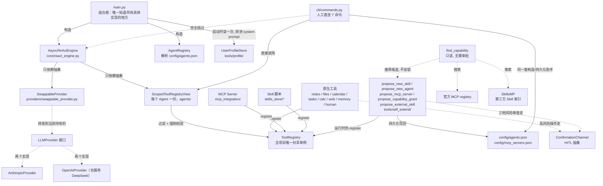
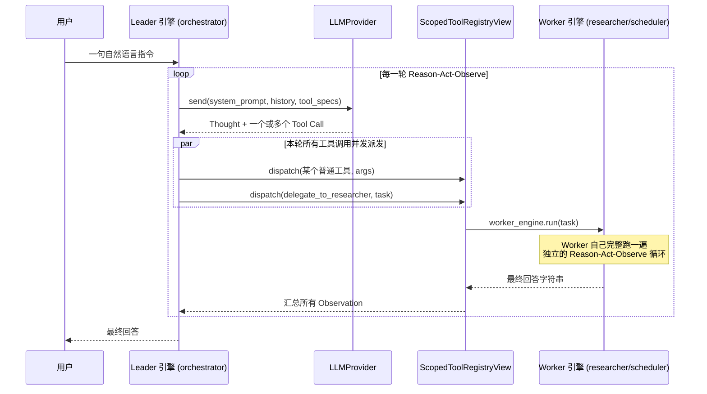

# AuraAgent —— 技术架构文档

**[English](ARCHITECTURE.md)** · **[← 返回通俗版 README](../README-cn.md)**

这是顶层 [README](../README-cn.md) 的工程配套文档——每个模块、每个抽象、每条安全边界、每个设计决策，都是给贡献者/维护者看的详细版本。如果你想了解"AuraAgent 是什么、怎么用"，请先看 README；这份文档默认你已经知道它为什么存在，只是想搞清楚它是怎么造出来的。

一个从零构建的轻量级个人 AI Agent：纯 `asyncio` + 官方 SDK 实现的白盒 ReAct 循环，不依赖 LangChain 等黑盒框架。现已支持 Multi-Agent（Leader-Worker 编排）。

## v1 范围（完整技术细节）

- **核心异步 ReAct 循环**（`core/react_engine.py`）：Reason → Act → Observe，每一轮的 Thought / Tool Call / Observation 都打印到终端并写入 `logs/session-*.jsonl`。
- **可插拔的 LLM 抽象层**（`providers/`）：`LLMProvider` 接口 + 两个真实实现——`AnthropicProvider`（官方 `anthropic` SDK）和 `OpenAIProvider`（官方 `openai` SDK，走 Chat Completions + Function Calling，同时兼容 OpenAI 和任何 OpenAI 协议兼容的服务，如 DeepSeek，只需切换 `OPENAI_BASE_URL`）。通过 `.env` 里的 `AURA_LLM_PROVIDER` 切换。
- **本地 Markdown 笔记工具**（`tools/notes/`）：`search_notes` / `read_note` / `create_note` / `update_note`，所有文件操作严格限制在 `sandbox/notes/` 内，防止路径穿越。沙盒校验函数 `resolve_within_sandbox()` 现在住在 `tools/sandbox_path.py`（原来在 `tools/notes/path_guard.py`——它本来就跟"notes"无关，只是历史上放错了地方，`tools/files/` 需要同一份逻辑时顺手搬了家）。
- **通用本地文件管理**（`tools/files/`）：`list_directory`/`read_file`/`write_file`/`delete_file`/`move_file`/`copy_file`/`get_file_info`/`search_files` 八个工具，管的是笔记之外的任意文件。跟其它 sandbox 不同的是，这个沙盒根**可以通过 `.env` 里的 `AURA_WORKSPACE_ROOT` 改指向用户真实的工作目录**（默认 `sandbox/workspace/`）——边界（`resolve_within_sandbox()`）本身从不取消，只是位置可配置。`delete_file` 始终要人工确认；`move_file`/`copy_file` 只在目的路径**已经存在、会被覆盖**时才确认，平移到一个新位置不用打扰人——跟 `delete_task` 的确认原则一脉相承。挂给 `orchestrator`（跟笔记管理是同一类"本地资源操作"）。
- **本地 JSON 日历 + Human-in-the-loop 确认**（`tools/calendar/`, `confirmation/`）：`list_calendar_events` / `create_calendar_event` / `update_calendar_event` / `delete_calendar_event`，事件持久化在 `sandbox/calendar/events.json`。删除操作、以及对标记为 `important` 事件的修改，都会通过终端 Y/N 交互确认后才执行；用户拒绝时返回普通 Observation 而不是抛异常。
- **任务清单工具**（`tools/tasks/`）：`create_task` / `list_tasks` / `complete_task` / `delete_task`，持久化模式和日历完全一致（`sandbox/tasks/tasks.json`）；`delete_task` 复用日历那一个 `confirmation_channel` 实例，同样走终端确认。
- **安全计算 + 网页抓取工具**（`tools/calc/`, `tools/web/`）：`calculate`（基于 `ast` 白名单手写解释器求值数学表达式，不用 `eval`/`exec`，抗对抗性输入）、`fetch_url`（httpx 异步抓取网页转纯文本，scheme 白名单 + 超时 + 大小截断；已知局限：不做 SSRF IP 段过滤，也无法绕过需要 JS 执行的反爬挑战页）。同一个模块里还有两个更通用的网络工具：`http_request`（`GET`/`POST`/`PUT`/`PATCH`/`DELETE` + 自定义 headers/body，`fetch_url` 做不到的提交表单/调用 JSON API 场景）、`download_file`（把 URL 内容**流式写进 `tools/files/` 的同一个 workspace 沙盒**，不是任意路径，单独有一档 `download_max_bytes` 大小上限，比纯文本的 `fetch_url_max_bytes` 宽松得多）。两者都挂给 `researcher`，跟 `fetch_url` 同一归属。真实网络验证过：真实下载一个公开小文件落进沙盒、真实对 `httpbin.org` 发一次带自定义 header 的 POST 并核对回显内容。刻意没做的：通用 Shell/命令执行工具（任意命令没法像 `propose_new_skill` 那样"审查一次、复用多次"，风险不可控，需要就引导写一个具体的 Skill）、原生浏览器自动化（引导通过 `find_capability`→`propose_mcp_server` 装一个现成的 Playwright/Puppeteer MCP server，不往项目里加浏览器二进制依赖）。
- **跨会话记忆工具**（`tools/memory/`）：`remember_fact` / `recall_facts`，持久化在 `sandbox/memory/facts.json`。拉取式设计——记忆内容不自动注入 system prompt，模型需要主动调用才能读到，避免随记忆条数增长而增加每轮 token 成本。（跟下面的用户画像是刻意设计成两种不同取舍的互补机制，不是同一个东西的两份实现。）
- **结构化、自动注入的用户画像**（`tools/profile/`）：跟 `remember_fact`/`recall_facts`"拉取式"相反的"推送式"设计——`update_user_profile` 把 `preferences`/`habits`/`common_topics`/`notes` 写进 `sandbox/memory/user_profile.json`（同样是 JSON + `asyncio.Lock`），但 `main.py` 启动时会读一次并**直接拼进 orchestrator 的 system prompt**，模型不需要调用任何工具就"认识"用户。列表字段合并去重、`notes` 追加而不是覆盖，避免一次调用抹掉之前积累的内容。取舍很直接：画像默认常驻但只在进程重启后反映最新一次更新（`AsyncReActEngine.system_prompt` 本来就是构造时固定的一个字符串，不是每轮重新读的），换来的是"模型天然记得你是谁"而不需要每次显式 recall——已用真实 DeepSeek 两次独立进程运行验证：第一次调用 `update_user_profile` 并确认文件正确合并写入，第二次全新进程、不调用任何工具，模型直接从 system prompt 里复述出画像内容。
- **`ask_human` 工具**（`tools/human/`）：让模型能暂停当前任务、向人类提出开放式问题并等待自由文本回答。复用日历/任务工具已有的 `confirmation_channel` 实例——`ConfirmationChannel` 接口在原来的 `confirm()`（Y/N）基础上加了 `ask_open_question()`（自由文本），同一个物理通道，两种响应形态。
- **MCP 客户端**（`mcp_integration/`）：`MCPClientManager` 用官方 `mcp` SDK 通过 stdio 连接 `config/mcp_servers.json` 里配置的 server，把每个 server 上报的工具适配成 `ToolSpec` 注册进同一个共享 `ToolRegistry`（工具名加 `mcp_<server>_` 前缀防冲突）。某个 server 连接失败只会打印警告、跳过，不影响其他 server 或整个程序启动。附带一个零外部依赖的示例 server（`mcp_servers/example_server.py`，两个玩具工具），开箱即用地演示整条链路，不需要 `npx`/联网拉包。另外也真实接入了一个第三方包——Anthropic 官方的 `@modelcontextprotocol/server-filesystem`（需要机器上装好 Node.js/`npx`；`config/mcp_servers.json` 里加一条指向 `workspace_root` 当前目录的配置就够了，授权给 `orchestrator` 时用的是单条通配符 `"mcp_filesystem_*"`，照抄 `propose_mcp_server` 自己已经确立的 `grant_access(f"mcp_{name}_*")` 先例，不逐个列举它 13+ 个工具名）。它允许访问的目录是配置写入那一刻的静态快照，不跟可切换的 `workspace_root` 联动——之后跑 `/workspace set` 并不会带着它一起换，要跟着换得手动改 `config/mcp_servers.json` 再重启。还有一点值得知道：`adapt_and_register()` 把每个 MCP 工具直接注册进 registry，完全没有接 `ConfirmationChannel`（确认逻辑是每个原生工具自己包一层，比如 `calendar_tool.py`，不在通用的 MCP 适配层里）——所以 `mcp_filesystem_write_file`/`edit_file`/`move_file`/`create_directory` 全都是无确认直接执行，跟原生 `tools/files/` 里对应工具"危险操作会问一句"的行为不一样（这个 server 本身没有删除文件的工具，是 reference 实现自己的安全考虑）。orchestrator 的 system prompt 引导它默认优先用原生文件工具，只有在需要原生工具做不到的能力时才用 MCP 版本：`edit_file` 的精确模式匹配局部编辑，和 `directory_tree` 一次性拿到的递归目录树。
- **Skill 热加载**（`skills/`, `skills_store/`）：`SkillLoader` 扫描 `skills_store/*/SKILL.md`（YAML front matter：`name`/`description`/`input_schema`），为每个 skill 起一个子进程（`sys.executable run.py --args-json '...'`，所有参数统一走一个 JSON blob，不用逐个映射成 CLI flag），捕获 stdout 当 Observation，同样注册进共享 `ToolRegistry`。有超时保护（默认 30s，超时会杀掉子进程），单个 skill 解析/加载失败只跳过它，不影响其他 skill 或程序启动。`skills_store/example_skill/`（`word_count`）是一个真实可跑的示例。
- **细分市场洞察 Skill**（`skills_store/market_*`）：`market_new_products`/`market_tech_trends`/`market_company_moves` 三个 Skill，参数都是一个市场细分名称（比如 `"smartphone"`、`"electric vehicle"`），分别查该细分市场的新产品、新技术、主要公司动态资讯。数据源是 Google News 官方公开 RSS 订阅（不是爬虫），只读 GET、无需 API Key、标准库实现（`urllib`+`xml.etree`，零新增依赖）。挂在 `researcher` worker 的能力列表里。
- **Multi-Agent：Leader-Worker 编排**（`agents/`）：`config/agents.json` 声明一个 leader + N 个 worker（名字/角色 system prompt/`capabilities` 能力白名单，`fnmatch` 模式匹配工具名）。所有 Agent 共享同一个 `ToolRegistry`，各自只能看到并调用 `ScopedToolRegistryView` 按 `capabilities` 过滤出的子集——过滤同时是展示层（`get_tool_specs()`）和强制边界（`dispatch()` 会拒绝越权调用，即使该工具确实存在于共享 registry 里）。每个 Worker 被包装成 Leader 能调用的普通工具 `delegate_to_<name>`（worker-as-tool 模式），只存在于 Leader 自己的视图里，Worker 之间结构性地无法互相委派。`core/react_engine.py` 完全不知道 Multi-Agent 存在——委派就是一次普通的工具调用。Leader 在同一轮里可以并发委派给多个 Worker（`asyncio.gather`，本地 JSON 存储都加了 per-instance 锁应对并发写）。白盒日志的每一行都带 `[agent_name]` 前缀和工具调用的 `call_id`，方便在多 Agent 并发交错的终端输出/JSONL 里按 Agent 和调用配对还原完整轨迹。`SequentialPipelineOrchestrator`/`DebateOrchestrator` 是留好接口的占位（`OrchestrationMode`），本轮只实现 Leader-Worker。
- **运行时自我扩展（三个自我扩展工具，风险分三档）**（`tools/self_extend/`）：只有 `orchestrator` 有权限用的高风险工具族，统一走同一套流程——结构性预检查（不打扰人）→ **完整内容**（不是摘要）交给人工审批（复用同一个 `ConfirmationChannel.confirm()`，没有新增接口）→ 批准后当场热生效 **并且** 持久化写回对应的 config 文件（重启进程后依然可用）。

  - `propose_new_skill`（`risk_level=code_execution`）：LLM 判断现有工具/Skill/Worker 都做不到某件事时，自己写一个新 Skill 的完整 `run.py` 代码。非法名字、目录/工具名冲突、代码语法错误先拦掉；过审后完整代码连同一份静态扫描警告（正则匹配 `subprocess`/`eval`/`exec`/`socket`/网络请求/文件写入等敏感模式，不是沙箱，只是引导人的注意力）一起展示。批准后写入 `skills_store/<name>/`、`SkillLoader.register_one()` 热注册。**这段代码执行没有沙箱，权限等同 AuraAgent 本身**——责任在人工审批这一步，务必读代码而不是只看描述。
  - `propose_new_agent`（`risk_level=scope_expansion`）：LLM 判断需要一个长期存在的新团队角色（不是单次任务）时，提议一个新 worker——只有 system prompt 和一份 `capabilities` 白名单，不写新代码，只能触达**已存在**的工具。人工审批界面会把每条 `capabilities` pattern 实际解析到哪些真实工具**列出来**，避免"看起来窄、其实很宽"的授权（比如 `"*"`）被忽略过去。批准后当场构造 `ScopedToolRegistryView`/`AsyncReActEngine`，包装成 `delegate_to_<name>` 工具挂进 Leader 自己的 `extra_tools`（`agents/agent_builder.py` 抽出这段构造逻辑，供这里和未来的人工直连命令复用）。
  - `propose_mcp_server`（`risk_level=arbitrary_execution`，三者里风险最高）：LLM 提议连接一个全新的外部 MCP server 包。**没有代码可读**——人工审批是在信任这个命令/包本身而非审查具体行为，审批文案因此专门加重警示。LLM 只能报环境变量的**名字**（如 `BRAVE_API_KEY`），实际值由人工通过 `ConfirmationChannel.ask_open_question()` 直接输入，绝不经过 LLM 的上下文、也不写进日志。

  三者批准后都会持久化写回 `config/agents.json` / `config/mcp_servers.json`（新增 `agents/agent_config_writer.py`、`mcp_integration/mcp_config_writer.py`，JSON 文件 + `asyncio.Lock` 保护并发写，同一套模式也补进了 `propose_new_skill`）——这修复了早期版本一个真实缺口：`grant_access` 曾经只在内存里生效，`make_pptx` 被批准后重启就"消失"过，靠手动补 `config/agents.json` 才发现并绕过（见下一条）；现在三个工具共用同一套持久化基础设施，一次修好。

  真实端到端验证 `propose_mcp_server` 时还顺带发现并修了一个真实并发 bug：自我扩展工具调用发生在 `core/react_engine.py` 并发派发生成的**独立 asyncio Task** 里，而 `anyio` 的 cancel scope 要求进入和退出必须在同一个 Task——旧版 `MCPClientManager` 在这种场景下连接服务器后，进程退出时会抛 `RuntimeError: Attempted to exit cancel scope in a different task than it was entered in`。修复：把所有连接/关闭操作都路由到一个常驻的 "owner task"（通过 `asyncio.Queue` 传递指令），无论调用方身处哪个 Task 都能安全操作。
- **自主发现能力：`find_capability` + 两个新的受限安装工具**（`tools/self_extend/capability_search.py`、`find_capability_tool.py`、`propose_capability_grant_tool.py`、`propose_external_skill_tool.py`）：以上三个自我扩展工具都要求"已经知道要装什么"——这一条补的是"找"。`find_capability` 只读、不问人、不装任何东西，按自然语言 `intent` 依次查三处：(1) **完整共享 `ToolRegistry`**（不只是当前 Agent 被 `capabilities` 过滤后看到的子集，用来发现"已装但未授权给我"的工具）；(2) **官方 MCP registry**（`registry.modelcontextprotocol.io`，Anthropic/GitHub/Microsoft 背书，免鉴权查询——真实拉取过响应确认字段结构，只保留有 `packages` 数组、`transport.type=stdio` 的 npm/pypi 条目，因为本项目的 `MCPClientManager` 只实现了 stdio，HTTP/SSE 的"remote"条目再合适也装不了）；(3) **SkillsMP**（`skillsmp.com`，第三方聚合站，索引公开 GitHub 仓库里的 `SKILL.md`，匿名查询免 Key）。三类候选各自对应一条**已有**或**新增**的安装路径：内部命中 → 新增的 `propose_capability_grant`（`risk_level=capability_grant`，四档里最轻的一档——授权的代码早就装过、审查过了，只是把它加进 `capabilities`，审批文案因此比另外三个短很多）；MCP 命中 → **直接复用现成的 `propose_mcp_server`**，`find_capability` 已经把 registry 返回的包信息翻译成可以直接填进去的 `command`/`args`/`env_keys_needed`，零新增安装代码；SkillsMP 命中 → 新增的 `propose_external_skill`（`risk_level=code_execution`，跟 `propose_new_skill` 同档），因为 SkillsMP 给的是一个 GitHub 文件夹链接而不是 zip 包，所以直接用 GitHub 官方 raw content 接口取 `SKILL.md`+`run.py` 原文，取到之后跟其他安装路径汇合到同一套 `skills/skill_package.py::stage_skill_install()`/`finalize_skill_install()`（这段逻辑连同 `cli/skill_package.py` 原有的 zip 校验一起搬到了 `skills/` 包下，不再是 CLI 专属，因为 `propose_external_skill` 也要用同一套"结构预检查"）。**"自动"到此为止**：真正落地安装前，三条路径全部走人工确认，没有一条绕过审批——跟这个项目至今为止每一次自我扩展的原则一致。

  真实端到端跑通三条路径时，SkillsMP 那条发现了一个真实的生态差异，不是猜的：随手挑的 `nano-pdf` 候选，GitHub 上那个文件夹**只有一个 `SKILL.md`，没有 `run.py`**——因为 SkillsMP 索引的是更广义的"Agent Skills"生态（Claude/Codex 通用的 `SKILL.md` 约定，本质是给模型读的纯文本指令，可能引用一个需要另外安装的外部 CLI），跟 AuraAgent 自己"Skill 必须是一个能被 `--args-json` 调用的可执行 `run.py`"这个更窄的约定不是一回事。多数 SkillsMP 命中大概率都会在这一步结构性失败，这不是 bug，是两种"Skill"定义本来就不同——`propose_external_skill` 现在会给出明确提示（"这多半是个纯指令型 Skill，没有可执行代码，装不了"）而不是甩一个干巴巴的 404。
- **`make_pptx`（一个通过自我扩展生成、再正式收编进仓库的真实 Skill）**：`python-pptx` 生成中文友好的 PowerPoint，`orchestrator` 直接可用。留作一个真实案例：Skill 从"对话中被 LLM 提议 → 人工审批 → 临时可用"到"永久可用"的完整路径（这条路径现在是全自动持久化，不再需要手动补 `config/agents.json`）。过程中还顺带修了一个真实 bug：Windows 上子进程 stdout 走管道（不是真实控制台）时默认不会用 UTF-8，而是退回系统 ANSI codepage（比如中文系统的 GBK），导致任何 Skill 输出的中文在写进 Observation/JSONL 之前就已经被静默损坏成替换字符——不是终端显示问题，是数据本身错了。修复：`SkillLoader` 给子进程的环境变量强制加 `PYTHONIOENCODING=utf-8`。
- **人工直连 CLI 命令层**（`cli/`）：REPL 里以 `/` 开头的一行**不会**变成发给 orchestrator 的用户消息，而是被 `dispatch_command()` 直接拦下处理——这是跟"LLM 提议 + 人工审批"（`tools/self_extend/`）并列的**第二条通道**，服务同一批底层能力（新增/移除团队成员、安装 Skill），只是触发者是人、不是 LLM，所以跳过"结构性预检查 → 人工审批"里的审批一环（人已经是审批者本身），但复用完全相同的构造/持久化辅助函数（`agents/agent_builder.py`、`agents/agent_config_writer.py`），两条通道不会走出两套不一致的行为。命令**完全不经过** `core/react_engine.py`、LLM 或 `logs/session-*.jsonl`——这是 `/config set-key` 的安全性所在：输入的 API Key 只会进 `.env` 和一个内存字典，不会被任何会记录/展示给 LLM 的东西碰到。

  - `/config` [`use <provider> <model_id>` | `set-key <provider>`]：查看/切换 provider+model（Key 打码显示）、掩码输入并保存/更新 API Key（标准库 `getpass`，`.env` 写入复用已有依赖 `python-dotenv` 的 `set_key()`）。切换生效依赖新增的 `providers/swappable_provider.py`：所有引擎（Leader、每个 Worker、以及 `propose_new_agent`/`/agents add` 建的新 Worker）持有的都是**同一个** `SwappableProvider` 实例而不是具体 provider 对象，`/config use` 换的是这一个共享对象内部指向的具体 provider，不需要逐个引擎去改。
  - `/agents` [`add` | `remove <name>`]：查看/新增/移除团队成员。`add` 交互式收集 `name`/`system_prompt`/`capabilities`，构造+碰撞检查复用 `propose_new_agent` 抽出来的同一份 `agents/agent_builder.ensure_worker_name_available()`，最终仍会请人确认一次（防误输入，不是防 LLM 越权）。
  - `/skills` [`load <url>` | `install <local_path>`]：查看已安装 Skill；从网页链接下载或本地文件安装一个 Skill 包（`.zip`，含 `SKILL.md`+`run.py`）。校验（`skills/skill_package.py`）拒绝非法 zip、路径穿越（zip-slip）、结构不明确（顶层不止一个候选目录）的包，5MB 大小上限；**完整代码**+静态扫描警告一起打印给人看，审查强度跟 `propose_new_skill` 完全一致——代码的**来源**是外部下载/上传而不是 LLM 现场生成，不代表可以降低审查标准。
  - 三个命令批准后走的都是同一套热注册+持久化路径（`agents/agent_config_writer.py`/`mcp_integration/mcp_config_writer.py`），跟自我扩展工具一样重启后依然生效。
- **GUI 后端第一阶段（M1）：共享组合根 + WebSocket 传输**（`core/bootstrap.py`, `gui/`）：迈向图形化 App（设计参考 Claude Code/Workbuddy，CLI/GUI 功能一致是硬约束）的第一步，纯后端，还没有前端。把 `main.py` 里"装配所有工具/Agent/自我扩展工具"那整块逻辑原样抽成 `core/bootstrap.py::build_app_context(settings, confirmation_channel, logger) -> AppContext`——这个函数完全不知道终端或 WebSocket 的存在，只负责装配。`main.py` 和新增的 `gui/server.py` 调用的是**同一个**函数；不管从哪个前端新装的能力，落地的都是同一个 `ToolRegistry`/`config/agents.json`，这就是"功能一致"在架构上被强制保证，而不是靠记性。做到这一步之前先做了两个更小的重构：`core/logger.py::AuraLogger` 从"每个 `log_*` 方法里硬编码打印终端+写 JSONL"改成一个 `LogSink` 抽象类（`write(event) -> None`，绝不能阻塞）+ 一个 sink 列表，`AuraLogger` 依次喂给每个 sink——`TerminalSink`/`JSONLSink` 原样复刻旧行为，新增的 `WebSocketSink` 用 `asyncio.Queue` 缓冲事件再异步 drain 出去，因为 `AsyncReActEngine` 调 `log_*` 是同步调用、没有 `await`；`ConfirmationChannel`（已有的抽象，接口没改）多了第二个真实实现 `WebSocketConfirmationChannel`，用标准的"按 `request_id` 存一堆 pending `asyncio.Future`"模式，把一次 `confirmation_request`/`confirmation_response` 在同一条 WebSocket 上的往返，变成 `confirm()`/`ask_open_question()` 能直接 `await` 的东西——`ask_open_question()` 的回答两个实现都依然刻意不写日志，因为这是 `propose_mcp_server` 用来收集环境变量密钥值的通道。顺带修了一个真实存在的缺口：`AuraLogger.log_confirmation()` 这个方法早就写好了，但之前没有任何地方调用过——确认决定在 `logs/session-*.jsonl` 里一直是不可见的；现在两个 `ConfirmationChannel` 实现都会调用它。`gui/server.py` 的单一 `/ws` 端点同时承载出站事件流和双向确认协议；它的接收循环把 `orchestrator.run()` 派发成一个后台 `asyncio.Task`，而不是直接内联 `await`——直接 `await` 会死锁，因为一次 run 内部可能正卡在 `confirm()` 里等一条 `confirmation_response` 消息，而这条消息只能靠同一个接收循环读到。已用一个真实跑起来的服务端+真实 LLM 调用、通过原始 WebSocket 客户端验证过：一次普通聊天往返，以及一次 `delete_file` 调用产出真实的 `confirmation_request` → 批准 → `confirmation` 事件 → JSONL 记录 → 真的删除文件，事后确认 `config/agents.json` 和会话自己的 JSONL 都没有留下测试痕迹。
- **GUI 前端 + 命令层对应面板，M2+M3**（`gui/frontend/`, `gui/routes.py`, `cli/service.py`）：M2 是一个最小的 React+Vite 聊天界面（`gui/frontend/`），对接 M1 的 `/ws` 端点——一个纯函数（`buildTurns.js`）把扁平的事件流转换成一棵"轮次"树，通过 tool_call/observation 的 `call_id` 配对推断出 `delegate_to_<worker>` 的嵌套关系（原始事件结构里没有父调用字段，这是纯前端推断出来的，没有改后端），这样一个 Worker 完整的 Thought/Tool Call/Observation 序列就会嵌套渲染在 Leader 发起委派的那次调用里面，而不是像终端那样扁平交错；确认/开放式问题请求渲染成内嵌的、按这个项目已有的四档自我扩展风险分级配色的卡片。`gui/server.py` 直接托管构建产物（`gui/static/`，已 gitignore）在 `/`，一个 `uvicorn gui.server:app` 就能把整个 App 端出来。M3 给 CLI 的 "/" 命令配了 GUI 对应物：`cli/commands.py` 内部逻辑拆成了 `cli/service.py`（纯粹的取数据/动作函数——`list_agents`/`get_config_status`/`list_skills`、`switch_provider`/`set_api_key`/`validate_new_agent`+`commit_new_agent`/`remove_agent`/`stage_skill_from_*`+`commit_skill`——里面没有一处自己调用 `input()`/`print()`/`getpass()`），`cli/commands.py` 现在是它上面一层很薄的适配器（验证过行为完全一致：27 个已有的 CLI 命令测试在重构后的代码上原样全部通过）。`gui/routes.py` 新增 `/api/config`、`/api/agents`、`/api/skills`（GET，实时快照）以及对应的写入端点，调用的是完全同一套 `cli/service.py` 函数——Settings/Team/Skills 面板的一次操作和它对应的 "/" 命令，结构上就不可能走出两套不同的行为。通过 GUI 装 Skill 保留了 CLI 那种两阶段形状（`POST /api/skills/stage` 返回完整的 `SKILL.md`/`run.py` 文本和静态扫描警告供人工审查，`POST /api/skills/commit` 才真正落地），而不是收成一次调用——因为外部来源的代码理应让人先读完再批准，跟 `propose_new_skill` 的要求一致；新增 worker 或者授权某个能力则直接一步到位，跟 CLI 自己 `/agents add` 最后那个 `[y/N]` 被形容为"防误输入，不是防 LLM 越权"是同一个道理。做这部分时顺带揪出并修了一个真实存在的潜在 bug：`core/bootstrap.py` 把 `CLIContext.env_file_path` 硬编码成了真实项目的 `.env`，完全不看传进去的 `Settings` 对象——意味着任何测试一旦真的跑到 `/config set-key` 就会悄悄写进真实 `.env`；修复方式是给 `Settings` 加一个 `env_file_path` 字段（跟 `agents_config_path` 同一个套路）并接上。项目里没有浏览器自动化工具，所以前端/面板的验证方式是干净构建+lint+对着一个真实跑起来的后端核对真实 REST/WebSocket 流量是否符合界面预期，不是真的驱动一个浏览器操作——建议你亲自试一下（见下面"运行 GUI"）。
- **桌面打包，M4**（`gui_app.py`）：把 `uvicorn gui.server:app` 端出来的那个 App 原样包进一个原生系统窗口（`pywebview`，Windows 上是 Edge WebView2）——`python gui_app.py` 就能拿到一个真正的应用窗口，不用打开浏览器、不用自己敲 URL。随机挑一个空闲的本地端口（`socket.bind(("127.0.0.1", 0))`），而不是固定端口，这样就不会跟已经在跑的 `uvicorn gui.server:app --port 8000` 或者自己的另一个实例冲突；把 `uvicorn.Server` 放到后台线程跑，主线程轮询 `server.started` 再开窗口（如果启动失败——比如 API Key 没配——会给出清楚的错误提示，而不是打开一个空白窗口）；关闭窗口会把 `server.should_exit` 设成 `True`，让 `gui/server.py` 生命周期的 `finally` 块（`AppContext.aclose()`，关掉 MCP 连接等等）照样跑一遍，跟 `python main.py` 退出时一样干净地收尾。已经真实验证过：真的启动了一次，通过系统进程列表确认脚本启动的那一刻，一整棵 `msedgewebview2` 进程树（浏览器/GPU/渲染/网络等子进程）确实被拉起来了，之后也干净地关闭——不只是"脚本没崩"，是真的开出了一个原生窗口。
- **会话记忆 + 更智能的能力发现，Epic N1**（`core/react_engine.py`, `tools/self_extend/capability_search.py`）：修的是一个真实存在的实用性缺口——之前每一轮对话都是零上下文的，因为 `AsyncReActEngine.run()` 每次调用都会新建一个只有当前这一句话的空 `history`。`run()` 现在多了一个可选的 `history` 参数（默认 `None`，不传的话行为跟以前完全一样）；下一次调用把同一个列表对象传回去，它就会一直累积下去——因为循环体内部只对它做 `.append()`，从不重新赋值。`main.py` 的 REPL 给整个进程维护一份 `history`；`gui/server.py` 给每个 WebSocket 连接维护一份（断开重连=重新开始，跟重启 CLI 是同一个道理）。Worker 引擎（`agents/delegate_tool.py`）刻意继续不传 `history`——它们必须保持一次性、无状态，因为它们要支持并发执行（`asyncio.gather`），一份共享的可变历史列表会在并发委派之间产生真实的数据竞争。给会话加上持久历史之后，GUI 这边冒出一个之前不存在的新风险：同一个连接上前后脚发来的两条 `user_message` 现在会竞争往同一份共享 history 里追加——修复方式是让 WebSocket 的接收循环在上一条还没跑完时直接拒绝（不是排队）新来的 `user_message`，用一条普通的 `error` 事件告知，沿用现有的白盒事件流，没有发明新的消息类型。做这部分时还顺带揪出一个完全独立的、真实存在的潜在 bug：`ctx.orchestrator` 其实是包在 Leader 的 `AsyncReActEngine` 外面一层很薄的 `LeaderWorkerOrchestrator`，它自己的 `run()` 根本没有转发新加的 `history` 参数——`main.py`/`gui/server.py` 的每一次调用本来都会因为多传了一个未知关键字参数而抛 `TypeError`（被外层的 `except Exception` 捞住，所以表现成一个被吞掉的错误而不是直接崩溃，这也是它不容易被发现的原因）——修复方式是把 `history` 一路穿透 `OrchestrationMode` 接口和三个实现（`LeaderWorkerOrchestrator`，以及 `SequentialPipelineOrchestrator`/`DebateOrchestrator` 两个占位实现，为了保持签名一致）。另外，`find_capability` 的内部搜索（`capability_search.py::search_internal()`）以前要求关键词重叠打分必须 > 0 才保留、还只截取前 5 个——用词跟工具描述不一致的匹配会被静默吞掉，而且作为一个真实存在的 bug，任何中文意图之前都会搜出空列表（`re.findall(r"[a-z0-9]+", ...)` 从非 ASCII 文本里提取不出任何词）。现在它会返回全部候选，只用打分做排序、绝不用打分做过滤，把"谁相关"这个判断交还给已经在用的 LLM，而不是靠一个更弱的关键词匹配器替模型预先决定它能看到什么。orchestrator 的 system prompt 也加了一段新的引导，鼓励它在动手之前先在自己的 Thought 里把多步骤请求的执行顺序列出来——纯提示词层面的引导，没有新工具、没有新架构。四项改动都做了真实验证：一次真实的 DeepSeek 对话里，两轮之后模型凭上下文（零工具调用）就答出了之前没被要求"记住"的一个事实（"我最喜欢的颜色是青绿色"）；同样的场景在一个真实 WebSocket 连接上复现了一遍，另外还故意留一个确认请求悬而未决，同时往同一个连接发第二条消息，确认拒绝逻辑真的生效了；`find_capability` 现在能为一个中文意图、以及一个跟工具描述完全没有共同关键词的英文意图都搜到 `market_new_products`（以前两种情况都会漏检）；一个真实的复合请求（"先调研 X，再创建一篇总结笔记"）在第一条 Thought 里就直接列出了执行步骤。
- **系统/桌面操作，Epic L2**（`tools/system/`）：四个新模块，全部直接挂给 `orchestrator`（跟 `tools/files/` 一样属于"本地资源操作"这一类，不委派给 worker）——`clipboard_tool.py`（`read_clipboard`/`write_clipboard`，用 `pyperclip`）、`screenshot_tool.py`（`take_screenshot`，用 `mss`）、`process_tool.py`（`list_processes`/`kill_process`，用 `psutil`）、`notification_tool.py`（`send_notification`，用 `plyer`）。刻意只做纯文本范围：`take_screenshot` 把截图存进 workspace 沙盒、回报文件路径——模型自己"看"不到图像内容，因为那需要给 `ConversationTurn`/`ToolResultInput` 加图像内容块、并且在 `AnthropicProvider`/`OpenAIProvider` 里都接上对应 vision API 的转换，是一个独立且明显更大的架构改动，不在这轮范围内。跟其它工具一样按风险分级：`read_clipboard`/`write_clipboard`/`list_processes`/`send_notification` 不设防（沿用 `read_file`/`write_file(mode="overwrite")` 已有的不设防先例），而 `take_screenshot`（`risk_level=privacy_exposure`，新引入的一档——截取整个屏幕是隐私暴露风险，不是数据丢失风险，所以不复用 `destructive`）和 `kill_process`（`risk_level=destructive`，跟 `delete_file` 同档）永远先走 `ConfirmationChannel`——`kill_process` 的确认文案里带着真实查出来的进程名（问之前先查好，不是只给一个裸 PID），让人真的知道自己要杀的是什么。`list_processes` 把返回条数封顶在 100 条（真实机器上可能有几百个进程，大多跟当前任务无关）——这跟 N3 给 `find_capability` 去掉截断的决定不矛盾，只是原因不同：那边是"候选池小、担心漏检"，这边是"候选池可能真的很大，需要降噪"。测试基本都是打真实系统（剪贴板真实读写后还原、真实截屏、真实起一个一次性子进程再杀掉），唯一刻意的例外是 `send_notification`——测试用 mock 打 `plyer.notification.notify()`，不会每次跑测试都真的弹一个系统通知打扰人。已经走真实 CLI 做过端到端验证，包括两个需要确认的工具的拒绝路径（非交互/管道输入的会话读不到任何输入，确认会正确默认为拒绝——这是真实跑出来验证的，不是只在测试里断言）。
- **运行时可切换的 workspace 根目录，`/workspace`**（`tools/workspace_root.py`, `cli/service.py`, `cli/commands.py`）：直接接着 L2 做的后续——用户截了一张图，发现存进了 `sandbox/workspace/` 而不是自己想要的地方，问能不能不改 `.env`、不重启就换目录。`workspace_root` 以前是一个在注册时被四处消费者（`tools/files/file_tool.py`、`tools/system/screenshot_tool.py`、`tools/web/fetch_url_tool.py` 的 `download_file`、`skills/skill_loader.py` 给 `make_pptx` 这类 Skill 子进程用的 `AURA_WORKSPACE_ROOT` 环境变量）各自捕获一次的裸 `Path`——要在运行时切换，跟当年 `providers/swappable_provider.py::SwappableProvider` 解决 provider 切换是同一个问题，所以新的 `SwappableWorkspaceRoot` 照抄了同一个模式：一个共享的可变 `.current`，每个消费者每次调用时现读，不在闭包里缓存一份。`/workspace` 显示当前路径；`/workspace set <path>` 校验、切换、并持久化到 `.env`（跟 `/config set-key` 用的同一个 `set_key()` 调用），重启后依然生效——拒绝 Windows 系统目录（`%WINDIR%`、两个 Program Files、盘符根目录本身——不过盘符根目录只拒绝它自己，不拒绝它下面的一切，因为盘符根目录是单盘机器上几乎所有真实路径的祖先目录，这是写这部分时真实揪出并修掉的一个 bug）和 AuraAgent 自己的项目目录（双向都挡——指向项目目录内部，或者反过来把项目目录包在里面——防止文件工具反过来摸到自己的源码/配置/`.env`）。当前路径也会打在每次 CLI 启动的横幅上。GUI 对应入口（Settings 面板字段 + REST 端点）刻意先不做——底层的间接层已经是 GUI-ready 的，以后接上不需要把这部分推倒重做。已做真实验证：`/workspace set C:\Windows\System32` 被干净拒绝；真实切换到项目外的一个真实目录后，`write_file` 调用确认落到了新位置而不是旧位置。一个真实用户实际用出来的第二个 bug：`Path.mkdir(parents=True)` 只能在一个已经挂载的盘符上创建目录——指向一个机器上根本不存在的盘符（比如没有 D 盘的机器上填 `D:\...`）会抛出一个裸的 `FileNotFoundError`（WinError 3），而不是像其它所有非法路径那样得到干净的拒绝提示。现在 `set_workspace_root()` 在实际创建目录那一步外面包了一层 `try/except OSError`，重新抛成带人类可读信息的 `ValueError`，跟这个项目"绝不裸露异常"的一贯规则保持一致。
- **运行时可切换的笔记根目录，`/notes`**（`tools/notes/notes_tool.py`, `cli/service.py`, `cli/commands.py`）：直接接着上面 workspace 切换功能做的后续——用户发现即使已经把 `/workspace` 切到了别的目录，笔记还是存进了 `sandbox/notes/`，问为什么；原因是笔记一直用的是自己独立、固定的 `settings.notes_sandbox_root`，从来不受 `/workspace` 影响（这是有意为之的设计——notes/calendar/tasks/memory 各自有自己独立的沙盒根目录，不是共用一个 workspace）。随后用户提出想把笔记目录指向自己真实的目录，比如一个 Obsidian 笔记库。没有另外造一个专门的间接层，而是直接复用 `/workspace` 已经在用的同一个 `SwappableWorkspaceRoot`（`tools/workspace_root.py`）——再实例化一份独立的，这样切换其中一个完全不影响另一个。`register_notes_tools`（`tools/notes/notes_tool.py`）现在在四个工具处理函数（`search_notes`/`read_note`/`create_note`/`update_note`）内部各自现读 `sandbox_root.current`，而不是在注册时捕获一个裸 `Path` 存起来——跟当初给 `tools/files/file_tool.py` 做 `/workspace` 支持时的改法完全一样。`/notes` 显示当前路径；`/notes set <path>` 做校验（复用 `cli/service.py` 里跟 `/workspace set` 完全同一套 Windows 系统目录/AuraAgent 项目目录拒绝规则，没有另外重复写一遍）、切换、并持久化到 `.env`（`AURA_NOTES_SANDBOX_ROOT`，现在是 `config/settings.py` 里一个真正的 `Field(..., alias=...)`，不再是写死、不可配置的默认值）——重启后依然生效，跟 `/workspace` 一样。当前笔记路径也会跟 workspace 路径一起打在 CLI 启动横幅上。GUI 对应入口出于跟 `/workspace` 完全相同的理由先不做。已做真实验证：通过真实 CLI 跑了 `/notes` 和 `/notes set` 到项目外的一个真实目录，确认新目录被创建、`.env` 被正确更新（通过 `dotenv_values` 读回校验，不是裸文本匹配），并且 `ctx.workspace_root` 在这次切换中完全没有被改动——两个沙盒确实是相互独立的，不是同一个东西的两个名字。
- **Google Calendar 接入，Epic E（日历）**（`tools/calendar/google_calendar_provider.py`, `tools/calendar/google_auth.py`, `tools/calendar/swappable_calendar_provider.py`）：给 `list_calendar_events`/`create_calendar_event`/`update_calendar_event`/`delete_calendar_event` 接上一个真实的 Google Calendar 后端，跟原有的本地 JSON 后端并存——**`tools/calendar/calendar_tool.py` 零改动**，完全兑现了 Epic L 时 `CalendarProvider` 这个抽象和它两个实现 stub 文件早就写在 docstring 里的承诺。OAuth（`google-auth`/`google-auth-oauthlib`，用最小权限的 `calendar.events` 授权范围，不用更宽的 `calendar`）只负责一次性的本地回环浏览器授权流程和凭证/token 刷新记账——真正的日程增删改查直接走项目里已经在共用的 `httpx.AsyncClient` 打 Calendar API v3 的 REST 端点，不用 `google-api-python-client`，全项目保持同一套 HTTP 调用方式，不引入第二套。几个关键的字段转换,是让"零改动接入"真正成立而不只是嘴上说说的地方：Google 的字段叫 `summary` 不是 `title`；`important`（Google 没有这个原生概念）存进一个 Google Calendar UI 里看不见的私有 `extendedProperties` 字段；整个系统里所有的时间都是隐式假设"本地时间"的 naive datetime，所以 `GoogleCalendarProvider` 发出去时用 `naive_dt.astimezone()` 转换，读回来时再折回 naive 本地时间；`update_calendar_event` 传来的局部 `patch` 字典要用 HTTP `PATCH`（`events.patch`）发出去，绝不能用 `PUT`（`events.update`，会把请求体里没出现的字段整体清空）；`list_events` 的日期范围过滤在客户端重新按 `LocalJSONCalendarProvider` 的"日程自己的开始日期落在区间内"语义做了一遍，而不是直接用 Google 自己"跟时间窗口有重叠"的 `timeMin`/`timeMax` 语义。`SwappableCalendarProvider`（完全照抄 `SwappableProvider`/`SwappableWorkspaceRoot` 的间接层模式）让 `/calendar connect` 能立刻热切换当前生效的后端、不需要重启，只有在 OAuth 真正成功之后才会把 `AURA_CALENDAR_BACKEND=google` 持久化进 `.env`——这是特意解决了设计这个功能时发现的一个真实的启动顺序陷阱：如果 `AURA_CALENDAR_BACKEND=google` 在 token 还不存在时就被设置了，应用会直接启动失败，用户根本没法打开 CLI 去跑 `/calendar connect`，所以 `load_settings()` 专门校验了这一点，并在报错信息里给出了恢复步骤（针对手动改 `.env` 而不是走命令的情况）。Token 刷新（一个阻塞调用）包进了 `asyncio.to_thread()`，并用一把窄范围、双重检查的 `asyncio.Lock` 保护——不是照抄本地 provider"整个方法体加锁"的模式（对着一个本身就是原子真相来源的远程 API 这样做只是无意义的串行化）；这把锁存在的唯一理由是两个并发运行的 Worker 可能同时触发刷新、同时写 token 文件。`/calendar`/`/calendar connect`/`/calendar disconnect` 在结构上照抄 `/workspace`/`/notes`；用户需要自己从 Google Cloud Console 拿到的 OAuth 客户端密钥文件（这一步没法代劳，没法帮用户建那个 Google Cloud 项目）和最终生成的 token，都存在已经被 gitignore 覆盖的 `sandbox/calendar/` 下。测试用 `httpx.MockTransport` 覆盖（5 个 CRUD 方法、上面提到的 `summary`/`PATCH`/`important`/时区/404/409 各种细节、一个断言"并发场景下 token 刷新确实只发生一次"的并发测试）——真实端到端验证（一个日程真的出现在真实 Google 日历里）需要用户自己在浏览器里点完 OAuth 同意页面，这一步没法由我这个编码 agent 独立完成。
- **Project——通用的"积累型"任务容器，`/project`**（`tools/projects/project_store.py`, `tools/projects/project_tool.py`, `cli/service.py`, `cli/commands.py`）：源于用户问"不同领域的持续性工作是不是要各自设计专门的 Agent"，讨论出来的结论是——Agent 和 Project 是两个正交的轴：Agent 回答"谁有干这活的技能"，Project 回答"这次积累归到哪个筐里"——所以这次做成**跟任何具体工具解耦、只对 Leader 生效**，完全不碰 Worker 引擎（Worker 保持现在这种无状态、并发安全的设计；委派任务需要 Project 背景时，由 Leader 自己把背景写进任务描述里）。一个 Project 本质上就两样东西：一个真实目录——`/project use <slug>` 复用 `/workspace set` 已经在用的同一个 `SwappableWorkspaceRoot`（`tools/workspace_root.py`），所有已经绑定 `workspace_root` 的工具（文件工具、截图、下载、Skill 子进程）自动跟着切换，"把文档拖进这个 Project"完全不需要新写任何存文档的工具；以及一份紧凑、有界的摘要，**放在这个目录之外**（`sandbox/project_meta/<slug>/summary.json`，跟 Project 自己的 `sandbox/projects/<slug>/` 分开——沿用项目里已有的 `config/` vs `sandbox/` 分离惯例），这样 Project 的真实内容文件夹不会被 AuraAgent 自己的记账文件弄脏。摘要的 `current_state` 字段是**每次整段替换，绝不追加**（`outputs`/`open_questions` 是去重追加的短列表，只保留最近 30 条）——这是刻意的、代码强制的选择（配一个 `project_summary_max_chars` 硬字符上限，沿用 `clipboard_max_chars` 已有的配置模式），保证不管一个 Project 用了多久，token 成本基本恒定，不靠模型自觉写简短。一个相对 `user_profile` 现有局限的真实改进：读代码确认了 `core/react_engine.py::AsyncReActEngine.run()` 每一轮内部循环都是现读 `self.system_prompt`，不是构造时缓存死的——所以不像 `user_profile`（docstring 明确写着"改了要下次重启才生效"），`/project use`/`/project none` 以及会话中途调用 `update_project_summary`，都是直接改 `leader_engine.system_prompt`，从下一句话起立刻生效，不需要重启。Project 的选择刻意**不持久化进 `.env`**（跟 `/workspace`/`/notes`/`/calendar` 那种长期设置不一样）——它就是要做成频繁、可选的会话内选择；进入一个 Project 时会把进入前的 `workspace_root` 存一份快照（只存一份，不是栈，所以在多个 Project 间直接切换不会动它），`/project none` 会精确复原这份快照。PDF/Word/网页解析这次明确不做——既然 Project 就是一个普通目录，以后要做的话无非是一个新工具把解析出来的文本写进同一个文件夹，架构上现在不需要动。已做真实端到端验证：创建一个 Project、进入它，确认 `write_file` 调用真的落在这个 Project 的真实目录（不是之前的 workspace），且原 workspace 完全没被动过；调用了一次 `update_project_summary`，然后在**完全独立的下一条消息里（没有重启）**，让模型仅凭上下文（零工具调用）回忆这个 Project 的状态，它准确答对了——这验证的是"同一会话内实时生效"这件事真的成立，不只是代码能编译通过。

## 运行方式

```bash
# 1. 安装依赖（建议先建虚拟环境）
python -m venv .venv
.venv\Scripts\activate        # Windows PowerShell: .venv\Scripts\Activate.ps1
pip install -r requirements.txt

# 2. 配置 API Key
copy .env.example .env
# 编辑 .env：
#   使用 Anthropic：AURA_LLM_PROVIDER=anthropic，填 ANTHROPIC_API_KEY
#   使用 DeepSeek（或其他 OpenAI 兼容服务）：
#     AURA_LLM_PROVIDER=openai
#     OPENAI_API_KEY=<你的 key>
#     OPENAI_BASE_URL=https://api.deepseek.com
#     AURA_MODEL_ID=deepseek-chat

# 3. 运行
python main.py
```

启动后进入交互式 REPL,输入自然语言指令即可(如"帮我创建一篇笔记记录今天的会议要点"),输入 `exit` 退出。终端会实时打印每一轮的 Thought / Tool Call / Observation,每一行都带 `[agent_name]` 前缀。

默认的 Agent 团队（编辑 `config/agents.json` 自定义）：`orchestrator`（leader，管笔记/记忆/问人类，能委派给两个 worker）、`researcher`（网页抓取+计算）、`scheduler`（日历+任务）。试试"同时让 researcher 查一下 example.com、让 scheduler 建个任务"这种需要并发委派两个 worker 的指令。

### 接入真实的 Google Calendar（可选）

默认情况下，日历工具读写的是本地 JSON 文件（`sandbox/calendar/events.json`）——用来试用没问题，但不是你真实的日历。要接入真实日历：

1. 打开 [Google Cloud Console](https://console.cloud.google.com/)，新建（或选择）一个项目，启用 **Google Calendar API**。
2. 创建一个"桌面应用"（Desktop app）类型的 OAuth 2.0 客户端 ID，下载它的 JSON 文件。
3. 把这个文件存成 `sandbox/calendar/google_client_secret.json`。
4. 运行 `python main.py`，输入 `/calendar connect`——会打开一个浏览器让你确认授权；同意之后，连接立即生效（不需要重启），同时 `AURA_CALENDAR_BACKEND=google` 会被存进 `.env`，下次启动也会记得。

`/calendar` 可以查看当前生效的是哪个后端；`/calendar disconnect` 会切回本地 JSON 日历，但不会丢弃已保存的 Google token（所以以后想重连不用再走一遍浏览器授权）。

### 在一个 Project 里工作（可选）

如果你有一项持续性的工作，希望 AuraAgent 能跨会话记住积累的背景（一个研究课题、一个长期项目——不限定具体类别），可以为它建一个 Project：

```
/project create ai_governance                       # 自动建在 sandbox/projects/ai_governance/
/project create enoch_education "C:\Users\you\Documents\Enoch"   # 也可以指向你已经有的目录
/project use ai_governance                           # 进入——文件工具、截图、下载现在都落在这里
/project                                             # 查看当前激活的 Project + 列出所有 Project
/project none                                        # 退出，恢复到进入前的 workspace
```

进入 Project 是会话内的选择，不会写进 `.env`——每次启动 AuraAgent 默认不激活任何 Project，可以在对话中途随时切换。时不时让 Agent 总结一下自己的进展（或者只是提到什么值得记住的东西），它会偶尔主动调用 `update_project_summary`，留一份精简的"当前进展如何"摘要——以后每次重新进入这个 Project，这份摘要会自动出现在它眼前，不需要你每次都重新交代背景。

## 运行 GUI（M1-M4：后端、前端、面板、桌面应用）

```bash
# 首次运行需要先构建前端（产物输出到 gui/static/）
cd gui/frontend
npm install
npm run build
cd ../..

# 方式一：真正的桌面窗口（推荐）
python gui_app.py

# 方式二：浏览器标签页，背后是同一个后端
uvicorn gui.server:app --port 8000   # 然后打开 http://127.0.0.1:8000
```

不管哪种方式，你都会得到一个 **Chat** 标签页（可折叠的 Thought/Tool Call/Observation 块、`delegate_to_<worker>` 调用会渲染成那个 worker 完整一轮的嵌套子树、按风险分级配色的 `confirmation_request`/`open_question_request` 内嵌确认卡片），背后跟 `python main.py` 是完全同一套团队/工具集，走的是同一个 `ws://.../ws` 连接；另外还有 **Team**/**Settings**/**Skills** 三个标签页——分别对应 `/agents`/`/config`/`/skills`，背后是这些命令同一套 `cli/service.py` 逻辑（想用原始客户端直连调试的话，协议/REST 细节见 `gui/server.py` 和 `gui/routes.py` 的模块 docstring）。`gui_app.py`（M4）只是把同一个 App 包进一个原生系统窗口（`pywebview`，Windows 上是 Edge WebView2）——它在后台线程里把后端跑在一个随机选取的空闲本地端口上，再开一个指向它的窗口，所以不会跟已经在跑的 `uvicorn gui.server:app` 冲突；关闭窗口会用跟 `python main.py` 退出时一样干净的方式把后端关掉。不要同时跑多个 AuraAgent 前端（CLI、`uvicorn gui.server:app`、`gui_app.py`）对着同一份 `config/agents.json`/`sandbox/`——并发模型（`asyncio.Lock`）是进程内的，不是跨进程的。

前端开发（热更新）：`cd gui/frontend && npm run dev`（Vite 跑在 `:5173`，把 `/ws` 代理到 `:8000` 的后端——记得先在另一个终端启动 `uvicorn gui.server:app --port 8000`）。`gui/frontend/` 是源码，`gui/static/` 是构建产物（已加入 `.gitignore`，`npm run build` 随时可以重新生成），不是前端本体。

**目前还没有自动化的浏览器测试**（项目里没有接入 Playwright 之类的浏览器工具）——前端的验证方式是：确认它能干净地构建、能被一个真实跑起来的后端正确托管、并且它所依赖的 WebSocket 事件结构跟一次真实 LLM 端到端运行完全吻合（见 `tests/test_gui_server.py` 和 Epic M1 的真实验证过程）。真正在浏览器里的观感（渲染效果、布局、HITL 卡片点击是否顺畅）还没有肉眼确认过——建议你亲自打开试一下，有任何看着不对的地方随时反馈。

## 运行测试

```bash
pytest
```

测试使用 `FakeLLMProvider`(见 `tests/fakes.py`)驱动 ReAct 引擎,不需要真实 API Key。

## 目录结构

```
AuraAgent/
├── main.py                 # CLI 前端：调用 core/bootstrap.py，再套一个 REPL 循环
├── gui_app.py               # 桌面前端：包着 gui/server.py 那个 App 的 pywebview 窗口（M4）
├── gui/                     # GUI：FastAPI+WebSocket+REST 后端（调用同一个 core/bootstrap.py）+ gui/frontend/（React+Vite 源码）+ gui/static/（构建产物，已 gitignore）+ gui/routes.py（REST，调用 cli/service.py）
├── config/                 # 配置加载 (pydantic-settings) + agents.json / mcp_servers.json
├── core/                   # ReAct 引擎、bootstrap.py（共享组合根）、日志（LogSink 扇出）、异常、消息类型
├── agents/                 # Multi-Agent：AgentDefinition/Registry、ScopedToolRegistryView、编排模式
├── cli/                    # 人工直连 "/" 命令层（/help /config /agents /skills）+ cli/service.py（共享的取数据/动作逻辑，gui/routes.py 也在用），不经过引擎/LLM
├── providers/               # LLMProvider 抽象层 + Anthropic/OpenAI 实现 + SwappableProvider（运行时切换）
├── tools/                  # ToolRegistry + sandbox_path.py（共享沙盒守卫）+ notes/files/calendar/tasks/calc/web/memory/human/profile/system 工具
├── confirmation/            # Human-in-the-loop 确认通道抽象
├── mcp_integration/         # MCP 客户端（真实实现：stdio 连接 + 工具适配）
├── mcp_servers/             # 零外部依赖的示例 MCP server，用于本地验证
├── skills/ skills_store/    # Skill 热加载（真实实现）+ skill_package.py（zip 校验/安装，CLI+propose_external_skill 共用）
│                            # tools/self_extend/ 是运行时自我扩展 + 自主发现：
│                            #   propose_new_skill / propose_new_agent / propose_mcp_server
│                            #   find_capability（只读发现）/ propose_capability_grant / propose_external_skill
│                            # agents/agent_config_writer.py, mcp_integration/mcp_config_writer.py
│                            #   是持久化写回（JSON + asyncio.Lock），六个自我扩展工具共用
├── sandbox/                # 所有工具副作用限定于此
├── logs/                   # 白盒执行日志 (JSONL)
└── tests/                  # pytest 单测
```

## AuraAgent 架构设计

### 设计哲学

- **白盒优先**：不用任何"黑盒" Agent 框架（LangChain 之类），从最基础的 ReAct 循环到最上层的 Multi-Agent 编排全部原生实现，建立在官方 SDK 之上。每一轮 Thought / Tool Call / Observation 都被打印到终端、写进 `logs/session-*.jsonl`，可见、可回放、可审计——这是整个项目最早定下、也贯穿始终的第一原则。
- **插件优先 / 严格解耦**：`core/react_engine.py` 是全项目唯一的"引擎"，但它不 import `tools/`、`providers/`、`confirmation/`、`agents/` 下任何具体实现——只依赖几个抽象接口。新增一个工具来源（MCP）、一种能力载体（Skill）、一套编排模式（Multi-Agent）都不需要改引擎一行代码。
- **小步演进，随时可跑**：整个项目是按 Epic（A 记忆/ask_human → B MCP → C Skill → D Multi-Agent → F 自我扩展一期 → H 自我扩展二期 → I CLI 命令层 → J 用户画像 → K 自主发现 → L 本地文件+网络增强 → M1 共享组合根 + GUI WebSocket 后端 → M2 GUI 前端 → M3 GUI 命令层对应面板 → M4 GUI 桌面打包 → N1 会话记忆 + 更智能的能力发现 → L2 系统/桌面操作）一批批加出来的，每一批都独立可运行、有真实测试覆盖、经过真实 LLM 端到端验证后才提交。没有"半成品"状态。
- **安全默认，风险分级处理**：能从架构上消除的风险就消除（`calculate` 用手写 AST 解释器而不是 `eval`，笔记工具强制沙箱路径），不能消除的风险交给人（破坏性操作走 HITL 确认，LLM 自己生成代码必须经过人工审查完整源码才能执行）。

### 分层架构



核心信息：**引擎在最中间，只认接口；四种工具来源（原生/MCP/Skill/自我扩展）最终都汇流到同一个 `ToolRegistry`，而 CLI 命令层是唯一一条不经过引擎的旁路通道**。这个"汇流"设计是整个架构能长期扩展而不腐化的关键——`core/react_engine.py` 从第一行代码到现在，签名和职责完全没变过。

### 各功能模块架构

上面的分层图是"一张图看全局"，这里按目录逐个模块说明内部结构和设计要点——`v1 范围`一节说的是"这个模块能做什么"，这里说的是"这个模块内部长什么样、为什么这么分"。

| 模块                                                         | 关键文件                                                                                                                                                                                                        | 架构要点                                                                                                                                                                                                                                                                                                                                                     |
| ------------------------------------------------------------ | ------------------------------------------------------------------------------------------------------------------------------------------------------------------------------------------------------------- | ------------------------------------------------------------------------------------------------------------------------------------------------------------------------------------------------------------------------------------------------------------------------------------------------------------------------------------------------------------ |
| **`core/`**（引擎核心）                              | `react_engine.py`、`message_types.py`、`logger.py`、`exceptions.py`                                                                                                                                     | 全项目唯一"引擎"，不 import 任何具体实现，只认`LLMProvider`/`ToolRegistry` 的接口形状（鸭子类型，`ScopedToolRegistryView` 结构上满足即可，不需要共同基类）。`AsyncReActEngine` 本身几乎无状态——`run()` 的 `history` 是每次调用全新的局部变量——所以同一个引擎实例能被多个并发的 `delegate_to_<worker>` 调用安全复用。                       |
| **`providers/`**（LLM 抽象层）                       | `base.py`（`LLMProvider` ABC）、`anthropic_provider.py`、`openai_provider.py`、`swappable_provider.py`                                                                                                | 每个具体 provider 独立负责把 provider-neutral 的`ConversationTurn`/`ToolSpec` 翻译成自己厂商的 wire format（`tool_use` block vs `tool_calls`），互不感知对方存在。`SwappableProvider` 是后加的一层间接——`main.py` 只构造一个实例，所有引擎（Leader/Worker/未来新建的 Worker）共享它，`/config use` 换的是这一个对象内部指向的具体 provider。 |
| **`agents/`**（Multi-Agent 编排）                    | `agent_definition.py`/`agent_registry.py`、`scoped_tool_registry.py`、`delegate_tool.py`、`agent_builder.py`、`agent_config_writer.py`、`leader_worker_orchestrator.py`/`orchestration_mode.py` | 声明式配置（`AgentRegistry.load()`）与运行时可变状态（`add_worker`/`remove_worker`）分离；`ScopedToolRegistryView` 同时是展示层和强制层；`agent_builder.py` 把"构造 Worker 引擎 + 包装成 delegate 工具"这一整套逻辑抽成一个函数，`propose_new_agent` 和 `/agents add` 两条触发路径共用，不会各写一份、行为慢慢分叉。                           |
| **`tools/registry.py`**（共享工具注册表）            | `ToolRegistry` 类                                                                                                                                                                                             | 全架构唯一的汇流点：`register()`/`get_tool_specs()`/`dispatch()` 三个方法，原生工具、MCP 工具、Skill、自我扩展新建的工具全部走同一套调用，注册进去之后彼此不可区分——`ScopedToolRegistryView` 的过滤逻辑也因此完全不需要知道一个工具"来自哪里"。                                                                                                    |
| **`tools/self_extend/`**（四档自我扩展 + 只读发现）   | `propose_skill_tool.py`/`propose_agent_tool.py`/`propose_mcp_tool.py`/`propose_capability_grant_tool.py`/`propose_external_skill_tool.py`、`find_capability_tool.py`+`capability_search.py`、`code_review.py` | 五个"propose_*"安装/授权工具共享同一个形状：结构性预检查（不打扰人）→ 完整内容交给人工审批（`ConfirmationChannel.confirm()`）→ 批准后热注册 + 持久化。风险分四档，从轻到重（`capability_grant` < `code_execution` < `scope_expansion` < `arbitrary_execution`），审批文案的措辞强度随档位递增，而不是一刀切。`find_capability` 是这一组里唯一的例外——纯只读搜索，不接 `ConfirmationChannel`，找到的候选交给对应的 propose_* 工具去走正常审批。`code_review.py` 是纯正则的"提醒式"静态扫描，不是沙箱。 |
| **`cli/`**（人工直连命令层）                         | `commands.py`（`dispatch_command` 主分发）、`context.py`（`CLIContext` 依赖打包）、`skill_package.py`（外部 Skill 包校验）                                                                            | 跟`tools/self_extend/` 并列的第二条触发通道，服务同一批底层能力（新增/移除 Agent、安装 Skill），复用完全相同的 `agents/agent_builder.py`/`agent_config_writer.py` 等助手，但触发者是人不是 LLM，所以跳过"审批"这一步（人已经是审批者），命令解析用 `partition`（不是 `shlex`）避免 Windows 路径里的反斜杠被当成转义符吞掉。                        |
| **`confirmation/`**（HITL 抽象）                     | `base.py`（`ConfirmationChannel` 接口）、`terminal_channel.py`（终端实现）                                                                                                                                | `confirm()`（Y/N）+ `ask_open_question()`（自由文本）共享同一个物理通道，`asyncio.to_thread` 包裹阻塞的 `input()` 避免卡住事件循环；引擎完全不 import 这个模块，只有具体工具的 handler 会用。                                                                                                                                                        |
| **`mcp_integration/`**（MCP 客户端）                 | `mcp_client_manager.py`、`mcp_tool_adapter.py`、`mcp_config_writer.py`                                                                                                                                    | `MCPClientManager` 内部用一个常驻的"owner task" + `asyncio.Queue` 串行化所有连接/关闭操作——这是修复"自我扩展工具调用在独立 Task 里连接服务器、进程退出时 anyio cancel scope 跨 Task 报错"这个真实 bug 之后的设计，不是从一开始就有的。                                                                                                                 |
| **`skills/` + `skills_store/`**（Skill 系统）      | `skill_loader.py`、`skill_schema.py`、`skills_store/*/`（数据，不是代码）                                                                                                                                 | 每个 Skill 是独立子进程（`sys.executable run.py --args-json '...'`），用统一的一个 JSON blob 传参而不是逐个映射成 CLI flag；`PYTHONIOENCODING=utf-8` 强制注入子进程环境修复了 Windows 上一个真实的中文输出损坏 bug；`registered_skill_names` 是 `SkillLoader` 自己维护的列表，因为共享 `ToolRegistry` 本身不区分"这个工具是不是 Skill"。           |
| **`tools/memory/` + `tools/profile/`**（双轨记忆） | `memory_store.py`/`memory_tool.py`（拉取式）、`user_profile_store.py`/`user_profile_tool.py`（推送式）                                                                                                  | 刻意做成两种不同取舍的互补机制，不是同一个东西的两份实现：`remember_fact`/`recall_facts` 不进 system prompt、需要模型主动查；用户画像启动时读一次直接拼进 system prompt、模型不需要调用任何工具就"认识"用户，代价是画像的更新只在下次重启后才反映到当前运行的 system prompt 里。两者都是 JSON 文件 + `asyncio.Lock` 的同一套持久化模式。               |
| **原生业务工具**                                       | `tools/notes/`、`tools/files/`、`tools/calendar/`、`tools/tasks/`、`tools/calc/`、`tools/web/`、`tools/human/`                                                                                                      | 每个子包只对外暴露一个`register_x_tools(registry, ...)` 函数，`main.py` 是唯一调用者，彼此互不 import。`calendar`/`tasks`/`files` 共享同一个 `confirmation_channel` 实例；`notes`/`files` 都强制走 `tools/sandbox_path.py` 的沙箱路径校验（各自指向不同的沙盒根，`files` 的可以通过 `AURA_WORKSPACE_ROOT` 改指向真实工作目录）；`calc` 是手写 AST 白名单解释器，不调用 `eval`/`exec`。                                                                  |
| **`config/`**（配置加载）                            | `settings.py`（`pydantic-settings`）、`agents.json`、`mcp_servers.json`                                                                                                                                 | `settings.py` 是全项目唯一读 `.env`/环境变量的地方，其余模块只接收 `Settings` 对象里已经解析好的字段；`agents.json`/`mcp_servers.json` 既是启动时的声明式配置，也是自我扩展工具和 CLI 命令运行时持久化写回的落点——同一份文件，两种写入路径。                                                                                                     |

### 核心抽象一览

| 抽象                                    | 定义位置                                             | 职责                                                                                                                                          |
| --------------------------------------- | ---------------------------------------------------- | --------------------------------------------------------------------------------------------------------------------------------------------- |
| `LLMProvider`                         | `providers/base.py`                                | 屏蔽厂商差异（Anthropic 的`tool_use` block vs OpenAI 的 `tool_calls`），引擎只看 provider-neutral 的 `ConversationTurn`/`LLMResponse` |
| `ToolRegistry`                        | `tools/registry.py`                                | 工具的唯一注册表：`register()`/`get_tool_specs()`/`dispatch()`，原生工具、MCP 工具、Skill 全部走同一个 `register()`                   |
| `ScopedToolRegistryView`              | `agents/scoped_tool_registry.py`                   | 每个 Agent 的能力边界：按`capabilities` 过滤 `get_tool_specs()`（展示层），并在 `dispatch()` 里重新校验一遍（强制层）——两者缺一不可   |
| `ConfirmationChannel`                 | `confirmation/base.py`                             | HITL 抽象：`confirm()`（Y/N）+ `ask_open_question()`（自由文本），引擎完全不知道它存在，只有具体工具 handler 会用                         |
| `AgentDefinition` / `AgentRegistry` | `agents/agent_definition.py`/`agent_registry.py` | 解析`config/agents.json`，fail-fast 校验（有且仅有一个 leader、名字唯一合法、能力非空）                                                     |
| `AsyncReActEngine`                    | `core/react_engine.py`                             | 真正的 Reason→Act→Observe 循环本体，全项目状态最少、职责最单一的一个类                                                                      |
| `OrchestrationMode`                   | `agents/orchestration_mode.py`                     | 编排模式的可插拔接口，`LeaderWorkerOrchestrator` 是目前唯一的真实实现                                                                       |

### 一次请求的完整生命周期



几个不直观、但很关键的实现细节：

1. **工具列表不是启动时冻结的**：`registry.get_tool_specs()` 在循环的**每一轮**都重新调用，不是引擎构造时缓存一次——这就是为什么 `propose_new_skill` 批准后新工具**当场**可用、不需要重启进程。
2. **并发不是"多线程"**，是 `asyncio.gather(..., return_exceptions=True)`：一轮里 LLM 如果同时请求好几个工具调用（包括同时委派给多个 Worker），会真的并发跑，其中一个失败也不会牵连其他——这也是本地 JSON 存储（日历/任务/记忆）都要加 `asyncio.Lock` 的原因。
3. **委派 Worker 本质上就是一次普通工具调用**：`delegate_to_researcher` 这个"工具"的 handler 里就是 `await worker_engine.run(task)`——`core/react_engine.py` 全程不知道 Multi-Agent 存在，Worker 的引擎是提前构造好、反复复用的（因为 `run()` 每次都是无状态的局部变量）。

### 白盒可观测性设计

`core/logger.py` 是双写设计：终端用 `rich` 打印彩色面板给人看，同时每一步都写一条结构化 JSON 到 `logs/session-*.jsonl` 给机器/未来的 Web 后端看，两者互不依赖。Multi-Agent 上线后每条记录都带 `agent_name`（顶层字段，不是塞进 payload）和工具调用的 `call_id`——因为多个 Worker 并发跑意味着终端打印顺序不再保证连续，靠这两个字段才能把交错的输出重新按 Agent、按调用配对回放。（这里踩过一个真实的坑：`rich` 默认把字符串里的方括号当成它自己的 markup 语法解析掉，`[agent_name]` 前缀和 `list_tasks` 这类 `- [id] ...` 格式的 Observation 曾经被静默吞掉过，后来统一用 `rich.markup.escape()` 修复。)

### 安全边界设计一览

| 风险点                      | 设计手段                                                                                                                                                                                                                                 |
| --------------------------- | ---------------------------------------------------------------------------------------------------------------------------------------------------------------------------------------------------------------------------------------- |
| 笔记/通用文件工具系统越权   | `tools/sandbox_path.py::resolve_within_sandbox()` 拒绝绝对路径和 `..` 穿越，越权直接报错而不是静默截断；`tools/notes/` 和 `tools/files/` 共用同一份逻辑，各自指向不同的沙盒根                                                    |
| 数学表达式注入              | `calculate` 用 `ast` 白名单手写递归解释器，全程不调用 `eval`/`exec`，压根不存在"沙箱逃逸"这个 bug 类别                                                                                                                           |
| 破坏性操作（删日历/删任务） | `ConfirmationChannel.confirm()` 终端 Y/N 确认，拒绝返回普通 Observation 而不是抛异常                                                                                                                                                   |
| Agent 越权调用工具          | `ScopedToolRegistryView.dispatch()` 强制重新校验 `capabilities`，不只是在 `get_tool_specs()` 展示层过滤——即使该工具真实存在于共享 registry 里也会被拒绝                                                                          |
| Worker 互相委派 / 越权升级  | `delegate_to_<worker>` 工具只存在于 Leader 自己的 `extra_tools`，Worker 的视图构造时从不传入，结构性地摸不到                                                                                                                         |
| LLM 自己生成代码并执行      | `propose_new_skill`（`risk_level=code_execution`）：非法名字/目录冲突/工具名冲突/语法错误先拦下来不打扰人；过审后**完整代码**（不是摘要）+ 静态扫描警告一起交给人工审批；批准后执行权限等同 AuraAgent 本身，**没有沙箱** |
| LLM 扩大团队自身的触达范围  | `propose_new_agent`（`risk_level=scope_expansion`）：新 Agent 只能触达**已存在**的工具，不写新代码；审批界面把每条 `capabilities` pattern 实际解析到的真实工具列出来，过宽授权（如 `"*"`）一眼可见                         |
| LLM 发起任意外部命令        | `propose_mcp_server`（`risk_level=arbitrary_execution`，风险最高）：无代码可读，审批即信任命令/包本身；环境变量**值**只能由人工直接输入，绝不经过 LLM 上下文或日志                                                             |
| LLM 悄悄扩大自己能调用的工具范围 | `propose_capability_grant`（`risk_level=capability_grant`，四档里最轻）：不装任何新代码，只是把一个已装、已审查过的工具加进 `capabilities`；仍然走人工确认而不是自动放行，因为 `capabilities` 本身就是强制边界，悄悄放宽它人不知情就是真实风险 |
| LLM 从不可信的第三方来源装 Skill | `propose_external_skill`（`risk_level=code_execution`，跟 `propose_new_skill` 同档）：审批文案显式提示"来自第三方聚合站 SkillsMP，非官方来源"，不会把外部代码包装成跟官方来源同等可信；结构预检查复用 `skills/skill_package.py`，同一套规则 |
| 网页抓取滥用                | `fetch_url`/`http_request` 限制 scheme 白名单（拒绝 `file://`）、超时、响应体大小上限；已知局限不做 SSRF 的 IP 段过滤                                                                                                                               |
| 下载文件写到任意路径        | `download_file` 的目的路径同样走 `resolve_within_sandbox()`，落在跟 `tools/files/` 相同的 workspace 沙盒里，不是任意本机路径；单独有 `download_max_bytes` 上限（比纯文本的 `fetch_url_max_bytes` 宽松，因为下载对象通常是真实文件） |
| 任意本地命令执行            | **架构上直接不提供这个能力**——没有通用 Shell/命令执行工具；需要跑命令的场景引导用 `propose_new_skill`（写一个具体、单一用途、人工审查过完整代码的脚本），而不是开一个"每次调用都要重新审查任意命令"的后门 |
| 并发写本地 JSON 存储        | 日历/任务/记忆三个 provider 各自一把`asyncio.Lock`，锁住整个方法体而不只是写操作；`config/agents.json`/`config/mcp_servers.json` 的运行时持久化写回同样各自一把锁                                                                  |
| 截图截到跟对话无关的隐私内容 | `take_screenshot`（`risk_level=privacy_exposure`，Epic L2）永远先确认，理由文案明确写清楚"会截取当前屏幕上的全部内容，不只是跟这次对话相关的东西"；模型自己看不到图像像素，只拿到保存的文件路径 |
| 杀错进程                    | `kill_process`（`risk_level=destructive`，Epic L2）永远先确认，理由文案带着问之前查出来的真实进程名（不只是一个裸 PID） |
| 剪贴板内容泄露进 LLM 上下文/日志 | `read_clipboard`（Epic L2）不设防（沿用 `read_file` 已有的读操作不设防先例），但 docstring 和工具描述都明确写了剪贴板内容可能跟当前对话无关甚至敏感——只在请求确实需要时才读 |

### 可扩展性：加一个新能力要改哪些文件

这是"插件优先"原则的直接体现——下表每一行都不需要碰 `core/react_engine.py`：

| 想加什么                                     | 需要改的地方                                                                                                                                                                                     |
| -------------------------------------------- | ------------------------------------------------------------------------------------------------------------------------------------------------------------------------------------------------ |
| 一个新的原生工具                             | 新建`tools/<name>/`，在 `main.py` 里调一次 `register_x_tools(registry, ...)`                                                                                                               |
| 一个新的 MCP Server                          | 只改`config/mcp_servers.json`，加一条 `{"name", "command", "args"}`；或者让 LLM 通过 `propose_mcp_server` 在对话中自己提议（人工审批 + 手动填环境变量值）                                  |
| 一个新的 Skill                               | 只加`skills_store/<name>/`（`SKILL.md` + `run.py`），启动时自动扫描发现；或者让 LLM 通过 `propose_new_skill` 在对话中自己提议；或者人直接用 `/skills load\|install` 装一个外部 Skill 包 |
| 一个新的 Agent（含定位、能力、可选新 Skill） | 只改`config/agents.json`，加一条 worker 声明；或者让 LLM 通过 `propose_new_agent` 在对话中自己提议（能力只能来自已存在的工具）；或者人直接用 `/agents add`                                 |
| 一种新的编排模式                             | 实现`agents/orchestration_mode.py` 的 `OrchestrationMode` 接口（`SequentialPipelineOrchestrator`/`DebateOrchestrator` 已经是留好的真实占位）                                             |

## 路标

| Epic | 内容                                                                                                              | 状态           |
| ---- | ----------------------------------------------------------------------------------------------------------------- | -------------- |
| A    | 记忆工具 +`ask_human`                                                                                           | ✅ 已完成      |
| B    | MCP`stdio` 客户端真实连接 + 工具动态注册                                                                        | ✅ 已完成      |
| C    | Skill 热加载真实实现（解析`SKILL.md`）                                                                          | ✅ 已完成      |
| D    | Multi-Agent 基础设施 + Leader-Worker 编排（进程内，`worker-as-tool` 模式，并发工具派发）                        | ✅ 已完成      |
| F    | 对话式 Skill 自我扩展（`propose_new_skill` + 人工代码审批 + 热加载）                                            | ✅ 已完成      |
| H    | 自我扩展二期（`propose_new_agent` + `propose_mcp_server`）+ 三者共用的持久化写回基础设施                      | ✅ 已完成      |
| I    | 人工直连 CLI 命令层：`/help` `/config` `/agents` `/skills`（配置 API、管理团队、加载外部 Skill）          | ✅ 已完成      |
| J    | 用户画像：结构化、自动注入 system prompt 的用户画像（区别于按需检索的`remember_fact`）                          | ✅ 已完成      |
| K    | 自主发现：`find_capability`（内部/官方 MCP registry/SkillsMP 三路搜索）+ `propose_capability_grant` + `propose_external_skill` | ✅ 已完成      |
| L    | 本地操控能力一期：通用文件管理（`tools/files/`，可配置 workspace 沙盒）+ 网络增强（`http_request`/`download_file`）；明确不做通用 Shell 工具，浏览器自动化引导走 MCP | ✅ 已完成      |
| L2   | 系统/桌面操作：剪贴板读写（`pyperclip`）、截图存文件（`mss`，纯文本不做 vision）、进程查看/结束（`psutil`）、桌面通知（`plyer`）；`take_screenshot`/`kill_process` 需要确认，其余不设防。另外：workspace 根目录本身现在可以运行时切换，`/workspace set <path>`（`tools/workspace_root.py::SwappableWorkspaceRoot`，照抄 `SwappableProvider` 的间接层模式），持久化到 `.env`，拒绝 Windows 系统目录和 AuraAgent 自己的项目目录 | ✅ 已完成 |
| G    | PM 能力团队扩编：`user_researcher`/`analyst` 新 Agent + `make_docx`/`make_html_report` + 报告输出沙箱加固 | 暂缓，未来路标 |
| M1   | GUI 第一阶段：共享组合根（`core/bootstrap.py`）+ `LogSink` 扇出（Terminal/JSONL/WebSocket）+ `WebSocketConfirmationChannel` + 一个最小的 `/ws` FastAPI 端点（纯后端，无前端） | ✅ 已完成 |
| M2   | GUI 第二阶段：最小 React+Vite 前端（`gui/frontend/`）——对话流、可折叠 Thought/Tool Call/Observation 块、`delegate_to_<worker>` 调用渲染成嵌套子树、按风险分级配色的 HITL 确认/开放问题卡片；`gui/server.py` 现在直接托管构建好的界面。验证方式是干净构建+真实 WebSocket 流量核对事件结构，**还没有在真实浏览器里肉眼确认过**（项目里没有浏览器自动化工具） | ✅ 已完成（后端已验证，浏览器观感待确认） |
| M3   | GUI 第三阶段：命令层对应面板（Settings/Team/Skills），配套把 `cli/commands.py` 拆成 `cli/service.py`（不自己调 `input()`/`print()` 的取数据/动作函数），`gui/routes.py` 的 REST 端点直接复用；装 Skill 保留 CLI 的两阶段（先 stage 审查、再 commit）形状 | ✅ 已完成（后端已验证，浏览器观感待确认） |
| M4   | GUI 第四阶段：`gui_app.py`，一个 `pywebview` 桌面窗口（真正的应用窗口，不是浏览器标签页），把同一个后端跑在随机选取的空闲端口上 | ✅ 已完成（真实验证过：启动时真的拉起了一整棵 WebView2 进程树，窗口运行正常） |
| M5   | GUI 第五阶段（更远期）：多会话标签、`find_capability` 候选卡片、Agent 实时活动指示、更丰富的代码 diff 审查视图 | 更远期，仅占位 |
| N1   | Agent 能力提升第一批：Leader 的会话级对话记忆（`core/react_engine.py` 的 `run()` 加一个调用方自己维护的可选 `history`）+ 为此新增的 GUI 侧并发防护 + 永不过滤的 `find_capability` 内部搜索 + 引导先列步骤再动手的 system prompt 微调 | ✅ 已完成 |
| N2   | Agent 能力提升第二批（backlog，未开始）：推送式长期记忆（自动摘要最近的 `remember_fact` 内容，而不是完全依赖模型自己调用 `recall_facts`） | 暂缓，未来路标 |
| N4/N7 | Agent 能力提升第三批（backlog，未开始）：`max_turns` 优雅降级（保留已完成的部分进度，而不是裸崩溝）+ 任务中途可取消 | 暂缓，未来路标——**优先级提高**：真实的深度调研任务（行业洞察、AI 治理语料）已经在逼近 `max_turns` 上限，不再是纯假设性需求 |
| N8   | 主动性（backlog，未开始）：主动推送提醒/定时检查，而不是只在被问到时才响应——backlog 里改动面最大的一项，特意没跟其他小修小补捆在一起 | 暂缓，未来路标——**优先级提高**：直接服务于 Enoch 教育陪伴这个场景——"只在被问到时才回应"对陪伴这件事本身就是一个真实缺口，不是锦上添花 |
| N5/N9 | 可靠性/可观测性（backlog，未开始）：网络类工具的重试+退避；基于已有 JSONL 日志的 token 用量/延迟可观测性 | 暂缓，未来路标 |
| N6   | 评测基线（backlog，未开始）：一组有代表性的真实多步骤任务集，用来衡量后续改动是否真的提升了实际任务完成质量，而不只是通过单元测试 | 暂缓，未来路标 |
| N10  | 语义检索/召回，覆盖笔记和 Project 内容（基于 embedding，不是 `search_notes` 现在的子串匹配）+ 文档解析（PDF/Word/网页）转成可搜索文本——设计 Project 时就已经预留了架构上的扩展空间，一直没做 | 暂缓，未来路标——**优先级提高**：这是给 AI 治理这类、真实存在大量文档语料的 Project 场景已经确认存在的真实缺口，不是凭空加的功能 |
| N11  | 多模态/视觉理解：让模型真正"看懂"一张截图或一份文档图片，而不只是拿到保存后的文件路径（`take_screenshot` 目前刻意只做纯文本——见 Epic L2） | 观察中，暂不排期——是一个真实存在的能力缺口（报告图表、示意图、代码截图），但目前还没有具体任务真的撞上这堵墙；按这个项目一贯的做法，等真实摩擦出现了再做 |
| E-cal | Google Calendar 接入：对用户真实 Google 日历的读取/创建/修改/删除（`tools/calendar/google_calendar_provider.py`，OAuth 走 `google-auth`/`google-auth-oauthlib`，`/calendar connect`），`calendar_tool.py` 零改动 | ✅ 已完成（自动化测试+伪造 API；真实端到端需要用户自己完成一次 OAuth 授权） |
| P    | Project：通用的、可在运行态创建的"积累型"任务容器（`tools/projects/`, `/project`）——一个目录（复用 `SwappableWorkspaceRoot`）+ 一份有界、自动注入、会话中途更新立刻生效（不需要重启）的摘要，刻意只对 Leader 生效、跟具体工具解耦 | ✅ 已完成 |
| E    | 其他编排模式、A2A 协议对外互通                                               | 更远期，仅占位 |
