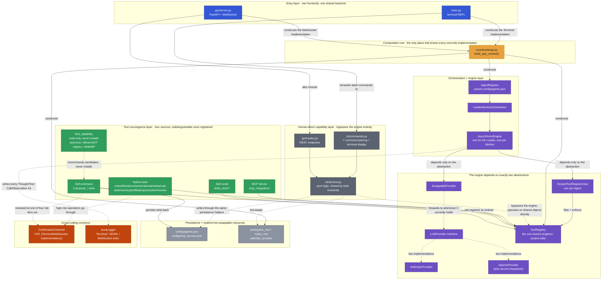
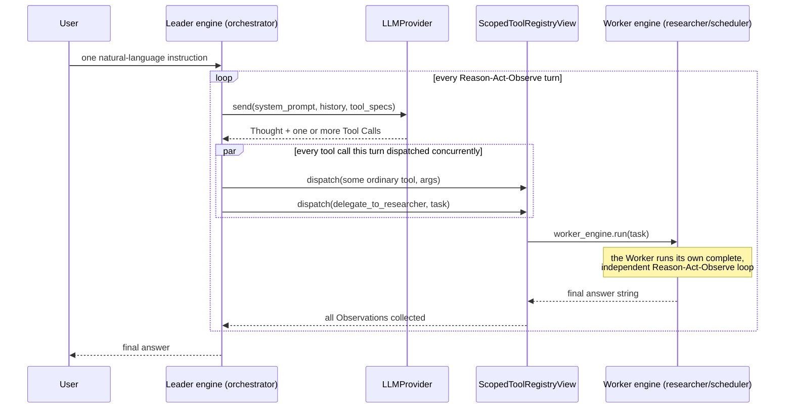

# AuraAgent — Technical Architecture

**[中文文档](ARCHITECTURE-cn.md)** · **[← Back to the plain-language README](../README.md)**

This is the engineering companion to the top-level [README](../README.md): every module, abstraction, security boundary, and design decision, in the detail a contributor or maintainer needs. If you're looking for "what is AuraAgent and how do I use it," start with the README instead — this document assumes you already know why it exists and want to know how it's built.

A lightweight personal AI Agent built from scratch: a white-box ReAct loop implemented in pure `asyncio` + official SDKs, with no LangChain-style black-box framework. Now supports Multi-Agent (Leader-Worker orchestration).

## v1 Scope, in Full Technical Detail

- **Core async ReAct loop** (`core/react_engine.py`): Reason → Act → Observe. Every turn's Thought / Tool Call / Observation is printed to the terminal and written to `logs/session-*.jsonl`.
- **Pluggable LLM abstraction layer** (`providers/`): the `LLMProvider` interface plus two real implementations — `AnthropicProvider` (official `anthropic` SDK) and `OpenAIProvider` (official `openai` SDK, using Chat Completions + Function Calling; also works with any OpenAI-compatible service such as DeepSeek by just switching `OPENAI_BASE_URL`). Switched via `AURA_LLM_PROVIDER` in `.env`.
- **Local Markdown note tools** (`tools/notes/`): `search_notes` / `read_note` / `create_note` / `update_note`, with all file access strictly confined to `sandbox/notes/` to prevent path traversal. The sandbox-validation function `resolve_within_sandbox()` now lives in `tools/sandbox_path.py` (it used to be `tools/notes/path_guard.py` — it was never actually notes-specific, it was just historically in the wrong place; it moved once `tools/files/` needed the exact same logic).
- **General local file management** (`tools/files/`): eight tools — `list_directory`/`read_file`/`write_file`/`delete_file`/`move_file`/`copy_file`/`get_file_info`/`search_files` — for any file beyond notes. Unlike the other sandboxes, this one's root **can be pointed at a user's real working directory via `AURA_WORKSPACE_ROOT` in `.env`** (defaults to `sandbox/workspace/`) — the boundary (`resolve_within_sandbox()`) itself is never removable, only its location is configurable. `delete_file` always asks for human confirmation; `move_file`/`copy_file` only ask when the destination **already exists and would be overwritten** — moving something to a brand-new location never bothers a human, the same confirmation principle `delete_task` already established. Owned by `orchestrator` (the same category of "local resource management" as note-taking).
- **Local JSON calendar + human-in-the-loop confirmation** (`tools/calendar/`, `confirmation/`): `list_calendar_events` / `create_calendar_event` / `update_calendar_event` / `delete_calendar_event`, persisted to `sandbox/calendar/events.json`. Deletions, and modifications to events flagged `important`, always pause for a terminal Y/N confirmation first; a decline returns a plain Observation rather than raising an exception.
- **Task list tools** (`tools/tasks/`): `create_task` / `list_tasks` / `complete_task` / `delete_task`, using the exact same persistence pattern as the calendar (`sandbox/tasks/tasks.json`); `delete_task` reuses the calendar's own `confirmation_channel` instance, going through the same terminal confirmation.
- **Safe calculation + web-fetching tools** (`tools/calc/`, `tools/web/`): `calculate` (a hand-written `ast`-whitelist interpreter for evaluating math expressions — no `eval`/`exec`, resistant to adversarial input); `fetch_url` (httpx async page fetch converted to plain text, scheme allowlist + timeout + size truncation; known limitation: no SSRF IP-range filtering, and it can't get past anti-bot challenge pages that need JS execution). The same module also has two more general network tools: `http_request` (`GET`/`POST`/`PUT`/`PATCH`/`DELETE` + custom headers/body, for submitting forms or calling JSON APIs that `fetch_url` can't handle) and `download_file` (streams a URL's content **into the same workspace sandbox `tools/files/` uses**, not an arbitrary path, with its own more generous `download_max_bytes` size cap, well above the text-oriented `fetch_url_max_bytes`). Both are owned by `researcher`, alongside `fetch_url`. Verified against real network calls: a real small public file downloaded into the sandbox, and a real POST to `httpbin.org` with a custom header, with the echoed content checked. Deliberately NOT built: a general shell/command-execution tool (an arbitrary command can't be "reviewed once, reused many times" the way `propose_new_skill`'s code can — the risk isn't tractable, so anything command-shaped should go through a specific Skill instead), and native browser automation (routed instead through `find_capability` → `propose_mcp_server` to install an existing Playwright/Puppeteer MCP server, rather than adding a browser binary dependency to this project).
- **Cross-session memory tools** (`tools/memory/`): `remember_fact` / `recall_facts`, persisted to `sandbox/memory/facts.json`. Pull-based by design — memory content is never auto-injected into the system prompt; the model must actively call the tool to read it, which keeps per-turn token cost from growing as the memory count grows. (This is a deliberate complementary design to the user profile below, not two implementations of the same thing.)
- **Structured, auto-injected user profile** (`tools/profile/`): the "push" counterpart to `remember_fact`/`recall_facts`'s "pull" design — `update_user_profile` writes `preferences`/`habits`/`common_topics`/`notes` into `sandbox/memory/user_profile.json` (same JSON + `asyncio.Lock` pattern), but `main.py` reads it once at startup and **splices it directly into the orchestrator's system prompt** — the model doesn't need to call anything to "know" the user. List fields are merged and deduplicated; `notes` is appended rather than replaced, so one call never wipes out what's already accumulated. The trade-off is explicit: the profile is always present, but only reflects the latest update after the next process restart (`AsyncReActEngine.system_prompt` was already a fixed string set at construction time, not re-read every turn) — in exchange the model "just knows who you are" without ever needing an explicit recall. Verified with two separate real DeepSeek process runs: the first calls `update_user_profile` and confirms the file merges correctly on disk; the second is a fresh process that, without calling any tool, recites the profile straight from its system prompt.
- **`ask_human` tool** (`tools/human/`): lets the model pause the current task, ask the user an open-ended question, and wait for a free-text answer. Reuses the same `confirmation_channel` instance the calendar/task tools already have — the `ConfirmationChannel` interface adds `ask_open_question()` (free text) alongside the original `confirm()` (Y/N), one physical channel, two response shapes.
- **MCP client** (`mcp_integration/`): `MCPClientManager` uses the official `mcp` SDK to connect over stdio to the servers configured in `config/mcp_servers.json`, adapting each server's advertised tools into a `ToolSpec` and registering them into the same shared `ToolRegistry` (tool names get an `mcp_<server>_` prefix to avoid collisions). A server that fails to connect just logs a warning and is skipped — it never blocks other servers or startup itself. Ships with a zero-external-dependency example server (`mcp_servers/example_server.py`, two toy tools) that demonstrates the whole pipeline out of the box, no `npx`/network package pull required. Also connects a real third-party one — Anthropic's official `@modelcontextprotocol/server-filesystem` (needs Node.js/`npx` installed; a `config/mcp_servers.json` entry pointed at `workspace_root`'s current directory is all it takes, granted to `orchestrator` as a single wildcard capability, `"mcp_filesystem_*"`, following the same pattern `propose_mcp_server`'s own `grant_access(f"mcp_{name}_*")` already established rather than enumerating its 13+ individual tools by name). Its allowed directory follows whichever Project/Chat directory is currently active (`config/mcp_servers.json`'s `"follow_active_directory": true` + a `{directory}` placeholder in `args`, substituted at connect time) -- `cli/service.py::sync_active_directory()` reconnects the server's own subprocess with the new directory whenever it actually changes (see Epic N13); it does NOT use the MCP protocol's own "Roots" mechanism for this, since that was marked deprecated in the spec (SEP-2577) right around when this was built. Also worth knowing: `adapt_and_register()` wires every MCP tool straight into the registry with no `ConfirmationChannel` gating at all (that logic lives per-tool in each native wrapper, e.g. `calendar_tool.py`, not in the generic MCP adapter) — so `mcp_filesystem_write_file`/`edit_file`/`move_file`/`create_directory` all execute ungated, unlike their gated-when-destructive native `tools/files/` counterparts (the server has no delete tool at all, by the reference implementation's own design). The orchestrator's system prompt steers it to prefer the native file tools by default and only reach for the MCP ones for what they add that natives can't: `edit_file`'s precise pattern-based partial edits, and `directory_tree`'s single-call recursive listing.
- **Skill hot-loading** (`skills/`, `skills_store/`): `SkillLoader` scans `skills_store/*/SKILL.md` (YAML front matter: `name`/`description`/`input_schema`), spawns a subprocess per skill (`sys.executable run.py --args-json '...'` — every argument goes through a single JSON blob rather than being mapped to individual CLI flags), captures stdout as the Observation, and registers it into the same shared `ToolRegistry`. Timeout-protected (30s default, the subprocess gets killed on timeout); a skill that fails to parse/load is just skipped, without affecting any other skill or startup itself. `skills_store/example_skill/` (`word_count`) is a real, runnable example.
- **Market-segment insight Skills** (`skills_store/market_*`): three Skills — `market_new_products`/`market_tech_trends`/`market_company_moves` — each taking a single market-segment name (e.g. `"smartphone"`, `"electric vehicle"`) and looking up recent new-product, new-technology, and major-company news respectively for that segment. The data source is Google News' official public RSS subscription (not scraping) — read-only GET, no API key required, stdlib implementation (`urllib`+`xml.etree`, zero new dependencies). Attached to the `researcher` worker's capability list.
- **Multi-Agent: Leader-Worker orchestration** (`agents/`): `config/agents.json` declares one leader + N workers (name/role/system prompt/`capabilities` allowlist, `fnmatch` patterns against tool names). All Agents share the same `ToolRegistry`; each can only see and call the subset a `ScopedToolRegistryView` filters by `capabilities` — the filtering is both a display layer (`get_tool_specs()`) and an enforcement boundary (`dispatch()` rejects an out-of-scope call even if the tool genuinely exists in the shared registry). Each Worker is wrapped into an ordinary tool the Leader can call, `delegate_to_<name>` (the worker-as-tool pattern), existing only in the Leader's own view — Workers are structurally unable to delegate to each other. `core/react_engine.py` has zero awareness that Multi-Agent exists at all. The Leader can delegate to multiple Workers concurrently within the same turn (`asyncio.gather`; every local JSON store has a per-instance lock to handle concurrent writes). Every line of white-box logging carries an `[agent_name]` prefix and the tool call's `call_id`, so an interleaved terminal/JSONL trace from concurrent Workers can be reconstructed per-Agent, per-call. `SequentialPipelineOrchestrator`/`DebateOrchestrator` are real, wired-up placeholders (`OrchestrationMode`) — this round only implements Leader-Worker.
- **Runtime self-extension (three self-extension tools, three risk tiers)** (`tools/self_extend/`): a family of high-risk tools only `orchestrator` has, all following the same flow — structural pre-checks (never bother a human) → **full content** (never a summary) handed to a human for approval (reusing the same `ConfirmationChannel.confirm()`, no new interface) → on approval, hot-activation **and** a persisted write-back to the relevant config file (still there after a restart).

  - `propose_new_skill` (`risk_level=code_execution`): when the LLM judges that no existing tool/Skill/Worker can do something, it writes the complete `run.py` source for a brand-new Skill itself. Illegal names, directory/tool-name collisions, and syntax errors are all rejected up front; once past those checks, the full code is shown alongside a static-scan warning list (regex matches for `subprocess`/`eval`/`exec`/`socket`/network calls/file writes and similarly sensitive patterns — not a sandbox, just something to point a human's attention at). On approval it's written to `skills_store/<name>/` and hot-registered via `SkillLoader.register_one()`. **This code runs with no sandbox, at the same permissions as AuraAgent itself** — the responsibility sits entirely at the human-approval step, so actually read the code, not just the description.
  - `propose_new_agent` (`risk_level=scope_expansion`): when the LLM judges an ongoing (not one-off) new team role is needed, it proposes a new worker — just a system prompt and a `capabilities` allowlist, no new code, and it can only reach **already-existing** tools. The human-review screen lists exactly which real tools each proposed `capabilities` pattern actually resolves to, so an overly broad grant (e.g. `"*"`) that "looks narrow but isn't" doesn't slip past unnoticed. On approval it immediately constructs a `ScopedToolRegistryView`/`AsyncReActEngine` and wraps it into a `delegate_to_<name>` tool added to the Leader's own `extra_tools` (`agents/agent_builder.py` factors out this construction logic so both this path and the future human-direct CLI command can reuse it).
  - `propose_mcp_server` (`risk_level=arbitrary_execution`, the riskiest of the three): the LLM proposes connecting a brand-new external MCP server package. **There's no code to read** — approval here means trusting the command/package itself rather than reviewing specific behavior, so the review text is deliberately weightier. The LLM may only report the **names** of needed environment variables (e.g. `BRAVE_API_KEY`); the actual values are typed directly by the human via `ConfirmationChannel.ask_open_question()`, never passing through the LLM's context or getting logged.

  All three, once approved, persist their write-back to `config/agents.json` / `config/mcp_servers.json` (new `agents/agent_config_writer.py`, `mcp_integration/mcp_config_writer.py` — JSON file + `asyncio.Lock` guarding concurrent writes, the same pattern retrofitted onto `propose_new_skill` too) — this closes a real gap an earlier version had: `grant_access` used to only take effect in memory, so `make_pptx` "disappeared" after a restart once approved, and was only discovered and worked around by manually editing `config/agents.json` (see the next bullet). Now all three tools share the same persistence infrastructure, fixed once.

  Real end-to-end verification of `propose_mcp_server` also turned up and fixed a real concurrency bug: a self-extension tool call runs inside its own **independent asyncio Task**, spawned by `core/react_engine.py`'s concurrent dispatch, while `anyio`'s cancel scopes require entering and exiting from the exact same Task — the old `MCPClientManager`, having connected a server from that scenario, would raise `RuntimeError: Attempted to exit cancel scope in a different task than it was entered in` at process shutdown. Fixed by routing every connect/close operation through one persistent "owner task" (commands passed via an `asyncio.Queue`), so it's safe regardless of which Task the caller is running in.
- **Autonomous discovery: `find_capability` + two new gated install tools** (`tools/self_extend/capability_search.py`, `find_capability_tool.py`, `propose_capability_grant_tool.py`, `propose_external_skill_tool.py`): all three self-extension tools above require "already knowing what to install" — this fills in the "finding" step. `find_capability` is read-only, never asks a human, and never installs anything; given a natural-language `intent`, it checks three places in order: (1) the **full shared `ToolRegistry`** (not just the subset the calling Agent's `capabilities` filter would show it — this is how it discovers something already installed but not yet granted to it); (2) the **official MCP registry** (`registry.modelcontextprotocol.io`, backed by Anthropic/GitHub/Microsoft, no-auth queries — the real response shape was pulled and verified before writing this, keeping only entries with a `packages` array and `transport.type=stdio` npm/pypi entries, since this project's `MCPClientManager` only implements stdio — an HTTP/SSE "remote" entry, however suitable, still can't be installed here); (3) **SkillsMP** (`skillsmp.com`, a third-party aggregator indexing public GitHub repos' `SKILL.md` files, anonymous queries, no key needed). Each candidate type maps to an **existing** or **new** install path: an internal hit → the new `propose_capability_grant` (`risk_level=capability_grant`, the lightest of the four tiers — the code being granted access to was already installed and reviewed, this just adds it to `capabilities`, so the review text is much shorter than the other three); an MCP hit → **directly reuses the existing `propose_mcp_server`**, since `find_capability` has already translated the registry's package info into a `command`/`args`/`env_keys_needed` ready to pass straight in — zero new install code; a SkillsMP hit → the new `propose_external_skill` (`risk_level=code_execution`, the same tier as `propose_new_skill`), which — because SkillsMP gives a GitHub folder link rather than a zip package — fetches the raw `SKILL.md`+`run.py` text directly via GitHub's official raw-content API, then converges with every other install path onto the same `skills/skill_package.py::stage_skill_install()`/`finalize_skill_install()` (this logic, along with the zip validation that used to live at `cli/skill_package.py`, moved under the `skills/` package, since it's no longer CLI-exclusive — `propose_external_skill` needs the exact same "structural pre-check" too). **"Autonomous" stops right there**: before anything is actually installed, all three paths still go through human confirmation — none of them bypass approval, consistent with every self-extension this project has ever shipped.

  Running all three paths for real turned up a genuine ecosystem mismatch, not a guessed one: an arbitrarily-picked `nano-pdf` candidate's GitHub folder **contained only a `SKILL.md`, no `run.py` at all** — because SkillsMP indexes the broader "Agent Skills" ecosystem (the `SKILL.md` convention shared by Claude/Codex, which is fundamentally plain-text instructions meant for a model to read, possibly referencing a separately-installed external CLI), which isn't the same thing as AuraAgent's own, narrower convention that a Skill must be an executable `run.py` callable via `--args-json`. Most SkillsMP hits will probably fail structurally at this exact step — that's not a bug, it's just two different definitions of "Skill" — `propose_external_skill` now gives a clear, specific message ("this is most likely an instruction-only Skill with no executable code, and can't be installed here") instead of a bare 404.
- **`make_pptx` (a real Skill generated via self-extension, later retired) — kept here as a case study, even though the Skill itself is gone**: originally `python-pptx`-based, generating a Chinese-friendly PowerPoint deck. It was a real demonstration of a Skill's full path from "proposed by the LLM mid-conversation → human-approved → available for the session" to "available permanently" (that path is fully automatic, no manual `config/agents.json` edit needed). Along the way it also surfaced and fixed a real bug, whose fix lives on in `SkillLoader` regardless of `make_pptx`'s own fate: on Windows, a child process's stdout piped through (not a real console) doesn't default to UTF-8, falling back to the system ANSI codepage (e.g. GBK on a Chinese-locale install) instead — any Chinese text a Skill printed was silently corrupted into replacement characters before it ever reached the Observation/JSONL, not merely a terminal-display glitch, the underlying data itself was wrong. Fixed by forcing `PYTHONIOENCODING=utf-8` into the subprocess's environment. `make_pptx` (and a second, separately-authored Skill, `docx_text_extract`) were later deleted outright and replaced by the native `tools/documents/` package — see Epic N12 — once it became clear a Skill subprocess's own cwd-vs-workspace mismatch (documented in `skill_loader.py`'s module docstring) was a whole class of bug a native tool sidesteps by construction, not something worth re-fixing per-Skill.
- **Human-direct CLI command layer** (`cli/`): a line in the REPL starting with `/` **never** becomes a user message sent to the orchestrator — `dispatch_command()` intercepts and handles it directly. This is a deliberate **second channel**, parallel to "LLM-proposal + human-approval" (`tools/self_extend/`), serving the same underlying capabilities (add/remove a team member, install a Skill), just triggered by a human instead of an LLM — so it skips the "approval" half of "structural pre-check → human approval" (the human typing the command already IS the reviewer), while reusing the exact same construction/persistence helpers (`agents/agent_builder.py`, `agents/agent_config_writer.py`) so the two channels never drift into inconsistent behavior. Commands **never touch** `core/react_engine.py`, the LLM, or `logs/session-*.jsonl` — this is precisely why `/config set-key` is safe: the API key typed in only ever reaches `.env` and an in-memory dict, never anything that logs or shows content to the LLM.

  - `/config` [`use <provider> <model_id>` | `set-key <provider>`]: view/switch provider+model (key masked on display), masked input to save/update an API key (stdlib `getpass`, `.env` writes reuse the already-installed `python-dotenv`'s `set_key()`). Switching relies on the new `providers/swappable_provider.py`: every engine (the Leader, every Worker, and any new Worker built later by `propose_new_agent`/`/agents add`) holds the exact **same** `SwappableProvider` instance rather than a concrete provider object, so `/config use` just swaps which concrete provider this one shared object currently points at, no need to touch each engine individually.
  - `/agents` [`add` | `remove <name>`]: view/add/remove team members. `add` interactively collects `name`/`system_prompt`/`capabilities`, reusing the exact same `agents/agent_builder.ensure_worker_name_available()` `propose_new_agent` already factored out for construction + collision checks, and still asks for one final human confirmation (guarding against a typo, not against LLM overreach).
  - `/skills` [`load <url>` | `install <local_path>`]: view installed Skills; install a Skill package (`.zip`, containing `SKILL.md`+`run.py`) either downloaded from a URL or from a local file. Validation (`skills/skill_package.py`) rejects an invalid zip, path traversal (zip-slip), an ambiguous structure (more than one candidate top-level folder), with a 5MB size cap; the **full code** plus static-scan warnings are printed for a human to review, at the exact same review intensity as `propose_new_skill` — the **source** being an external download/upload rather than LLM-generated on the spot is not license to lower the bar.
  - All three commands, once approved, go through the same hot-registration + persistence path (`agents/agent_config_writer.py`/`mcp_integration/mcp_config_writer.py`) as the self-extension tools, still there after a restart.
- **GUI backend, M1: shared composition root + WebSocket transport** (`core/bootstrap.py`, `gui/`): the first step toward a graphical app (planned to look like Claude Code/Workbuddy, with CLI/GUI feature parity as a hard requirement) is entirely backend plumbing, no frontend yet. `main.py`'s entire "wire up every tool/Agent/self-extension tool" block was extracted verbatim into `core/bootstrap.py::build_app_context(settings, confirmation_channel, logger) -> AppContext` — a function that knows nothing about terminals or WebSockets, just assembly. `main.py` and the new `gui/server.py` both call this **same** function; a capability added through either frontend lands in the same `ToolRegistry`/`config/agents.json`, which is what makes "feature parity" an architectural guarantee rather than a discipline to remember. Getting there required two smaller refactors first: `core/logger.py::AuraLogger` changed from hardcoding "print to terminal + write JSONL" inline in every `log_*` method to a `LogSink` ABC (`write(event) -> None`, must never block) fanned out to a sink list — `TerminalSink`/`JSONLSink` reproduce the exact prior behavior, and the new `WebSocketSink` buffers events via `asyncio.Queue` and drains them asynchronously, since `AsyncReActEngine` calls `log_*` synchronously with no `await`; and `ConfirmationChannel` (already an abstraction, unchanged) gained a second real implementation, `WebSocketConfirmationChannel`, using the standard "pending `asyncio.Future`s keyed by a `request_id`" pattern to turn a `confirmation_request`/`confirmation_response` round trip over one WebSocket into something `confirm()`/`ask_open_question()` can simply `await` — `ask_open_question()`'s answer is still deliberately never logged by either implementation, since it's the channel `propose_mcp_server` uses to collect secret env-var values. Fixing this also closed a real, previously-existing gap: `AuraLogger.log_confirmation()` existed but was never called by anything — confirmation decisions were invisible in `logs/session-*.jsonl` before this; both `ConfirmationChannel` implementations now call it. `gui/server.py`'s single `/ws` endpoint carries the outgoing event stream and the bidirectional confirmation protocol on one connection; its receive loop dispatches `orchestrator.run()` as a background `asyncio.Task` rather than awaiting it inline — awaiting it directly would deadlock, since a run can itself block inside `confirm()` waiting for a `confirmation_response` message that only that same receive loop can ever read. Verified with a real running server and a real LLM call over a raw WebSocket client: a normal chat round trip, and a `delete_file` call that produced a live `confirmation_request` → approval → `confirmation` event → JSONL record → actual deletion, with `config/agents.json` and the session's own JSONL confirmed clean of test artifacts afterward.
- **GUI frontend + command-parity panels, M2+M3** (`gui/frontend/`, `gui/routes.py`, `cli/service.py`): M2 is a minimal React+Vite chat UI (`gui/frontend/`) talking to the M1 `/ws` endpoint — a pure function (`buildTurns.js`) turns the flat event stream into a tree of turns, inferring `delegate_to_<worker>` nesting from tool-call/observation `call_id` pairing (the raw event schema has no parent-call field, so this is reconstructed client-side, not a backend change) so a Worker's whole Thought/Tool Call/Observation sequence renders nested inside the Leader's delegating call instead of as a flat interleaved list; confirmation/open-question requests render as inline, risk-colored cards matching the four self-extension tiers. `gui/server.py` mounts the build (`gui/static/`, gitignored) at `/`, so one `uvicorn gui.server:app` serves the whole app. M3 gives the CLI's "/" commands a GUI counterpart: `cli/commands.py`'s internals were split into `cli/service.py` (pure query/action functions — `list_agents`/`get_config_status`/`list_skills`, `switch_provider`/`set_api_key`/`validate_new_agent`+`commit_new_agent`/`remove_agent`/`stage_skill_from_*`+`commit_skill` — none of them call `input()`/`print()`/`getpass()` themselves) with `cli/commands.py` now a thin adapter over it (verified behavior-identical: all 27 pre-existing CLI command tests pass unchanged against the refactored code). `gui/routes.py` adds `/api/config`, `/api/agents`, `/api/skills` (GET, live snapshots) plus the matching write endpoints, calling the exact same `cli/service.py` functions — a Settings/Team/Skills panel action and its "/" command counterpart can't drift apart, by construction. Installing a Skill through the GUI keeps the CLI's two-phase shape (`POST /api/skills/stage` returns the full `SKILL.md`/`run.py` text plus static-scan warnings for review, `POST /api/skills/commit` finalizes) rather than collapsing to a single call, since a human should read externally-sourced code before approving it the same way `propose_new_skill` requires; adding a worker or granting a capability skips straight to commit, matching the CLI's own "/agents add" `[y/N]` being described as "a typo guard, not an LLM-overreach guard." Building this surfaced and fixed a real latent bug: `core/bootstrap.py` hardcoded `CLIContext.env_file_path` to the real project `.env` regardless of the `Settings` object passed in, so any test exercising `/config set-key` would have silently written into it — fixed by adding `Settings.env_file_path` (same pattern as `agents_config_path`) and threading it through. No browser-automation tooling exists in this project, so the frontend/panels are verified by a clean build + lint + real REST/WebSocket traffic against a real running server matching what the UI expects, not by driving an actual browser — worth trying yourself (see "Running the GUI" below).
- **Desktop packaging, M4** (`gui_app.py`): wraps the exact same app `uvicorn gui.server:app` serves in a native OS window via `pywebview` (Edge WebView2 on Windows) — `python gui_app.py` and you get a real app window, no browser tab or typed URL involved. Picks a free localhost port at random (`socket.bind(("127.0.0.1", 0))`) rather than a fixed one, so it never collides with an already-running `uvicorn gui.server:app --port 8000` or a second instance of itself; runs `uvicorn.Server` on a background thread and polls `server.started` before opening the window (with a clear error instead of a blank window if startup fails, e.g. a missing API key); closing the window sets `server.should_exit = True` so `gui/server.py`'s lifespan `finally` — `AppContext.aclose()`, closing MCP connections etc. — still runs, the same clean shutdown `python main.py` does on exit. Live-verified: launched for real, confirmed via the OS process list that a full `msedgewebview2` process tree (browser/GPU/renderer/network processes) actually spawned at the exact moment the script started, then shut down cleanly — not just "the script didn't crash," a real native window was actually created.
- **Session memory + smarter capability discovery, Epic N1** (`core/react_engine.py`, `tools/self_extend/capability_search.py`): closes a real practicality gap — every prior turn was contextless, since `AsyncReActEngine.run()` built a brand-new, empty `history` on every call. `run()` now takes an optional `history` parameter (default `None`, so nothing about the default one-shot behavior changes); pass the SAME list back on the next call and it just keeps growing, because the loop body only ever `.append()`s to it, never reassigns. `main.py`'s REPL keeps one `history` for the whole process; `gui/server.py` keeps one per WebSocket connection (a reconnect starts fresh, same as restarting the CLI). Worker engines (`agents/delegate_tool.py`) deliberately keep calling `run()` with no `history` at all — they stay one-shot and stateless specifically because they can run concurrently (`asyncio.gather`), and a shared mutable list across concurrent delegations would race. Persistent history introduced a NEW risk on the GUI side that didn't exist before: two `user_message`s arriving close together on one connection would now race appending to that connection's shared history — fixed by having the WebSocket receive loop reject (not queue) a `user_message` while a previous one is still in flight, reported back as a normal `error` event, matching the existing white-box event stream rather than inventing a new message type. Building this also caught a real, separate latent bug: `ctx.orchestrator` is actually a thin `LeaderWorkerOrchestrator` wrapper around the Leader's `AsyncReActEngine`, and its own `run()` didn't forward the new `history` parameter at all — every call from `main.py`/`gui/server.py` would have raised `TypeError` on the unexpected keyword argument (caught by the surrounding `except Exception`, so it surfaced as a swallowed error rather than a crash, which is what made it non-obvious) — fixed by threading `history` through `OrchestrationMode`'s interface and all three implementations (`LeaderWorkerOrchestrator`, plus the `SequentialPipelineOrchestrator`/`DebateOrchestrator` placeholders, for signature consistency). Separately, `find_capability`'s internal search (`capability_search.py::search_internal()`) used to require a keyword-overlap score `> 0` and cut off at the top 5 matches — silently hiding anything phrased differently from a tool's own description, and, as a real bug this also fixed, returning nothing at all for ANY Chinese-language intent (`re.findall(r"[a-z0-9]+", ...)` extracts zero words from non-ASCII text). It now returns every eligible tool, ranked by keyword overlap but never filtered by it, letting the LLM itself judge relevance instead of a second, weaker keyword matcher pre-deciding what the model even gets to see. The orchestrator's system prompt also gained one new paragraph nudging it to lay out the ordered steps of a multi-part request in its own Thought before acting on the first one — pure prompt guidance, no new tool or architecture. All four changes verified live: a real DeepSeek conversation recalling an unprompted fact ("my favorite color is turquoise") purely from context two turns later with zero tool calls; the same recall over a real WebSocket connection, plus a real confirmation left pending on purpose while a second message was sent on the same connection to confirm the rejection path actually engages; `find_capability` finding `market_new_products` for both a Chinese-language intent and an English intent sharing no keywords with its description (previously invisible either way); and a real compound request ("research X, then create a note summarizing it") producing an explicit step list in the very first Thought.
- **System/desktop control, Epic L2** (`tools/system/`): four new modules, all owned by `orchestrator` directly (same "local resource management" category as `tools/files/`, not delegated to a worker) — `clipboard_tool.py` (`read_clipboard`/`write_clipboard`, via `pyperclip`), `screenshot_tool.py` (`take_screenshot`, via `mss`), `process_tool.py` (`list_processes`/`kill_process`, via `psutil`), `notification_tool.py` (`send_notification`, via `plyer`). Deliberately scoped to text-only: `take_screenshot` saves a PNG into the workspace sandbox and reports back its path — the model never "sees" the image itself, since that would need `ConversationTurn`/`ToolResultInput` to carry image content blocks and both `AnthropicProvider`/`OpenAIProvider` to translate them into their respective vision APIs, a distinct and larger architecture change out of scope here. Risk-tiered like everything else: `read_clipboard`/`write_clipboard`/`list_processes`/`send_notification` are ungated (matching `read_file`'s/`write_file(mode="overwrite")`'s existing ungated precedents), while `take_screenshot` (risk_level=`privacy_exposure`, a new tier — capturing the whole screen is a privacy-exposure risk, not a data-loss one, so it doesn't reuse `destructive`) and `kill_process` (risk_level=`destructive`, same tier as `delete_file`) always go through `ConfirmationChannel` first — `kill_process`'s confirmation text includes the target's actual process name, looked up before asking, so the human reviewing it knows what they'd be killing, not just a bare PID. `list_processes` caps its output at 100 rows (a real machine can have hundreds, most irrelevant) — a different, non-contradictory reason for capping than N3's decision to stop capping `find_capability`'s results (there the candidate pool is small and every hidden match is a real capability the model can't find; here it's noise reduction on a pool that can be genuinely huge). Tested against real system state throughout (real clipboard round-trips restored afterward, a real screen capture, a real disposable subprocess spawned and killed) — the one deliberate exception is `send_notification`, whose tests mock `plyer.notification.notify()` rather than actually popping a system toast during every test run. Verified live end-to-end via the real CLI, including the decline path for both confirmation-gated tools (a piped/non-interactive session's confirmation prompt reads no input and correctly defaults to declining, exercised for real here rather than just asserted in a test).
- **Runtime-switchable workspace root, `/workspace`** (`tools/workspace_root.py`, `cli/service.py`, `cli/commands.py`): a direct follow-up to L2 — a user asked why a screenshot landed in `sandbox/workspace/` instead of somewhere they chose, and whether the workspace location itself could be changed without editing `.env` and restarting. `workspace_root` used to be a bare `Path` captured once at registration time by four separate consumers (`tools/files/file_tool.py`, `tools/system/screenshot_tool.py`, `tools/web/fetch_url_tool.py`'s `download_file`, `skills/skill_loader.py`'s `AURA_WORKSPACE_ROOT` env var for skill subprocesses) — switching it at runtime needed the exact same problem `providers/swappable_provider.py::SwappableProvider` already solved for the LLM provider, so the new `SwappableWorkspaceRoot` mirrors that pattern exactly: one shared mutable `.current`, read fresh by every consumer on each call rather than cached in a closure. `/workspace` shows the current path; `/workspace set <path>` validates, switches, and persists to `.env` (same `set_key()` call `/config set-key` already uses) so it survives a restart — rejecting Windows system directories (`%WINDIR%`, both Program Files, and bare drive roots, though only the drive root itself is rejected outright, not everything under it, since a drive root is an ancestor of nearly every real path on a single-drive machine — a real bug caught and fixed while writing this) and AuraAgent's own project directory (in both directions: pointing into it, or pointing at something that contains it) as a safety valve against the file tools reaching into AuraAgent's own source/config/`.env`. The current path is also printed on every CLI startup banner. GUI parity (a Settings-panel field + REST endpoint) is deliberately deferred — the indirection layer underneath is already GUI-ready, so wiring it up later doesn't need any of this work redone. Verified live: `/workspace set C:\Windows\System32` rejected cleanly; a real switch to a real directory outside the project, confirmed a `write_file` call afterward landed there instead of the old location and not in the previous one. A second real bug surfaced by an actual user hitting it live: `Path.mkdir(parents=True)` can only create directories on an already-mounted volume, so pointing at a drive letter that simply doesn't exist on the machine (e.g. `D:\...` with no D: drive) raised a raw `FileNotFoundError` (WinError 3) instead of the same clean rejection every other invalid path gets — `set_workspace_root()` now catches `OSError` around the actual directory-creation step and re-raises as a `ValueError` with a human-readable message, matching this project's "never show a bare exception" rule everywhere else.
- **Runtime-switchable notes root, `/notes`** (`tools/notes/notes_tool.py`, `cli/service.py`, `cli/commands.py`): a direct follow-up to the workspace-switch feature above — a user asked why a note still landed in `sandbox/notes/` after pointing `/workspace` elsewhere, since notes had always used their own separate, fixed `settings.notes_sandbox_root` (never touched by `/workspace`, by design — notes/calendar/tasks/memory each have their own independent sandbox root, not one shared workspace), then asked to be able to repoint notes at a real directory of their own, e.g. an Obsidian vault. Rather than introduce a second bespoke indirection class, `notes_sandbox_root` now goes through the exact same `SwappableWorkspaceRoot` (`tools/workspace_root.py`) `/workspace` already uses — a second, independent instance, so switching one never affects the other. `register_notes_tools` (`tools/notes/notes_tool.py`) reads `sandbox_root.current` fresh inside each of its four tool handlers (`search_notes`/`read_note`/`create_note`/`update_note`) rather than capturing a bare `Path` once at registration, mirroring exactly how `tools/files/file_tool.py` was changed for `/workspace`. `/notes` shows the current path; `/notes set <path>` validates (same Windows-system-directory and AuraAgent-project-directory rejection rules as `/workspace set`, reusing the same `cli/service.py` helper functions rather than duplicating them), switches, and persists to `.env` via `AURA_NOTES_SANDBOX_ROOT` (now a proper `Field(..., alias=...)` in `config/settings.py` rather than a hardcoded, non-configurable default) — surviving a restart the same way `/workspace` does. The current notes path is also printed on the CLI startup banner alongside the workspace path. GUI parity is deliberately deferred for the same reason `/workspace`'s was. Verified live: `/notes` and `/notes set` to a real directory outside the project via the actual CLI, confirming the new directory was created, `.env` was updated (read back through `dotenv_values`, not raw text-matched), and `ctx.workspace_root` was left completely unchanged by the switch — the two sandboxes really are independent, not two names for the same thing.
- **Google Calendar integration, Epic E (calendar)** (`tools/calendar/google_calendar_provider.py`, `tools/calendar/google_auth.py`, `tools/calendar/swappable_calendar_provider.py`): a real Google Calendar backend for `list_calendar_events`/`create_calendar_event`/`update_calendar_event`/`delete_calendar_event`, alongside the existing local JSON one — with **zero changes to `tools/calendar/calendar_tool.py`**, exactly as the abstraction (`CalendarProvider`) and its two implementation stubs had promised since Epic L. OAuth (`google-auth`/`google-auth-oauthlib`, least-privilege `calendar.events` scope, never the broader `calendar` scope) handles only the one-time local-loopback browser consent flow and credential/token-refresh bookkeeping — the actual event CRUD goes straight over the already-shared `httpx.AsyncClient` to the Calendar API v3 REST endpoints, not `google-api-python-client`, keeping one HTTP pattern across the codebase instead of two. A few translation points made "zero changes to CalendarTool" actually true rather than just promised: Google's field is `summary`, not `title`; `important` (no native Google concept) is stored in a private `extendedProperties` field invisible in the real Calendar UI; every datetime in this whole system is naive-and-implicitly-local, so `GoogleCalendarProvider` converts via `naive_dt.astimezone()` on the way out and folds back to naive local time on the way in; `update_calendar_event`'s partial `patch` dict is sent as an HTTP `PATCH` (`events.patch`), never `PUT` (`events.update`, which would silently wipe any field not present in the patch); `list_events`'s date-range filtering is re-applied client-side to match `LocalJSONCalendarProvider`'s exact "event's own start date in range" semantics rather than Google's own "overlaps the window" semantics for `timeMin`/`timeMax`. `SwappableCalendarProvider` (mirroring `SwappableProvider`/`SwappableWorkspaceRoot`'s exact indirection pattern) lets `/calendar connect` hot-swap the live backend immediately, no restart needed, persisting `AURA_CALENDAR_BACKEND=google` to `.env` only after OAuth actually succeeds — deliberately solving a real bootstrapping order-of-operations trap found while designing this: if `AURA_CALENDAR_BACKEND=google` were set before a token exists, the app would fail to start with no way to reach the CLI to run `/calendar connect` in the first place, so `load_settings()` validates this and explains the recovery path if a human edits `.env` by hand instead of using the command. Token refresh (a blocking call) is wrapped in `asyncio.to_thread()` and guarded by a narrow, double-checked `asyncio.Lock` — not the local provider's "lock the whole method" pattern, which would be pointless contention against a remote API that's already its own atomic source of truth; the lock exists only because two concurrently-running Workers could otherwise both refresh and both write the token file at once. `/calendar`/`/calendar connect`/`/calendar disconnect` mirror `/workspace`/`/notes`'s CLI structure; the OAuth client secret the user must obtain themselves from Google Cloud Console (this project can't automate creating that project) and the resulting token both live under the already-gitignored `sandbox/calendar/`. Tested via `httpx.MockTransport` (all 5 CRUD methods, the `summary`/`PATCH`/`important`/timezone/404/409 details above, a concurrency test asserting a token refresh under simultaneous calls happens exactly once) — real end-to-end verification (an actual event appearing in a real Google Calendar) needs a human to click through the browser consent screen themselves, which is not something this coding agent can complete unsupervised.
- **Project — a general-purpose "accumulation" container, `/project`** (`tools/projects/project_store.py`, `tools/projects/project_tool.py`, `cli/service.py`, `cli/commands.py`): grew out of a user question about whether different areas of ongoing work (industry research, compliance research, a long-running personal project, etc.) needed their own dedicated Agent. The answer that emerged: Project and Agent are orthogonal — Agent answers "who has the skillset for this task," Project answers "which accumulating body of context does this belong to" — so this is deliberately **tool-agnostic and Leader-only**, never touching Worker engines at all (Workers stay exactly as stateless/concurrency-safe as before; if a delegated task needs project context, the Leader writes it into the task description itself). A Project is just two things: a real directory — `/project use <slug>` repoints the exact same `SwappableWorkspaceRoot` `/workspace set` already uses (`tools/workspace_root.py`), so every tool already scoped to `workspace_root` (file tools, screenshots, downloads, Skill subprocesses) automatically operates inside it, meaning "drop a document into this project" needed no new file-storage tool at all — and a compact, bounded summary, kept **outside** that directory (`sandbox/project_meta/<slug>/summary.json`, vs. the project's own `sandbox/projects/<slug>/` — the same `config/`-vs-`sandbox/` split used elsewhere) so a project's real content folder never gets AuraAgent's own bookkeeping mixed into it. The summary's `current_state` field is **replaced wholesale on every update, never appended to** (`open_questions` is a short dedup-appended list, capped at the most recent 30 entries — an earlier `outputs` field with the same shape was later retired, see Epic P2) — a deliberate, code-enforced choice (plus a hard `project_summary_max_chars` truncation, mirroring `clipboard_max_chars`'s existing config pattern) to keep a project's token cost roughly constant no matter how long it's been worked on, rather than trusting the model to stay brief. A real architectural improvement over `user_profile`'s existing limitation: reading `core/react_engine.py` confirmed `AsyncReActEngine.run()` reads `self.system_prompt` fresh on every internal turn rather than caching it at construction — so unlike `user_profile` (whose docstring explicitly says an update only takes effect next restart), both `/project use`/`/project none` and a mid-session `update_project_summary` tool call directly mutate `leader_engine.system_prompt` and take effect starting the very next message, no restart needed. Project selection is deliberately **not persisted to `.env`** (unlike `/workspace`/`/notes`/`/calendar`'s standing settings) — it's meant to be a frequent, optional, per-session choice. An early version of `/project use`/`/project none` snapshotted the pre-project `workspace_root` and restored it on exit; that snapshot-and-restore approach was retired in favor of `sync_active_directory()`'s resolve-fresh-every-turn model once it became a real source of bugs (see Epic N13). PDF/Word/webpage parsing was explicitly scoped out at the time — since a project is just a directory, that capability, once wanted, needed no architecture change here; it later landed as `tools/documents/` (Epic N12), reading straight out of whichever directory is currently active, including a project's own. Verified live end-to-end: created a project, entered it, confirmed a `write_file` call landed in the project's real directory (not the prior workspace) and the prior workspace was untouched; called `update_project_summary`, then — in a completely separate follow-up message, no restart — asked the model to recall the project's state from context alone (zero tool calls), and it correctly did, confirming the same-session live-sync actually works, not just compiles.
- **Provider output-length hardening** (`providers/openai_provider.py`, `core/exceptions.py`, `config/settings.py`): a real failure a user hit through the OpenAI-compatible path (DeepSeek) — asking for a large `create_pptx` deck ("consulting-report style, many slides") produced a tool call whose JSON arguments were still being generated when the completion hit `max_tokens` (hardcoded at 4096, both SDKs' own default, and never wired to anything configurable), leaving `call.function.arguments` a syntactically truncated fragment. `json.loads()` on that fragment raised a bare `json.JSONDecodeError` ("Unterminated string starting at: line 1 column 7713...") straight out of `OpenAIProvider.send()`, uncaught anywhere between there and `main.py`'s/`gui/server.py`'s outermost `except Exception` — the user saw exactly that cryptic stdlib message with no explanation of what actually happened. (Anthropic's SDK parses a tool_use block's `input` for us rather than handing back a raw string, so this specific failure mode is OpenAI-path-specific; `AnthropicProvider` shares the same underlying `max_tokens` fix below as a preventive measure, not because it hit the same crash.) Fixed two ways, matching this project's "never show a bare exception" rule (see `/workspace set`'s `OSError`→`ValueError` translation above): (1) a new `Settings.llm_max_output_tokens` (`AURA_LLM_MAX_OUTPUT_TOKENS`, default raised to 8192) threaded into both provider constructors everywhere one gets built — `core/bootstrap.py` and `cli/service.py::switch_provider`'s `/config use` path — cutting how often a large single tool call hits the ceiling at all; (2) `OpenAIProvider.send()` now catches `json.JSONDecodeError` around each tool call's argument parsing and re-raises as the new `LLMOutputTruncatedError` (`core/exceptions.py`), with a message naming the tool, stating plainly that the response was cut off (when `finish_reason == "length"`) or unparseable otherwise, and suggesting a fix (ask for less content, or raise the new setting) — still propagates and crashes the turn loudly exactly as before (this project's engine deliberately never swallows unexpected errors, see `core/exceptions.py`'s own module docstring), just with an actionable message instead of a stdlib one.
- **Directory resolution redesign: Workspace/Project/Chat, and MCP following along, Epic N13** (`cli/service.py::sync_active_directory()`, `tools/sessions/session_store.py`, `gui/routes.py`, `mcp_integration/mcp_client_manager.py`): grew out of a user-prompted audit of whether Workspace/Project/MCP-tool directories could contradict each other. They could, concretely: `set_workspace_root()` (`/workspace set`) and `use_project()`/`exit_project()` (`/project use`/`/project none`) both mutated the exact same shared `workspace_root` with zero awareness of each other — running `/workspace set` while a Project was active left the UI/system prompt still reporting that Project as fully active (role/Memory/summary all still shown) while every file tool had actually moved somewhere else, and since `/workspace set` also persisted to `.env`, a later `/project none` would then "restore" the pre-Project value from an in-memory snapshot (`ActiveProjectState.pre_project_workspace`) that no longer matched what was on disk — a real, user-visible live-vs-persisted divergence, not a hypothetical one. The user's own diagnosis of the right fix, confirmed correct by reading the code: Workspace shouldn't be a standalone global something else temporarily overrides — it should be a **value derived fresh from whichever Project/Chat governs the current turn**, the same way `gui/server.py`'s pre-existing `_sync_active_project()` already tried to keep Project in lockstep with "which chat is being viewed" (just implemented as one more mutate-and-hope-nothing-else-touches-it call, not a resolve). The fix: a single new function, `sync_active_directory(ctx, *, project_slug, directory_override=None)`, with priority **Project directory > a GUI chat's own directory override > `ctx.default_workspace_root`** (a NEW, separate `SwappableWorkspaceRoot` instance holding only the persisted `/workspace set` value, so it can never again be the thing a Project silently clobbers) — called at the start of **every single turn**, live or scheduled, inside `ctx.run_lock`, so a GUI chat's own turn is always self-sufficient: it re-resolves from that chat's own persisted `SessionInfo` (`project_slug`/`directory`) every time, regardless of what ran in between, with nothing to snapshot or restore on ITS side. `use_project()`/`exit_project()` collapsed into thin wrappers around it. `scheduler_loop.py::_run_one()` is the one caller that still explicitly restores afterward (via a second call to the same function, not hand-rolled field mutation) — not because the resolver itself needs it, but because the CLI's own "current project" has no equivalent persisted source of its own to fall back to; it simply IS `ActiveProjectState.current_slug`, so a background scheduled run has to hand it back explicitly once done, the same way it always had to, just through the shared resolver now instead of duplicated logic. The user's two concrete asks on top of the fix: (1) **every GUI chat with no Project tag can have its own working directory** — any real folder, not confined to the sandbox, same `reject_if_windows_system_dir`/`reject_if_touches_project_dir` rules `/workspace set` already enforced (now made public functions specifically so `gui/routes.py` could reuse them directly, matching this project's existing "validation lives in `cli/service.py`, reused by both frontends" convention) — a new `SessionInfo.directory` field (`tools/sessions/session_store.py`), deliberately never cleared or copied when `project_slug` changes in either direction, so a custom directory set before joining a Project silently resumes the moment the chat leaves it again, with zero bookkeeping needed (this was a specific design question the user raised and confirmed before implementation: "does joining a Project need to touch the chat's own directory?" — no, by construction, two independently-persisted fields). (2) **the MCP filesystem server must follow the active directory too**, not stay pinned to the fixed path `config/mcp_servers.json` originally hardcoded. Investigated and rejected the MCP protocol's own "Roots" feature for this (letting a client dynamically tell a server which directories it's allowed to touch) — the installed SDK's own `mcp.types.Root` is marked `Deprecated in 2026-07-28 (SEP-2577)`, right around when this was built, making it a bad foundation regardless of whether it technically still works. Implemented instead as a protocol-agnostic subprocess reconnect: a server config gains `"follow_active_directory": true` plus a `{directory}` placeholder somewhere in `args`, substituted with the real path and the subprocess restarted whenever `sync_active_directory()` resolves a genuinely different directory (skipped entirely when it hasn't, via a small per-server "last known directory" cache) — reusing the exact `args`-based startup mechanism `@modelcontextprotocol/server-filesystem` already has, rather than anything bespoke. Building this surfaced a real, separate concurrency bug, found and fixed via a minimal reproduction script before it ever reached a test file: `MCPClientManager` originally routed every server's connect/reconnect/close through one shared "owner" `asyncio.Task` (a deliberate fix from an earlier bug, see that module's own history) — giving each server its own `AsyncExitStack` so one server's reconnect wouldn't touch another's seemed like the obviously-correct scoping, but anyio tracks cancel scopes as a stack **per Task**, not per `AsyncExitStack`, so closing two independently-tracked real servers from that one shared task raised `RuntimeError: Attempted to exit a cancel scope that isn't the current task's current cancel scope` — reproduced directly with two real MCP server subprocesses in an eight-line script, confirming it had nothing to do with `npx`/Windows subprocess timing (a plain Python server pair hit it identically) and everything to do with per-server isolation needing to be per-**Task**, not per-stack. Fixed by giving each server its own dedicated, persistent Task that owns its stdio_client/ClientSession lifecycle exclusively (connect, any number of reconnects, eventual close, all as one `while True` loop inside that one Task) — `MCPClientManager`'s shared owner-task/command-queue machinery was removed entirely, not patched, since per-server Tasks made it unnecessary. Verified live: `/workspace set` while a Project is active now leaves the Project and its live directory completely untouched (confirmed via a new regression test reproducing the exact original bug scenario) and only takes effect once `/project none`; a real GUI chat given a custom directory (outside the sandbox) had `list_directory`/`create_docx` actually operate there; the same chat's `mcp_filesystem_list_directory` call returned that chat's real directory contents, and switching to a different Project-tagged chat made it follow along, visibly reconnecting (`[MCP] Connected to 'filesystem'...` printed again) rather than staying stuck on the original startup path. That same manual pass surfaced one more real bug, by accident: deliberately double-firing a directory change (a slow client retry racing its own still-in-flight original request) made two reconnects of the same server collide, and the losing one's failure handler cleaned up `reconnect_server()`'s bookkeeping (as designed) but left nothing able to ever reconnect that server again — `reconnect_server()` only ever tried the reconnect path, never a fresh `connect_one()`, so a server that lost tracking this way stayed permanently disconnected for the rest of the process's life. Fixed by having `reconnect_server()` fall back to `connect_one()` whenever the server isn't currently tracked, using its last-known config — the same self-healing a server that failed its very first connect attempt already effectively got, just extended to "failed mid-life" too.

## Running It

```bash
# 1. Install dependencies (a virtual environment is recommended)
python -m venv .venv
.venv\Scripts\activate        # Windows PowerShell: .venv\Scripts\Activate.ps1
pip install -r requirements.txt

# 2. Configure an API key
copy .env.example .env
# Edit .env:
#   Using Anthropic: AURA_LLM_PROVIDER=anthropic, fill in ANTHROPIC_API_KEY
#   Using DeepSeek (or another OpenAI-compatible service):
#     AURA_LLM_PROVIDER=openai
#     OPENAI_API_KEY=<your key>
#     OPENAI_BASE_URL=https://api.deepseek.com
#     AURA_MODEL_ID=deepseek-chat

# 3. Run
python main.py
```

After it starts you're in an interactive REPL — just type natural-language instructions (e.g. "create a note summarizing today's meeting"), and type `exit` to quit. The terminal prints each turn's Thought / Tool Call / Observation in real time, every line prefixed with `[agent_name]`.

The default Agent team (customize via `config/agents.json`): `orchestrator` (leader — manages notes/memory/asking the user, can delegate to two workers), `researcher` (web fetching + calculation), `scheduler` (calendar + tasks). Try something like "have researcher look up example.com while scheduler creates a task" to see concurrent delegation to two workers in action.

### Connecting a real Google Calendar (optional)

By default the calendar tools read/write a local JSON file (`sandbox/calendar/events.json`) — fine for trying things out, but not your actual calendar. To connect a real one:

1. In [Google Cloud Console](https://console.cloud.google.com/), create (or pick) a project and enable the **Google Calendar API**.
2. Create an OAuth 2.0 Client ID of type **Desktop app**, and download its JSON.
3. Save that file as `sandbox/calendar/google_client_secret.json`.
4. Run `python main.py`, then type `/calendar connect` — a browser opens for you to approve access; once you do, the connection is active immediately (no restart needed) and `AURA_CALENDAR_BACKEND=google` is saved to `.env` so it's remembered next time too.

`/calendar` shows which backend is currently active; `/calendar disconnect` switches back to the local JSON calendar without discarding the saved Google token (so reconnecting later doesn't need the browser step again).

### Working inside a Project (optional)

If you have an ongoing body of work you want AuraAgent to keep accumulating context on across sessions (a research topic, a long-running project — anything, not a fixed category), create a Project for it:

```
/project create ai_governance                       # auto-creates sandbox/projects/ai_governance/
/project create enoch_education "C:\Users\you\Documents\Enoch"   # or point it at a folder you already have
/project use ai_governance                           # enters it -- file tools, screenshots, downloads now land here
/project                                             # shows the active project and lists all of them
/project none                                        # leave it, restoring your previous workspace
```

Entering a project is per-session and never written to `.env` — nothing is selected by default when you start AuraAgent, and you can switch between projects mid-conversation freely. Ask the agent to summarize its own progress from time to time (or just mention something worth remembering) and it will occasionally call `update_project_summary` to keep a compact "where things stand" note that's automatically shown to it every time you re-enter that project — no need to re-explain the background each session.

A project also carries its own `role` (edit directly with `/project role <slug> <text>`, or the GUI's Context tab), its own pull-based `Memory` (`/project memory <slug> [add|edit|delete ...]`, `remember_project_fact`/`recall_project_facts` for the model), and its own set of additionally-enabled Skill/MCP tools (`/project tools <slug> [enable|disable <pattern>]`, or the GUI's Tools tab) — all purely additive on top of the orchestrator's usual capabilities, and all scoped to that one project. The GUI's project page also lets you upload/rename/delete/download files in the project's directory directly, and the model can call `search_project_chats` to look something up in one of the project's *other* chats.

### Scheduled tasks (optional)

Ask for a task to run later without you present — once at a specific time, or repeatedly on a schedule — from any chat, whether or not a Project is active:

```
/schedule                                            # list every schedule (across all projects + unaffiliated)
/schedule add once 2026-10-05T15:00:00 remind me to renew insurance
/schedule add cron 0 9 * * * daily OpenAI insight    # 5-field cron: minute hour day month weekday
/schedule add cron 0 9 * * * project ai_governance daily insight  # scoped to a Project's context
/schedule pause <id> | /schedule resume <id> | /schedule delete <id>
```

Or just ask in plain language — the model translates the time/cadence itself and always confirms before creating one (`propose_scheduled_task`, `risk_level="recurring_autonomy"`, since this is a standing commitment, not a one-off action). Only actually fires while AuraAgent (CLI or GUI) is running; an overdue schedule found on startup runs once immediately rather than being silently skipped. Any confirmation a scheduled run would normally trigger is auto-declined (no one's there to answer it), and every run ends with a desktop notification either way. The GUI's Schedules panel (Tools → Schedules → Manage) is the centralized place to see/edit/pause/delete every schedule, regardless of which Project (if any) it belongs to.

## Running the GUI (M1-M4: backend, frontend, panels, desktop app)

```bash
# One-time: build the frontend (outputs into gui/static/)
cd gui/frontend
npm install
npm run build
cd ../..

# Option A: a real desktop window (recommended)
python gui_app.py

# Option B: a browser tab, same backend either way
uvicorn gui.server:app --port 8000   # then open http://127.0.0.1:8000
```

Either way you get a **Chat** tab (collapsible Thought/Tool Call/Observation blocks, `delegate_to_<worker>` calls rendered as a nested sub-tree of that worker's own full turn, inline HITL cards for `confirmation_request`/`open_question_request` color-coded by risk tier) talking to the exact same team/tools as `python main.py` over a single `ws://.../ws` connection, plus **Team**/**Settings**/**Skills** tabs — the GUI equivalents of `/agents`/`/config`/`/skills`, backed by the same `cli/service.py` logic those commands use (see `gui/server.py`'s and `gui/routes.py`'s module docstrings for the wire protocol / REST shape if you want to drive it with a raw client instead). `gui_app.py` (Epic M4) just wraps the same app in a native OS window via `pywebview` (Edge WebView2 on Windows) — it runs the backend on a randomly-picked free localhost port in a background thread and opens a window pointed at it, so it never collides with an already-running `uvicorn gui.server:app`; closing the window shuts the backend down the same clean way `python main.py` does on exit. Don't run more than one AuraAgent frontend (CLI, `uvicorn gui.server:app`, or `gui_app.py`) at the same time against the same `config/agents.json`/`sandbox/` — the concurrency model (`asyncio.Lock`) is per-process, not cross-process. Within that one process, multiple simultaneous `/ws` connections ARE safe (Epic N14) — each gets routed its own events and can hold its own chat session, and still never collide; what's still serialized is turns actually *running* (`ctx.run_lock`), so a second connection's message just waits its turn rather than racing the first.

For frontend development with hot-reload: `cd gui/frontend && npm run dev` (Vite on `:5173`, proxying `/ws` to the backend on `:8000` — start `uvicorn gui.server:app --port 8000` in another terminal first). `gui/frontend/` is the source; `gui/static/` is a build artifact (gitignored, regenerated by `npm run build`), not the frontend itself.

**No automated browser testing** exists for this UI yet (no Playwright/browser tooling wired into the project) — the frontend has been verified by building it cleanly, serving it from a real running backend, and confirming the exact WebSocket event shapes it expects match a real live LLM run end-to-end (see `tests/test_gui_server.py` and Epic M1's live verification). Actual in-browser behavior (rendering, layout, click-through of the HITL cards) has not been visually confirmed — try it yourself and report back anything that looks off.

## Running Tests

```bash
pytest
```

Tests drive the ReAct engine with `FakeLLMProvider` (see `tests/fakes.py`) and need no real API key.

## Directory Structure

```
AuraAgent/
├── main.py                 # CLI frontend: calls core/bootstrap.py, then a REPL loop
├── gui_app.py               # Desktop frontend: pywebview window wrapping gui/server.py's app (Epic M4)
├── gui/                     # GUI: FastAPI+WebSocket+REST backend (calls the SAME core/bootstrap.py) + gui/frontend/ (React+Vite source) + gui/static/ (build output, gitignored) + gui/routes.py (REST, calls cli/service.py)
├── config/                 # Config loading (pydantic-settings) + agents.json / mcp_servers.json
├── core/                   # ReAct engine, bootstrap.py (shared composition root), logging (LogSink fan-out), exceptions, message types
├── agents/                 # Multi-Agent: AgentDefinition/Registry, ScopedToolRegistryView, orchestration modes
├── cli/                    # Human-direct "/" command layer (/help /config /agents /skills) + cli/service.py (shared query/action logic, also used by gui/routes.py), bypasses the engine/LLM entirely
├── providers/               # LLMProvider abstraction + Anthropic/OpenAI implementations + SwappableProvider (runtime switching)
├── tools/                  # ToolRegistry + sandbox_path.py (shared sandbox guard) + notes/files/calendar/tasks/calc/web/memory/human/profile/system tools
├── confirmation/            # Human-in-the-loop confirmation channel abstraction
├── mcp_integration/         # MCP client (real implementation: stdio connection + tool adaptation)
├── mcp_servers/             # Zero-external-dependency example MCP server, for local verification
├── skills/ skills_store/    # Skill hot-loading (real implementation) + skill_package.py (zip validation/install, shared by the CLI and propose_external_skill)
│                            # tools/self_extend/ is runtime self-extension + autonomous discovery:
│                            #   propose_new_skill / propose_new_agent / propose_mcp_server
│                            #   find_capability (read-only discovery) / propose_capability_grant / propose_external_skill
│                            # agents/agent_config_writer.py, mcp_integration/mcp_config_writer.py
│                            #   are the persistence write-back (JSON + asyncio.Lock), shared by all six self-extension tools
├── sandbox/                # Every tool's side effects are confined here
├── logs/                   # White-box execution logs (JSONL)
└── tests/                  # pytest unit tests
```

## AuraAgent Architecture

### Design Philosophy

- **White-box first**: no "black-box" Agent framework (LangChain and the like) — everything from the most basic ReAct loop up to top-level Multi-Agent orchestration is implemented natively, built directly on official SDKs. Every Thought / Tool Call / Observation is printed to the terminal and written to `logs/session-*.jsonl` — visible, replayable, auditable. This was the project's very first principle, and it's held throughout.
- **Plugin-first / strict decoupling**: `core/react_engine.py` is the project's one and only "engine," yet it never imports any concrete implementation under `tools/`, `providers/`, `confirmation/`, or `agents/` — only a handful of abstract interfaces. Adding a new tool source (MCP), a new capability carrier (Skill), or a new orchestration scheme (Multi-Agent) never requires touching a single line of the engine.
- **Small increments, always runnable**: the whole project was built up Epic by Epic (A memory/ask_human → B MCP → C Skill → D Multi-Agent → F self-extension round 1 → H self-extension round 2 → I CLI command layer → J user profile → K autonomous discovery → L local files + network enhancements → M1 shared composition root + GUI WebSocket backend → M2 GUI frontend → M3 GUI command-parity panels → M4 GUI desktop packaging → N1 session memory + smarter capability discovery → L2 system/desktop control), each batch independently runnable, with real test coverage, and only committed after real LLM end-to-end verification. No "half-finished" states.
- **Secure by default, risk-tiered handling**: risk that can be eliminated architecturally is eliminated (`calculate` uses a hand-written AST interpreter instead of `eval`; note tools enforce a sandboxed path); risk that can't be eliminated is handed to a human (destructive operations go through HITL confirmation; LLM-generated code must pass a human review of the full source before it can ever run).

### Layered Architecture

> Reviewed and refreshed against the current code (it still said "main.py is the composition root," but that moved into `core/bootstrap.py` a while ago, and the diagram was missing the GUI frontend, the `cli/service.py` shared-logic layer, and the three hot-swappable resources added since). Reorganized into the 7 real layers below, color-coded by node kind, instead of one flat, unlayered dependency graph.



The core idea: **the two frontends (the CLI's `main.py` and the GUI's `gui/server.py`) share one and the same composition root, `core/bootstrap.py::build_app_context()`** — whichever frontend triggers a new capability, it lands in the exact same set of objects. The engine sits at the center of the diagram and only knows interfaces; four tool sources (native/MCP/Skill/self-extension) all converge on the same `ToolRegistry`; and `cli/service.py` is the one logic layer behind every human-direct capability (changing config, adding an Agent, installing a Skill) — `cli/commands.py` (the terminal's "/" commands) and `gui/routes.py` (the REST panels) are just two thin shells wrapped around it, which is exactly what turns "CLI and GUI stay feature-equal" from a slogan into an architectural fact. This "convergence + composition root" design is what lets the whole architecture keep expanding without rotting — `core/react_engine.py`'s signature and responsibilities haven't changed since its very first line.

### Per-Module Architecture

The diagram above is the whole-system view; this section goes module-by-module, by directory, covering internal structure and design rationale — the `v1 Scope` section above says "what this module can do," this one says "what it looks like inside, and why it's split this way."

| Module                                                                            | Key Files                                                                                                                                                                                                                     | Architecture Notes                                                                                                                                                                                                                                                                                                                                                                                                                                                                                                                                                                                                                                                                                                                                                                |
| --------------------------------------------------------------------------------- | ----------------------------------------------------------------------------------------------------------------------------------------------------------------------------------------------------------------------------- | --------------------------------------------------------------------------------------------------------------------------------------------------------------------------------------------------------------------------------------------------------------------------------------------------------------------------------------------------------------------------------------------------------------------------------------------------------------------------------------------------------------------------------------------------------------------------------------------------------------------------------------------------------------------------------------------------------------------------------------------------------------------------------- |
| **`core/`** (engine core)                                                 | `react_engine.py`, `message_types.py`, `logger.py`, `exceptions.py`                                                                                                                                                   | The project's one and only "engine" — imports no concrete implementation, only cares about the interface shape of`LLMProvider`/`ToolRegistry` (structural/duck typing — `ScopedToolRegistryView` just needs to satisfy it structurally, no shared base class needed). `AsyncReActEngine` itself is nearly stateless — `run()`'s `history` is a fresh local variable on every call — so the same engine instance can be safely reused across multiple concurrent `delegate_to_<worker>` calls.                                                                                                                                                                                                                                                                   |
| **`providers/`** (LLM abstraction)                                        | `base.py` (`LLMProvider` ABC), `anthropic_provider.py`, `openai_provider.py`, `swappable_provider.py`                                                                                                               | Each concrete provider is independently responsible for translating provider-neutral`ConversationTurn`/`ToolSpec` into its own vendor's wire format (`tool_use` blocks vs. `tool_calls`), with no awareness of the other. `SwappableProvider` is a layer of indirection added later — `main.py` constructs exactly one instance, shared by every engine (Leader/Worker/any Worker built later); `/config use` just swaps which concrete provider that one object currently points at.                                                                                                                                                                                                                                                                              |
| **`agents/`** (Multi-Agent orchestration)                                 | `agent_definition.py`/`agent_registry.py`, `scoped_tool_registry.py`, `delegate_tool.py`, `agent_builder.py`, `agent_config_writer.py`, `leader_worker_orchestrator.py`/`orchestration_mode.py`               | Declarative config (`AgentRegistry.load()`) is kept separate from mutable runtime state (`add_worker`/`remove_worker`); `ScopedToolRegistryView` is simultaneously a display layer and an enforcement layer; `agent_builder.py` factors "construct a Worker engine + wrap it as a delegate tool" into a single function shared by both the `propose_new_agent` and `/agents add` trigger paths, so they never end up as two independently-drifting copies.                                                                                                                                                                                                                                                                                                          |
| **`tools/registry.py`** (shared tool registry)                            | the`ToolRegistry` class                                                                                                                                                                                                     | The one convergence point in the whole architecture:`register()`/`get_tool_specs()`/`dispatch()` — native tools, MCP tools, Skills, and anything newly installed via self-extension all go through the exact same calls, and once registered are indistinguishable from each other — which is also why `ScopedToolRegistryView`'s filtering logic never needs to know where a tool came from.                                                                                                                                                                                                                                                                                                                                                                           |
| **`tools/self_extend/`** (four-tier self-extension + read-only discovery) | `propose_skill_tool.py`/`propose_agent_tool.py`/`propose_mcp_tool.py`/`propose_capability_grant_tool.py`/`propose_external_skill_tool.py`, `find_capability_tool.py`+`capability_search.py`, `code_review.py` | The five "propose_*" install/grant tools share one shape: structural pre-check (never bother a human) → full content handed to a human for approval (`ConfirmationChannel.confirm()`) → on approval, hot-register + persist. Risk is tiered across four levels, light to heavy (`capability_grant` < `code_execution` < `scope_expansion` < `arbitrary_execution`), with the review text's tone escalating with the tier rather than a one-size-fits-all approach. `find_capability` is the one exception in this group — pure read-only search, never touches `ConfirmationChannel`; whatever it finds gets handed to the matching propose_* tool for normal review. `code_review.py` is a purely regex-based "look here first" static scan, not a sandbox. |
| **`cli/`** (human-direct command layer)                                   | `commands.py` (`dispatch_command`'s main dispatch), `context.py` (`CLIContext` dependency bundle), `skill_package.py` (external Skill package validation)                                                           | A second trigger channel parallel to`tools/self_extend/`, serving the same underlying capabilities (add/remove an Agent, install a Skill), reusing the exact same helpers (`agents/agent_builder.py`/`agent_config_writer.py`, etc.), but triggered by a human rather than an LLM, so it skips the "approval" step (the human is already the reviewer). Command parsing uses `partition` (not `shlex`), so a Windows path's backslashes never get swallowed as escape characters.                                                                                                                                                                                                                                                                                       |
| **`confirmation/`** (HITL abstraction)                                    | `base.py` (the `ConfirmationChannel` interface), `terminal_channel.py` (the terminal implementation)                                                                                                                    | `confirm()` (Y/N) and `ask_open_question()` (free text) share the same physical channel; `asyncio.to_thread` wraps the blocking `input()` call so it never stalls the event loop. The engine never imports this module at all — only specific tool handlers use it.                                                                                                                                                                                                                                                                                                                                                                                                                                                                                                      |
| **`mcp_integration/`** (MCP client)                                       | `mcp_client_manager.py`, `mcp_tool_adapter.py`, `mcp_config_writer.py`                                                                                                                                                  | `MCPClientManager` internally serializes every connect/close operation through one persistent "owner task" + an `asyncio.Queue` — a design that came out of fixing a real bug (a self-extension tool call connecting a server from its own independent Task, then an `anyio` cancel-scope error crossing Tasks at process exit), not something that was there from day one.                                                                                                                                                                                                                                                                                                                                                                                                |
| **`skills/` + `skills_store/`** (Skill system)                          | `skill_loader.py`, `skill_schema.py`, `skills_store/*/` (data, not code)                                                                                                                                                | Every Skill is its own subprocess (`sys.executable run.py --args-json '...'`), with all arguments going through one JSON blob rather than being mapped to individual CLI flags; `PYTHONIOENCODING=utf-8` forced into the subprocess environment fixes a real Chinese-output-corruption bug on Windows; `registered_skill_names` is a list `SkillLoader` maintains itself, since the shared `ToolRegistry` itself has no notion of "is this tool a Skill."                                                                                                                                                                                                                                                                                                               |
| **`tools/memory/` + `tools/profile/`** (dual-track memory)              | `memory_store.py`/`memory_tool.py` (pull-based), `user_profile_store.py`/`user_profile_tool.py` (push-based)                                                                                                          | Deliberately built as two complementary mechanisms with different trade-offs, not two implementations of the same thing:`remember_fact`/`recall_facts` never enters the system prompt and requires the model to actively query it; the user profile is read once at startup and spliced directly into the system prompt, so the model "knows" the user without calling any tool — the cost is that a profile update only shows up in the currently-running system prompt after the next restart. Both use the same JSON-file + `asyncio.Lock` persistence pattern.                                                                                                                                                                                                         |
| **Native business tools**                                                   | `tools/notes/`, `tools/files/`, `tools/documents/`, `tools/calendar/`, `tools/tasks/`, `tools/calc/`, `tools/web/`, `tools/human/`                                                                                                  | Each subpackage exposes exactly one`register_x_tools(registry, ...)` function, called only by `main.py`, with no cross-imports between them. `calendar`/`tasks`/`files` share the same `confirmation_channel` instance; `notes`/`files`/`documents` all enforce sandboxed paths via `tools/sandbox_path.py` (each pointed at a different sandbox root — `files`'s can be redirected to a real working directory via `AURA_WORKSPACE_ROOT`); `documents` needs no `confirmation_channel` at all, following `write_file`'s existing `create_only`/`overwrite` convention instead of a new HITL gate; `calc` is a hand-written AST-whitelist interpreter that never calls `eval`/`exec`.                                                                                                                                                                                                                                  |
| **`config/`** (config loading)                                            | `settings.py` (`pydantic-settings`), `agents.json`, `mcp_servers.json`                                                                                                                                                | `settings.py` is the one and only place in the project that reads `.env`/environment variables — every other module only ever receives already-parsed fields off the `Settings` object; `agents.json`/`mcp_servers.json` serve as both declarative startup config and the landing spot for runtime persistence write-backs from self-extension tools and CLI commands — the same file, two different write paths.                                                                                                                                                                                                                                                                                                                                                     |

### Core Abstractions at a Glance

| Abstraction                             | Defined In                                           | Responsibility                                                                                                                                                                                         |
| --------------------------------------- | ---------------------------------------------------- | ------------------------------------------------------------------------------------------------------------------------------------------------------------------------------------------------------ |
| `LLMProvider`                         | `providers/base.py`                                | Shields vendor differences (Anthropic's`tool_use` blocks vs. OpenAI's `tool_calls`) — the engine only ever sees provider-neutral `ConversationTurn`/`LLMResponse`                             |
| `ToolRegistry`                        | `tools/registry.py`                                | The one tool registry:`register()`/`get_tool_specs()`/`dispatch()` — native tools, MCP tools, and Skills all go through the same `register()`                                                 |
| `ScopedToolRegistryView`              | `agents/scoped_tool_registry.py`                   | Each Agent's capability boundary: filters`get_tool_specs()` by `capabilities` (display layer), and re-validates again inside `dispatch()` (enforcement layer) — neither one alone is sufficient |
| `ConfirmationChannel`                 | `confirmation/base.py`                             | The HITL abstraction:`confirm()` (Y/N) + `ask_open_question()` (free text); the engine has no idea it exists, only specific tool handlers use it                                                   |
| `AgentDefinition` / `AgentRegistry` | `agents/agent_definition.py`/`agent_registry.py` | Parses`config/agents.json`, fail-fast validation (exactly one leader, unique valid names, non-empty capabilities)                                                                                    |
| `AsyncReActEngine`                    | `core/react_engine.py`                             | The actual Reason→Act→Observe loop itself — the class with the least state and the single most focused responsibility in the whole project                                                          |
| `OrchestrationMode`                   | `agents/orchestration_mode.py`                     | The pluggable interface for orchestration schemes;`LeaderWorkerOrchestrator` is currently the only real implementation                                                                               |

### The Full Lifecycle of One Request



A few implementation details that aren't obvious but matter a lot:

1. **The tool list is never frozen at startup**: `registry.get_tool_specs()` is called fresh on **every single turn** of the loop, not cached once at engine-construction time — this is exactly why a newly-approved `propose_new_skill` tool is usable **immediately**, with no process restart needed.
2. **Concurrency isn't "multithreading"** — it's `asyncio.gather(..., return_exceptions=True)`: if the LLM requests several tool calls in one turn (including delegating to multiple Workers at once), they genuinely run concurrently, and one failing never takes the others down with it — which is also why every local JSON store (calendar/tasks/memory) needs its own `asyncio.Lock`.
3. **Delegating to a Worker is, underneath, just an ordinary tool call**: the handler behind the "tool" `delegate_to_researcher` is literally `await worker_engine.run(task)` — `core/react_engine.py` has zero awareness that Multi-Agent exists at all, and the Worker's engine is constructed once ahead of time and reused repeatedly (safe because `run()`'s state is always a fresh local variable per call).

### White-Box Observability Design

`core/logger.py` is a dual-write design: the terminal gets colorful `rich` panels for humans, while every single step also writes one structured JSON line to `logs/session-*.jsonl` for machines/a future web backend — the two are entirely independent of each other. Since Multi-Agent shipped, every record also carries `agent_name` (a top-level field, not buried in the payload) and the tool call's `call_id` — because multiple Workers running concurrently means the terminal's print order is no longer guaranteed to stay contiguous, and these two fields are what let an interleaved trace be reconstructed per-Agent, per-call. (A real bug was hit here: `rich` by default treats square brackets in a string as its own markup syntax and silently swallows them — the `[agent_name]` prefix, and `list_tasks`-style `- [id] ...` Observations, were both getting eaten before this was fixed uniformly with `rich.markup.escape()`.)

### Memory & the Personal Data System: Design Philosophy

AuraAgent doesn't have "a memory system" — it has four layers, each shaped to the kind of information it holds rather than one schema stretched to fit everything. Two principles are applied consistently across all four: **match the persistence mechanism to the data's own shape** (a flat fact and a web of relationships don't belong in the same file format), and **enforce boundaries at the storage layer itself**, never leave a rule for the caller to honor voluntarily — the same principle `tools/sandbox_path.py::resolve_within_sandbox()` already applies to filesystem access, now applied to data integrity too (see the Personal Data Graph's human-authority rules below).

A second, equally deliberate design choice: most of this memory is **thin by design, not by accident**. `remember_fact`/`recall_facts` and `update_user_profile` are pull/push mechanisms the model calls only when it judges something durably worth keeping — not a surveillance log of everything that happens. The one layer that's thin **by current limitation, not by design** is the fourth one below; it only grows as rich as what actually feeds it today (see "What's deliberately deferred").

#### The four layers

| Layer | What it holds | Mechanism | Read path |
| --- | --- | --- | --- |
| **User Profile** (`tools/profile/`) | A handful of highly condensed fields: preferences, habits, common topics, free-text notes | Push — `update_user_profile` writes it; spliced directly into the Leader's system prompt once at startup | Automatic, zero tool calls — the model "just knows," at the cost of only reflecting the latest update after the next restart |
| **Facts Memory** (`tools/memory/`) | Durable, atomic facts — global, or per-Project via `remember_project_fact`/`recall_project_facts` | Pull — `remember_fact`/`recall_facts`, called only when the model judges something worth saving/looking up | Explicit tool call only — never auto-injected, so per-turn token cost doesn't grow with the fact count |
| **Project Accumulation** (`tools/projects/`) | A bounded working summary for one accumulating body of work: `role`, `current_state`, `open_questions` | Push (`current_state`/`role` replaced wholesale on update, never appended) while that Project is active | Automatic while that Project is active — spliced into the system prompt the same way the User Profile is |
| **Personal Data Graph** (`tools/personal_graph/`) | Structured, relational: footprints (life-event atoms), persons, projects (a DIFFERENT concept from the Project above — see below), and the links between them — synced with the Auralis phone app | A real SQLite database, not a JSON store (see below) | Pull via three read-only tools (`recall_person`/`recall_footprints`/`recall_project_context`); written via `create_footprint` (chat-typed) or synced from Auralis |

Two things worth flagging explicitly so they're never conflated:
- **"Project" means two different things** depending which layer you're in: `tools/projects/`'s Project is an AuraAgent-native accumulation container (a directory + a summary) a human enters/exits via `/project use`; the personal graph's `projects` table is Auralis's own OKR/growth-campaign concept (a `#tag`, "watered" by footprints). They happen to share an English name; nothing else connects them.
- **`create_footprint` and `save_quick_note` are deliberately independent** (a structured graph row vs. `tools/notes/thino_format.py`'s Thino-style daily-note bullet) — explicitly NOT auto-merged, by the user's own decision. A quick fragmented thought and a structured, linkable life event are different enough things that forcing them through one pipe would lose what makes each useful.

#### The Personal Data Graph: why SQLite, and how writes are governed

Every other memory layer above is a flat JSON file (the same `*_store.py` narrow-interface pattern used everywhere in this project). The personal graph is the one deliberate exception: "every footprint linked to this person" is a join, not a list scan, and a `link` is itself an entity (source, confidence, a `dismissed` flag) — not a bare foreign key a flat file can represent cleanly. `tools/personal_graph/graph_store.py::GraphStore` wraps the stdlib `sqlite3` module directly (no ORM, no `aiosqlite` — the same synchronous-I/O-under-an-`asyncio.Lock` convention every other store already uses). Schema:

```
footprints(id, text, polished_text, occurred_at, location, image_path, type, type_source, enrich_state, version, deleted_at)
persons(id, name, aliases, birthday, key_info, version, deleted_at)
projects(id, tag, name, goal, version, deleted_at)      -- Auralis's concept, not tools/projects/'s
links(id, from_entity, from_id, to_entity, to_id, source, confidence, dismissed, version, deleted_at)
change_log(seq AUTOINCREMENT, entity, entity_id, op, snapshot_json, created_at)   -- the one global cursor
applied_ops(op_id, applied_at)   -- idempotency for replayed sync pushes
```

This mirrors the entity model Auralis (the HarmonyOS companion app, `C:\MyPython\Auralis`) defines as its own PRD-level authority — AuraAgent's role, in Auralis's own words, is "cross-device canonical copy, server-side arbitration merge point."

**Ids are generated symmetrically, by whichever side creates the entity.** UUIDv7 (via the `uuid6` package — Python's stdlib doesn't get `uuid.uuid7()` until 3.14, and getting same-millisecond monotonicity/bit-layout right isn't worth hand-rolling, the same reasoning that keeps `croniter` a dependency instead of hand-rolled cron math) needs no central coordination to stay collision-free and time-sortable. `GraphStore` never generates an id itself and never assumes one it's given originated on the phone — a footprint created via the `create_footprint` tool (chat-typed, Windows-side) and one pushed up from Auralis are indistinguishable once stored. This is deliberately NOT the same scheme as `schedule_store.py`/`device_store.py`'s `uuid.uuid4().hex[:8]` short ids — those are AuraAgent-internal entities that never need to line up with another device's id space.

**Human authority is enforced inside `GraphStore.apply_op()` itself, not left to the caller** — matching Auralis's own five-tier `type_source` priority chain (`manual` > `tag` > `ai` > `heuristic` > `default`, smaller number wins): a write may only overwrite an existing `type`/`type_source` when its own priority number is `<=` the existing value's, so an AI-sourced reclassification can refine a heuristic guess but can never silently override something a human (or an explicit `#tag`) already decided. A `link` is rejected outright if another link already exists at the same endpoints with `source="user"` or `dismissed=1` — a human's own connection, or a suggestion they already dismissed, is never silently rejoined by a new AI-inferred one.

**Sync** (`gui/sync_routes.py`, Epic N15) follows Auralis's own stated principle: REST carries the data, WebSocket carries only a lightweight "something changed" signal (`sync_signal`, broadcast to every connected device via the same `WebSocketSink.broadcast()` built for `schedule_result`) — a reconnecting client always re-pulls via `GET /api/sync/changes?since=<seq>` rather than trusting it saw every live signal. `POST /api/sync/push` is idempotent per `op_id` (`applied_ops`), batches multiple ops, and returns each op's new `version` — the canonical value Auralis overwrites its own local copy with, since AuraAgent is the arbitration point for a single-user, low-concurrency setup (no HLC needed, per Auralis's own v1 scope decision).

#### What's deliberately deferred (explicit scope decisions, not gaps that were missed)

- **The Archivist Worker** — semantic classification and auto-linking (`source="ai"` writes) triggered when sync receives a new footprint. The schema already has the `ai`-source columns ready for it; the Worker itself doesn't exist yet, specifically so it never competes with the Leader for turns.
- **Field-level encryption** — `persons.key_info` is flagged "高敏" (highly sensitive) in Auralis's own PRD; Windows-side storage currently relies on filesystem permissions only, the same posture as `.env`/the Google OAuth token file.
- **`intel_cards`/`reports`** — tables exist, schema-ready; nothing populates them yet. That's the Archivist Worker's and a future weekly/monthly review schedule's job respectively, both intentionally out of scope so far.

### Security Boundaries at a Glance

| Risk                                                            | Mitigation                                                                                                                                                                                                                                                                                                                                                                                              |
| --------------------------------------------------------------- | ------------------------------------------------------------------------------------------------------------------------------------------------------------------------------------------------------------------------------------------------------------------------------------------------------------------------------------------------------------------------------------------------------- |
| Notes/general-file tools escaping the filesystem sandbox        | `tools/sandbox_path.py::resolve_within_sandbox()` rejects absolute paths and `..` traversal, raising a clear error rather than silently truncating; `tools/notes/` and `tools/files/` share the exact same logic, each pointed at a different sandbox root                                                                                                                                      |
| Math-expression injection                                       | `calculate` uses a hand-written recursive AST-whitelist interpreter, never calling `eval`/`exec` — the whole "sandbox escape" bug category simply doesn't exist here                                                                                                                                                                                                                             |
| Destructive operations (deleting a calendar event/task)         | `ConfirmationChannel.confirm()`, a terminal Y/N confirmation; a decline returns a plain Observation rather than raising                                                                                                                                                                                                                                                                               |
| An Agent calling an out-of-scope tool                           | `ScopedToolRegistryView.dispatch()` forcibly re-validates `capabilities`, not just filtering at the `get_tool_specs()` display layer — even a tool that genuinely exists in the shared registry gets rejected                                                                                                                                                                                    |
| Workers delegating to each other / privilege escalation         | The`delegate_to_<worker>` tool only ever exists in the Leader's own `extra_tools`; a Worker's view is never constructed with it — structurally unreachable, not merely omitted by convention                                                                                                                                                                                                       |
| The LLM generating and running its own code                     | `propose_new_skill` (`risk_level=code_execution`): illegal names/directory collisions/tool-name collisions/syntax errors are all rejected before a human is ever bothered; past those checks, the **full code** (never a summary) plus static-scan warnings go to a human for approval; on approval it runs with the same permissions as AuraAgent itself, **with no sandbox**          |
| The LLM expanding its own team's reach                          | `propose_new_agent` (`risk_level=scope_expansion`): a new Agent can only ever reach **already-existing** tools, never new code; the review screen lists exactly which real tools each `capabilities` pattern resolves to, so an overly broad grant (e.g. `"*"`) is visible at a glance                                                                                                    |
| The LLM launching an arbitrary external command                 | `propose_mcp_server` (`risk_level=arbitrary_execution`, the riskiest): no code to read, approval means trusting the command/package itself; environment variable **values** can only ever be typed directly by a human, never through the LLM's context or a log                                                                                                                              |
| The LLM quietly expanding which tools it can call               | `propose_capability_grant` (`risk_level=capability_grant`, the lightest of the four tiers): installs no new code at all, just adds an already-installed, already-reviewed tool to `capabilities`; still goes through human confirmation rather than auto-approving, because `capabilities` is itself the enforcement boundary — quietly widening it without a human's knowledge is a real risk |
| The LLM installing a Skill from an untrusted third-party source | `propose_external_skill` (`risk_level=code_execution`, the same tier as `propose_new_skill`): the review text explicitly flags "this comes from the third-party aggregator SkillsMP, not an official source" — never dressing up external code as equally trustworthy as an official one; structural pre-checks reuse `skills/skill_package.py`, the exact same rules                          |
| Web-fetching abuse                                              | `fetch_url`/`http_request` enforce a scheme allowlist (rejecting `file://`), a timeout, and a response-body size cap; known limitation: no SSRF IP-range filtering                                                                                                                                                                                                                                |
| Downloading a file to an arbitrary path                         | `download_file`'s destination path also goes through `resolve_within_sandbox()`, landing in the exact same workspace sandbox `tools/files/` uses — never an arbitrary local path; it has its own `download_max_bytes` cap (more generous than the text-oriented `fetch_url_max_bytes`, since a download is usually a real file)                                                              |
| Arbitrary local command execution                               | **This capability is simply not provided, architecturally** — there is no general shell/command-execution tool; anything command-shaped is routed to `propose_new_skill` instead (a specific, single-purpose script with its full code reviewed by a human), rather than opening a backdoor that would require re-reviewing an arbitrary command on every single call                          |
| Concurrent writes to local JSON storage                         | Each of the calendar/task/memory providers has its own`asyncio.Lock`, guarding the entire method body, not just the write itself; the runtime persistence write-backs to `config/agents.json`/`config/mcp_servers.json` each have their own lock too                                                                                                                                              |
| A screenshot capturing unrelated, private on-screen content     | `take_screenshot` (`risk_level=privacy_exposure`, Epic L2) always confirms first, with reason text stating plainly that it captures everything currently visible, not just something related to the conversation; the model never sees the image's pixels, only the saved file's path                                                                                                        |
| Killing the wrong process                                       | `kill_process` (`risk_level=destructive`, Epic L2) always confirms first, with the target's real process name (looked up before asking, not just a bare pid) in the reason text                                                                                                                                                                                                                  |
| Clipboard content leaking into the LLM's context/logs           | `read_clipboard` (Epic L2) is ungated (matching `read_file`'s own read precedent) but its docstring and tool description both state plainly that clipboard content may be unrelated/sensitive — the model is told to only read it when the request genuinely implies it should                                                                                                                |

### Extensibility: Which Files to Touch to Add a New Capability

The direct embodiment of "plugin-first" — not one row in the table below ever needs to touch `core/react_engine.py`:

| What You Want to Add                                                  | Where to Change It                                                                                                                                                                                                                                        |
| --------------------------------------------------------------------- | --------------------------------------------------------------------------------------------------------------------------------------------------------------------------------------------------------------------------------------------------------- |
| A new native tool                                                     | Create`tools/<name>/`, call `register_x_tools(registry, ...)` once in `main.py`                                                                                                                                                                     |
| A new MCP Server                                                      | Just edit`config/mcp_servers.json`, adding one `{"name", "command", "args"}` entry; or have the LLM propose it itself mid-conversation via `propose_mcp_server` (human approval + manually filling in environment-variable values)                  |
| A new Skill                                                           | Just add`skills_store/<name>/` (`SKILL.md` + `run.py`) — auto-discovered on the next scan; or have the LLM propose it itself mid-conversation via `propose_new_skill`; or a human installs an external Skill package directly with `/skills load |
| A new Agent (with its own role, capabilities, optionally a new Skill) | Just edit`config/agents.json`, adding one worker declaration; or have the LLM propose it itself mid-conversation via `propose_new_agent` (capabilities can only come from already-existing tools); or a human uses `/agents add` directly           |
| A new orchestration scheme                                            | Implement the`OrchestrationMode` interface in `agents/orchestration_mode.py` (`SequentialPipelineOrchestrator`/`DebateOrchestrator` are already real, wired-up placeholders)                                                                      |

## Roadmap

| Epic | Content                                                                                                                                                                                                                                          | Status                        |
| ---- | ------------------------------------------------------------------------------------------------------------------------------------------------------------------------------------------------------------------------------------------------ | ----------------------------- |
| A    | Memory tools +`ask_human`                                                                                                                                                                                                                      | ✅ Done                       |
| B    | Real MCP`stdio` client connection + dynamic tool registration                                                                                                                                                                                  | ✅ Done                       |
| C    | Real Skill hot-loading implementation (parsing`SKILL.md`)                                                                                                                                                                                      | ✅ Done                       |
| D    | Multi-Agent infrastructure + Leader-Worker orchestration (in-process, worker-as-tool pattern, concurrent tool dispatch)                                                                                                                          | ✅ Done                       |
| F    | Conversational Skill self-extension (`propose_new_skill` + human code review + hot-loading)                                                                                                                                                    | ✅ Done                       |
| H    | Self-extension round 2 (`propose_new_agent` + `propose_mcp_server`) + the persistence write-back infrastructure all three share                                                                                                              | ✅ Done                       |
| I    | Human-direct CLI command layer:`/help` `/config` `/agents` `/skills` (configure the API, manage the team, install an external Skill)                                                                                                     | ✅ Done                       |
| J    | User profile: a structured user profile auto-injected into the system prompt (distinct from`remember_fact`'s pull-based recall)                                                                                                                | ✅ Done                       |
| K    | Autonomous discovery:`find_capability` (three-way search across internal/official MCP registry/SkillsMP) + `propose_capability_grant` + `propose_external_skill`                                                                           | ✅ Done                       |
| L    | Local control round 1: general file management (`tools/files/`, configurable workspace sandbox) + network enhancements (`http_request`/`download_file`); deliberately no general shell tool, browser automation routed through MCP instead | ✅ Done                       |
| L2   | System/desktop control: clipboard read/write (`pyperclip`), screenshots to a file (`mss`, text-only — no vision), process list/kill (`psutil`), desktop notifications (`plyer`); `take_screenshot`/`kill_process` confirmation-gated, the rest ungated. Plus: the workspace root itself is now runtime-switchable via `/workspace set <path>` (`tools/workspace_root.py::SwappableWorkspaceRoot`, mirroring `SwappableProvider`'s indirection), persisted to `.env`, rejecting Windows system directories and AuraAgent's own project directory | ✅ Done                       |
| G    | PM-capability team expansion: new`user_researcher`/`analyst` Agents + `make_docx`/`make_html_report` + sandboxing for report output                                                                                                      | Deferred, future roadmap      |
| M1   | GUI, phase 1: shared composition root (`core/bootstrap.py`) + `LogSink` fan-out (Terminal/JSONL/WebSocket) + `WebSocketConfirmationChannel` + a minimal `/ws` FastAPI endpoint (backend only, no frontend) | ✅ Done |
| M2   | GUI, phase 2: minimal React+Vite frontend (`gui/frontend/`) — chat stream, collapsible Thought/Tool Call/Observation blocks, `delegate_to_<worker>` calls rendered as a nested sub-tree, inline HITL confirmation/open-question cards color-coded by risk tier; `gui/server.py` now serves the built UI directly. Verified by a clean build + real live WebSocket traffic matching the event shapes the UI expects; **not yet visually confirmed in an actual browser** (no browser-automation tooling in this project) | ✅ Done (backend-verified; browser check still pending) |
| M3   | GUI, phase 3: command-parity panels (Settings/Team/Skills) backed by a `cli/commands.py`→`cli/service.py` refactor (query/action functions with no `input()`/`print()` of their own) that `gui/routes.py`'s REST endpoints reuse directly; Skill install keeps the CLI's two-phase stage-then-commit review shape | ✅ Done (backend-verified; browser check still pending) |
| M4   | GUI, phase 4: `gui_app.py`, a `pywebview` desktop window (a real app window, not a browser tab) wrapping the same backend on a randomly-picked free port | ✅ Done (live-verified: a real WebView2 process tree spawned and the window ran cleanly) |
| M5   | GUI, phase 5 (further out): multi-session tabs, `find_capability` candidate cards, live agent-activity indicators, a richer code-diff review UI | Further out, placeholder only |
| N1   | Agent capability round 1: session-level conversational memory for the Leader (`core/react_engine.py`'s `run()` gains an optional, caller-supplied `history`) + a GUI-side concurrency guard this required + smarter, never-filtering `find_capability` internal search + a system-prompt nudge toward stating multi-step plans before acting | ✅ Done |
| N2   | Agent capability round 2 (backlog, not started): push-style long-term memory (auto-surface recent `remember_fact` entries instead of relying on the model to call `recall_facts`) | Deferred, future roadmap |
| N4/N7 | Agent capability round 3 (backlog, not started): graceful `max_turns` exhaustion (keep partial progress instead of a bare crash) + mid-task cancellation | Deferred, future roadmap — **elevated priority**: real deep-research tasks (industry insight, AI governance corpora) are already pushing against `max_turns`, this is no longer speculative |
| N8   | Proactivity, concrete form: user-defined scheduled tasks (`tools/scheduler/`) that run without a human re-triggering them, once at a specific time (`trigger_type="once"`, a plain ISO `run_at`) or repeatedly (`trigger_type="recurring"`, a standard 5-field cron expression via `croniter` -- hand-rolling next-run date math was judged not worth the correctness risk, see requirements.txt's comment). Callable from any chat, Project-scoped or not (`ScheduledTask.project_slug` is nullable) via `propose_scheduled_task` (always confirmed, new `risk_level="recurring_autonomy"`) or directly via the top-level `/schedule` CLI family / GUI Schedules panel -- centralized, not nested under any one Project's page. The one genuinely new architectural piece: a scheduled run and a live CLI/GUI turn share the same mutable Leader-side state (`workspace_root`, `ActiveProjectState`, the Leader's `ScopedToolRegistryView` dynamic patterns, the confirmation channel) that was previously only ever used by one human session at a time -- `AppContext.run_lock` (held around every `orchestrator.run()` call, live or scheduled) guarantees they never interleave. A scheduled run snapshots/restores that shared state around its own temporary use of it (Epic N13 later routed the workspace_root/ActiveProjectState/dynamic-patterns half of this through `sync_active_directory()` rather than hand-mutating fields directly, but the snapshot/restore shape itself stayed -- see that Epic's own entry for why the scheduler specifically still needs it, unlike a GUI turn). The confirmation-channel swap is the same shape for a different, orthogonal concern (making an unattended run auto-decline instead of hanging). `ConfirmationChannel` itself had to become swappable (`confirmation/swappable_channel.py::SwappableConfirmationChannel`, the fourth instance of this codebase's established Swappable-indirection pattern) so an unattended run can temporarily auto-decline any confirmation it triggers (`AutoDeclineConfirmationChannel`) without touching any tool's registration. Started once by `build_app_context()` itself (stored as `AppContext.scheduler_task`) so CLI and GUI both get it with zero extra wiring in either frontend -- whichever process stays running is what makes schedules actually fire; an overdue schedule found on startup runs once immediately rather than being silently skipped or repeatedly "caught up." Does not (yet) send email -- considered and explicitly deferred; a desktop notification (`plyer`, reusing Epic L2's dependency) fires after every run instead | ✅ Done (a more open-ended form of proactivity -- the model deciding entirely on its own, with no time set in advance, that something is worth surfacing -- remains a further-out, unscheduled goal) |
| N5/N9 | Reliability/observability (backlog, not started): retry+backoff for transient network-tool failures; token-usage/latency observability off the existing JSONL logs | Deferred, future roadmap |
| N6   | Evaluation baseline (backlog, not started): a small suite of realistic multi-step tasks to measure whether future changes actually improve practical task completion, not just pass unit tests | Deferred, future roadmap |
| N10  | Semantic search / retrieval over notes and Project content (embeddings-based, not the current substring match in `search_notes`) — reserved as an architecture-compatible extension when Project was designed, never built | Deferred, future roadmap — **elevated priority**: a concrete, already-identified gap for AI-governance-style Projects with large real document corpora, not a speculative addition |
| N11  | Multimodal/vision grounding: letting the model actually "see" a screenshot or a document image, not just receive its saved file path (`take_screenshot` is deliberately text-only today — see Epic L2) | Watching, not scheduled — a real capability gap (report charts, diagrams, code screenshots) but no concrete task has hit this wall yet; per this project's own practice, wait for real friction before building it |
| N12  | Native document read/create/edit (`tools/documents/`): `read_pdf` (text-layer only, no OCR); `read_docx`/`create_docx`/`edit_docx`; `read_pptx`/`create_pptx`/`edit_pptx`; `read_xlsx`/`create_xlsx`/`edit_xlsx` — the PDF/Word half of N10's original scope, split out and built once a real need (reading a real research report) surfaced. Closes the gap Epic P's own writeup flagged ("PDF/Word/webpage parsing was explicitly scoped out"). Retires and replaces two Skills that covered a narrower slice of the same ground — `skills_store/docx_text_extract/` (read-only, paragraphs only, no tables) and `skills_store/make_pptx/` (generation only) — deleted outright, not kept alongside the new tools | ✅ Done |
| N13  | Directory resolution redesign: `workspace_root` stopped being a standalone global `/workspace set` and `/project use` both mutated (and silently fought over); `cli/service.py::sync_active_directory()` now resolves it fresh before every single turn (Project directory > a GUI chat's own `SessionInfo.directory` override > the persisted default, `ctx.default_workspace_root`), live or scheduled -- a GUI turn always re-resolves from that chat's own persisted state, so it never needs anything restored; `scheduler_loop.py` still explicitly resolves back to what was active before its own run (through the same function, not hand-rolled field mutation), since the CLI's "current project" has no other persisted source to fall back to. Chats that aren't in a Project can now be given their own arbitrary working directory (any real folder, same Windows-system-dir/AuraAgent-own-dir rejection rules as `/workspace set`) via the sidebar's ⋯ menu / `POST /api/sessions/{id}/directory`. The MCP filesystem server (`config/mcp_servers.json`'s `follow_active_directory`) now follows along too, reconnecting its own subprocess with the newly resolved directory instead of staying pinned to a config-time snapshot -- considered and rejected using the MCP protocol's own "Roots" feature for this, since it was marked deprecated (SEP-2577) around when this was built. Surfaced and fixed a real, separate concurrency bug along the way: giving each MCP server its own `AsyncExitStack` (needed so one server's reconnect doesn't touch another's) but still closing them from one shared "owner" Task broke anyio's per-task cancel-scope nesting the moment two real servers were closed together -- fixed by giving each server its own dedicated, persistent Task for its entire connect/reconnect/close lifecycle (`mcp_integration/mcp_client_manager.py`'s module docstring has the full account) | ✅ Done |
| N14  | Multi-connection safety + remote-access groundwork, prompted by a planned future companion mobile app ("Auralis") talking to this same backend over a Cloudflare Tunnel. `gui/ws_log_sink.py::WebSocketSink` went from one shared outgoing `asyncio.Queue` (events from concurrent connections could be delivered to the wrong one's socket) to one queue per `connection_id`, routed via a `current` pointer that every action mutating it (`gui/server.py`'s connect-time sync, `new_chat`, `set_active_session`, `_run_orchestrator`) now re-asserts under `ctx.run_lock`, same reasoning as the shared `workspace_root`/`active_project` state a turn touches. `gui/routes.py`'s `/api/sessions/{id}/project`/`/directory` dropped their "eagerly re-sync if this is the connection's active session" special case entirely (a REST request has no connection identity of its own to safely guess that from) -- `_run_orchestrator()` already re-resolves fresh every turn regardless. New opt-in device-token auth (`settings.require_auth`, alias `AURA_REQUIRE_AUTH`, off by default -- a purely local setup is untouched): `tools/devices/device_store.py` (same JSON-file + `asyncio.Lock` pattern as `ScheduleStore`, SHA-256 token hash only, the raw token returned exactly once from `/device register`), `gui/auth.py`'s `require_device_token` (REST, `Depends()` on the whole router) and `check_ws_token` (checked before `websocket.accept()`, not after). Deliberately skips `CORSMiddleware` -- a native mobile client's HTTP/WS requests aren't subject to browser same-origin policy at all, so there was nothing to add. Two new wire-protocol pieces for the eventual phone client: `quick_note_sync` (client→server; routes each item into ITS OWN day's daily note file under a configurable `quick_notes_subdir` -- default "Daily Notes", matching Obsidian's Thino plugin convention, settable via `/notes quickdir` -- inserting a `- HH:MM:SS <text>` bullet right after the existing ones under that day's `## Today's Thino` heading rather than blindly appending to the file; shared formatting logic in `tools/notes/thino_format.py`, reused by the chat-facing `save_quick_note` tool too; deterministic file I/O, not routed through the LLM/ToolRegistry) and `schedule_result` (`core/logger.py::log_schedule_result`, emitted by `scheduler_loop.py::_run_one` after every run) -- the one event type `WebSocketSink.write()` special-cases to `broadcast()` to every registered connection instead of routing to `current`, since a finished background task is every connected device's event, not whichever one happens to be live. `str_replace` mode added to `write_file`/`update_note` (shared matching logic in `tools/text_patch.py`: `old_str` must match exactly once, same convention as Anthropic's own file-editing tools) -- an incremental-edit primitive the "Wiki Curator" use case needs that neither tool had before (only whole-file `overwrite`/`append`). A local structured database (telemetry/profile/entity graph) and the phone's own on-device storage were explicitly scoped OUT of this round -- positioned as two independent databases synced over this same WS protocol, not a shared file, deferred to when actually needed (see Epic N15 for the entity-graph half of that deferral) | ✅ Done (Windows side only -- no mobile client exists yet to connect) |
| N15  | The personal data graph (footprints/persons/projects/links) -- see "Memory & the Personal Data System" above for the full design. Prompted by a reflection on AuraAgent's "Personal Agent" positioning: the existing memory (`remember_fact`/`user_profile`) was judged too flat -- no structured relationships. Mirrors the entity model Auralis (the HarmonyOS companion app) defines as its own PRD authority; AuraAgent's role is "cross-device canonical copy, server-side arbitration merge point" (Auralis's own words). New `tools/personal_graph/graph_store.py::GraphStore` -- SQLite, not another JSON store, the one deliberate exception to this project's usual narrow-JSON-store pattern, because this data is genuinely relational (a `link` is itself an entity with source/confidence/dismissed, not a bare foreign key). Ids are UUIDv7 (`uuid6` package, Python 3.11 has no built-in `uuid.uuid7()`), generated symmetrically by whichever side creates an entity -- a real correction made mid-design: the first draft assumed only Auralis originates entities and AuraAgent only arbitrates, until the user clarified Windows-side chat input (`create_footprint`) needs to originate footprints too, and UUIDv7 needs no central coordination to stay collision-free either way. Human-authority enforcement (Auralis's five-tier `type_source` priority chain, and link-conflict rejection) lives in `GraphStore.apply_op()` itself, not left to the caller to honor -- same "boundary lives on the server side" principle as `resolve_within_sandbox()`. New sync surface `gui/sync_routes.py` (`POST /api/sync/push` idempotent via `op_id`, `GET /api/sync/changes?since=<seq>`), gated by the same device-token dependency as the rest of the REST surface; REST carries data, WebSocket only a `sync_signal` (broadcast, reusing `schedule_result`'s broadcast path) telling a client to go re-pull, never the data itself, matching Auralis's own stated sync principle. Four new Leader tools (`recall_person`/`recall_footprints`/`recall_project_context` read-only, `create_footprint` writes) -- deliberately independent from `save_quick_note`/Thino (two different datasets, never auto-merged, by explicit user decision). Found and fixed a real bug while testing: `json.dumps()` defaults to `ensure_ascii=True`, so a non-Latin alias (e.g. "小明") was stored escaped and never matched by `find_person()`'s `LIKE` search -- fixed with `ensure_ascii=False` on every JSON column write. Explicitly deferred, not missed: the Archivist Worker (semantic classification/auto-linking, `source="ai"` writes -- schema already has the column for it; triggered by sync, deliberately a separate Worker so it never competes with the Leader for turns), field-level encryption (`persons.key_info` is Auralis's own "高敏" flag; Windows side relies on filesystem permissions only for now, same posture as `.env`), and `intel_cards`/`reports` (tables exist, nothing populates them yet) | ✅ Done (storage/sync/tools; Archivist Worker and encryption deferred) |
| E-cal | Google Calendar integration: real read/create/update/delete against a user's actual Google Calendar (`tools/calendar/google_calendar_provider.py`, OAuth via `google-auth`/`google-auth-oauthlib`, `/calendar connect`), zero changes to `calendar_tool.py` | ✅ Done (automated tests + mocked API; real end-to-end needs a human to complete OAuth consent) |
| P    | Project: a general-purpose, runtime-creatable "accumulation" container (`tools/projects/`, `/project`) — a directory (reuses `SwappableWorkspaceRoot`) + a bounded, auto-injected summary that updates live mid-session, no restart, deliberately Leader-only and tool-agnostic | ✅ Done |
| P2   | Project upgrade — a sustainable working base, not just a folder+summary: AI-drafted/user-editable `role` (pushed into the system prompt like `current_state`) and per-project `Memory` (a `MemoryStore` instance pointed at that project's own `facts.json`, pull-based via `remember_project_fact`/`recall_project_facts`); per-project Skill/MCP visibility (`ScopedToolRegistryView`'s new `_dynamic_patterns`, wholesale-replaced by `set_dynamic_patterns()` on `/project use`/`none`, purely additive on top of `config/agents.json`'s static grants); read-write file management (upload/mkdir/rename/delete/download, `gui/routes.py`, still `resolve_within_sandbox`-guarded, direct human action with no `ConfirmationChannel` round trip); and `search_project_chats`, a naive substring search over a project's OTHER chats' JSONL events — the one genuinely GUI-only project tool, since it needs `ChatSessionStore`, which `build_app_context()` never constructs (registered separately from `gui/server.py`'s lifespan, after both it and `ctx` exist). A follow-up round retired `ProjectSummary.outputs` (a dedup-appended "file -- note" list that shadowed the project's real directory and could drift stale after a rename/delete via the new file-management endpoints) in favor of mentioning a notable deliverable directly in `current_state` — which also gained its own human-edit path (`PATCH /api/projects/{slug}/state`, `/project state`, mirroring `role`'s) as part of the same change, since it was previously AI-only | ✅ Done |
| E    | Other orchestration modes, A2A protocol interop                                                                                                                                                        | Further out, placeholder only |
